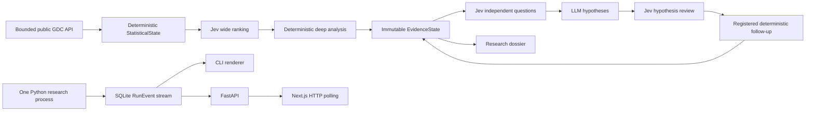

# CancerJEV — Phase 0 design

CancerJEV is a proposed autonomous research engine for bounded exploration of public NCI GDC data. Deterministic software creates scientific evidence; TypeSafe Jev prioritizes and judges supplied evidence; a generative model proposes competing hypotheses. Only registered deterministic follow-ups can acquire additional evidence.

**Status: design only. Phase 1 has not been implemented or approved.** Nothing in this repository currently runs a research pipeline. Commands below are the proposed Phase 1 interface, not working commands.



One ResearchRun is a bounded sweep, shown as one UI card. It may promote up to 20 investigations, each producing zero or one dossier. Continuous mode repeats bounded runs using a fair discovery cursor. It does not scan every project in one run.

Jev adds a visible judgment vector and changes prioritization and routing. Whether this improves discovery remains an empirical question. Jev scores are not p-values, biological measurements, or clinical confidence. Dossiers are research proposals, not treatment recommendations.

Start reading [the architecture](docs/ARCHITECTURE.md), [domain schemas](docs/DOMAIN_MODELS.md), [GDC strategy](docs/GDC_STRATEGY.md), [budget enforcement](docs/GDC_BUDGETS.md), and [Jev design](docs/JEV_DESIGN.md). [The Phase 0 report](docs/IMPLEMENTATION_STATUS.md) includes the architecture test, confidence, remaining risks, and approval boundary. [The source review](docs/SOURCE_REVIEW.md) records exactly what was inspected.

The reason for bounded GDC traffic is scientific and operational: preserve explicit examined populations, avoid untraceable partial datasets, limit resource use, and use server-side analysis before acquiring data. Large-file-dependent questions are `UNSUPPORTED_IN_V1`.

Proposed local setup after Phase 1 approval:

```powershell
python -m venv .venv
.venv\Scripts\Activate.ps1
pip install -e ".[dev]"
uvicorn apps.api.main:app --host 127.0.0.1 --port 8000
# A second terminal:
cd apps/web
npm ci
npm run dev
# A third terminal, from the repository root with the venv active:
python -m cancerjev run --fixture demo
```

```bash
python -m venv .venv
source .venv/bin/activate
pip install -e '.[dev]'
uvicorn apps.api.main:app --host 127.0.0.1 --port 8000
# Second terminal:
cd apps/web
npm ci
npm run dev
# Third terminal, repository root and venv active:
python -m cancerjev run --fixture demo
```

Open `http://localhost:3000/runs`. Proposed continuous fake mode: `python -m cancerjev worker --fixture demo`, immediately executing a run and waiting 60 minutes after completion by default. Only one research process may own the data directory. FastAPI and Next.js are separate serving processes, not additional research workers.

Future commands `python -m cancerjev run` and `python -m cancerjev worker` will require an explicit live profile. In Phase 1 they must fail with an explanation instead of silently calling a provider. Proposed later flags are `CANCERJEV_LIVE_GDC`, `CANCERJEV_LIVE_JEV`, and `CANCERJEV_LIVE_LLM`; each defaults false. Provider keys stay in the Python environment. No GDC token is accepted. These switches are planned configuration, not existing functionality.

All scientific integrations, provider integrations, UI, runtime, tests, and CI remain unimplemented. The detailed Phase 1 plan and acceptance gates are in [PHASE_1_PLAN.md](docs/PHASE_1_PLAN.md).
