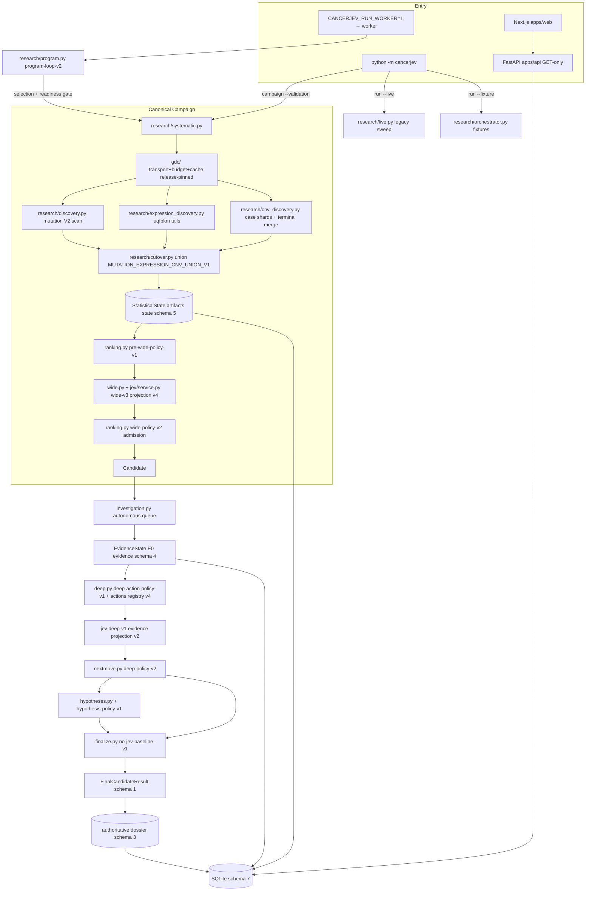

# OntoJev Full Repository Audit

## 1. Audit metadata

| Item | Value |
|---|---|
| Repository | `https://github.com/asimog/ontojev` |
| Audited branch | `main` (frozen audit target) |
| Audited HEAD SHA | `84c6b370fd571badd24283dc6f185f574c989550` |
| Audit dates | 2026-09-26 / 2026-09-27 |
| Working tree | Clean; `git status --porcelain` empty. The only anomaly is the pre-existing ACL-locked `.pytest-tmp/` directory that makes `git status` warn on Windows (it is not tracked). |
| Tracked-file inventory | 378 paths from `git ls-files` (the complete coverage universe, preserved during the audit) |
| Baseline inventory reconciliation | The supplied baseline audit claims 426 tracked paths (104 `cancerjev/`, 61 `apps/`, 228 `tests/`, 13 `docs/`, 208 Python). At the frozen SHA the actual tree is 378 paths (94 `cancerjev/`, 48 `apps/` — of which 43 `apps/web/`, 208 `tests/`, 13 `docs/`, 2 `deploy/`, 1 `.github/`, 1 `data/`, 11 root files), with 208 Python files (44,847 lines). The baseline inventory counts are therefore **stale/incorrect for this SHA**; the frozen-SHA inventory is authoritative for this audit. |
| Python module count | 208 `.py` files; 44,847 Python LOC |
| Test count | 208 tracked `tests/` paths (107 Python test/harness modules) plus 1 routed Playwright spec (`tests/browser/current.spec.ts`); 808 tests passed, 4 deselected in the offline suite (lead run) |
| Frontend source count | 43 tracked files under `apps/web/` |
| Documentation count | 13 files under `docs/` |
| CI workflows | `.github/workflows/ci.yml` (jobs: `python`, `frontend`, `browser`, `live`) |
| Workflow state | HEAD `84c6b37` is the current `main` tip at freeze; the audit did not observe HEAD movement during the run. |

### Canonical version facts (read from code, not prose)

| Constant | Value | Location |
|---|---|---|
| Package version | `0.2.0` | `cancerjev/__init__.py`, `pyproject.toml` (web package.json says `0.1.0`) |
| SQLite schema | `SCHEMA_VERSION = 7` | `cancerjev/storage/database.py:10` |
| StatisticalState schema | `STATE_SCHEMA_VERSION = 5` | `cancerjev/domain/codecs.py:112` |
| EvidenceState schema | `EVIDENCE_SCHEMA_VERSION = 4` | `cancerjev/domain/codecs.py:113` |
| Discovery schemas | `DISCOVERY_SCHEMA_VERSION = 1`, `EXPRESSION_DISCOVERY_SCHEMA_VERSION = 1`, `CNV_DISCOVERY_SCHEMA_VERSION = 1`, `CNV_SHARD_EVIDENCE_SCHEMA_VERSION = 2`, `CNV_PROJECT_SCAN_SCHEMA_VERSION = 1` | `cancerjev/domain/codecs.py:114-118` |
| Dossier schema | `DOSSIER_SCHEMA_VERSION = 3` | `cancerjev/domain/dossier.py:1` |
| Event log schema | `SUPPORTED_SCHEMA_VERSION = 1` | `cancerjev/domain/events.py:14` |
| Research spec schema | `RESEARCH_SPEC_SCHEMA_VERSION = 8` | `cancerjev/research/specs.py:35` |
| Jev projection versions | `jev-state-projection-v4`, `jev-evidence-projection-v2`, `jev-hypothesis-projection-v2` | `cancerjev/jev/projection.py:32-34` |
| Question sets | `wide-v3`, `deep-v1`, `hypothesis-v2` | `cancerjev/jev/questions.py:16-18` |
| Jev adapter / context guard | `typesafe-adapter-v1`, `jev-context-bytes-v1` | `cancerjev/jev/typesafe_adapter.py:16`, `cancerjev/jev/context.py:15` |
| Action registry | `ACTION_REGISTRY_VERSION = "4"` | `cancerjev/science/actions.py:105` |
| Ranking policies | `pre-wide-policy-v1`, `baseline-wide-v2`, `wide-policy-v2` | `cancerjev/research/ranking.py:13-20` |
| Deep policies | `deep-action-policy-v1`, `deep-policy-v2` | `cancerjev/research/deep.py:72`, `cancerjev/research/nextmove.py:21` |
| Hypothesis policy | `hypothesis-policy-v1` | `cancerjev/research/hypothesis_policy.py:22` |
| Maturity policy | `evidence-maturity-v1` | `cancerjev/domain/maturity.py:21` |
| Discovery reducer/policies | `REDUCER_VERSION = "3"`, `mutation-dispositions-v1`, `expression-dispositions-v2`, `cnv-dispositions-v1` | `cancerjev/domain/discovery.py:69-73,118-120,142-157` |
| Program/Campaign | `program-loop-v2`, `campaign-selection-v2`, `release-monitor-v1` | `cancerjev/research/program.py:49`, `campaign_selection.py:25`, `release_monitor.py:21` |
| Stage 8 / result | `no-jev-baseline-v1`, `FINAL_RESULT_SCHEMA_VERSION = 1` | `cancerjev/research/finalize.py:46-47` |
| Transport/budget/parser | `gdc-transport-v1`, `gdc-adaptive-v1`, `gdc-campaign-v1`, `gdc-parser-v1` | `cancerjev/gdc/transport.py:30`, `budget.py:26-27`, `parsers.py:16` |
| Storage doctor | `storage-doctor-v1` | `cancerjev/storage/doctor.py:26` |
| Replication partition | `hash-sorted-case-partition-v1` | `cancerjev/research/replication.py:16` |

## 2. Coverage statement

Every one of the 378 tracked files was assigned to at least one of 27 specialist review lanes (A–W, H2, R1–R4, S, T, U, V) with the complete inventory distributed before review. The lead auditor additionally read the critical files personally:

`cancerjev/research/systematic.py`, `cutover.py` (union path), `ranking.py`, `wide.py`, `nextmove.py`, `investigation.py`, `finalize.py`, `cancerjev/jev/projection.py`, `questions.py` (wide set and applicability), `contracts.py`, `service.py` (evaluation/cache/invoke region), `cancerjev/science/actions.py` (registry/eligibility), `cancerjev/science/methods.py` (V1/V2 method identities and scan result), `cancerjev/science/descriptors.py`, `cancerjev/domain/scientific.py` (CNV finding + occurrence contracts), `cancerjev/config.py` (caps), `cancerjev/cli/main.py` (campaign and legacy paths), `apps/api/routes.py` (child lists), `cancerjev/storage/repositories.py` (paging/ordering).

Coverage classification of the 378 tracked files:

| Classification | Count |
|---|---|
| `FULLY_REVIEWED` | 273 |
| `BINARY_OR_FIXTURE_VERIFIED` | 94 |
| `IRRELEVANT_TO_RUNTIME_BUT_REVIEWED` | 5 |
| `GENERATED_VERIFIED` | 3 |
| `DEPENDENCY_LOCK_REVIEWED` | 2 |
| `HISTORICAL_REFERENCE` | 1 |
| `NOT REVIEWED` | **0** |

The complete per-file ledger is in section 36. Non-`FULLY_REVIEWED` classifications are justified per file in that table (fixtures/lockfiles/generated files were structurally verified, including hash and provenance checks; `docs/BUGFIX_PLAN.md` is a historical repair record). No tracked file was silently omitted.

Independent verification performed by the lead on all P0/P1 claims: the mutation `JEV_REVIEW` contract abort (D-01/R3-02), the CNV out-of-universe union abort (F-01/G-06), the pre-Wide ceiling/tie abort (G-02/V-04), the E0 V1/V2 method-identity mislabel (W-08, escalated), the missing Deep applicability gate (H-04, escalated), the Stage-8 baseline-revision comparison (L-01), the frontend evaluation pagination false-negative (Q-02), the stale projection limitations (B01/B02), the union gate in `ranking.py`, and the action/eligibility registry were all re-checked in source by the lead. Disagreements between lanes and the lead's resolved severities are recorded in the finding text.

## 3. Executive verdict

OntoJev at HEAD `84c6b37` is a coherent, unusually disciplined research system whose **architecture is substantially stronger than its current scientific methods**, and whose **canonical validation path currently cannot complete end-to-end** for reasons that are all traceable and fixable.

What is genuinely strong:

- one canonical scientific state (`StatisticalState`, `cancerjev/domain/scientific.py`), one deterministic modality union (`MUTATION_EXPRESSION_CNV_UNION_V1`), one Campaign executor (`research/systematic.py`), one Jev boundary with fail-closed validation and content-addressed caching, immutable `EvidenceState` revision chains, deterministic Python policies for every model-derived decision, release-pinned acquisition, append-only artifacts, transactional persistence with immutability triggers, and declared evidence maturity that cannot be inflated by Jev confidence.
- The verification surface is real: 808 offline tests pass; strict mypy passes over a manual 87-file list; Ruff passes; repository-fact checks pass; the frontend typechecks and builds.

What blocks real scientific use today:

1. **P0** — Every Wide projection hands the judging model a stale, false statement of how the examined gene set was selected ("provider top-mutated ranking") alongside the correct union `selection_bias`, and a stale claim that mutation counts are provider bucket counts. This is the input to the admission-gating judgment.
2. **P1** — Three independent fail-closed aborts can kill a complete-universe canonical Campaign on real data: a mutation review-trigger contract disagreement (`ContractError`), a CNV recurrence outside the protein-coding universe (`UNION_OUTSIDE_UNIVERSE`), and the 1000-state pre-Wide ceiling hitting a tie group (`PRE_WIDE_ORDERING_AMBIGUOUS`).
3. **P1** — Deep Jev receives the canonical mutation count under the **deprecated V1 method identity** with V1 deprecation limitations, and the Deep policy consumes `revision_reliable` even when its applicability rule says it is unanswerable.
4. **P1** — The expression nomination rule (`≥1 Tukey-tail case at n≥20`) is near-universal at real cohort sizes; it inflates the union into the same ceiling that then aborts, and it is descriptive-measurement availability rather than a selective candidate signal.
5. **P1 (declared gaps)** — no inferential method anywhere (`STATISTICALLY_SUPPORTED` structurally unattainable), replication unwired, functional/external evidence deferred, all thresholds uncalibrated, and no live canonical Campaign evidence exists.

These do not invalidate the architecture; they define a bounded repair and evidence-generation program (section 33).

## 4. Current executable architecture

The canonical runtime is one path:

```text
CLI (`python -m cancerjev campaign --validation` | worker Program)
→ research/program.py (program-loop-v2) / campaign.py readiness gate
→ research/systematic.py:run_systematic_campaign
    → gdc budget (gdc-campaign-v1) + release pinning
    → mutation discovery: complete /ssm_occurrences scan → GENE_ID_ASC_INDEXED_COMPLETE_V1
    → expression discovery: /gene_expression values (uqfpkm) → Tukey tails → dispositions
    → CNV discovery: deterministic case shards → complete project scan → terminal merge
    → research/cutover.py compose_discovery_states (MUTATION_EXPRESSION_CNV_UNION_V1)
    → research/state_store.py persist StatisticalState artifacts (state schema 5)
    → research/ranking.py select_pre_wide_states (pre-wide-policy-v1)
    → research/wide.py run_wide_evaluation → jev/service.py (projection v4, wide-v3)
    → research/ranking.py JEV admission policy (wide-policy-v2) → Candidate (max 3)
→ research/investigation.py run_autonomous_candidate_queue
    → Candidate → EvidenceState E0 (domain/evidence.py, evidence schema 4)
    → research/deep.py Deep loop: deep-action-policy-v1 → registered actions
    → Jev Deep judgment (jev-evidence-projection-v2, deep-v1)
    → research/nextmove.py deep-policy-v2 → COMPLETE/FOLLOW_UP/GENERATE_HYPOTHESES/ABSTAIN
    → research/hypotheses.py + hypothesis_policy.py (optional, hypothesis-policy-v1)
→ research/finalize.py run_stage8_finalize
    → no-Jev baseline replay (no-jev-baseline-v1)
    → FinalCandidateResult (schema 1) → authoritative dossier (schema 3)
    → CANDIDATE_COMPLETE → CANDIDATE_COMPLETED
→ Campaign result → Program completion/idle
```

Non-canonical but retained execution surfaces (all classified by lane T/W):

| Surface | Entry | Classification |
|---|---|---|
| Legacy provider-ranked sweep | `python -m cancerjev run --live` → `research/live.py` (`LiveOrchestrator`) | ACTIVE operator/comparator path; **records `SYSTEM_AUTONOMOUS` ownership unless `--researcher`** (P2) |
| Demo | `run --fixture` → `research/orchestrator.py` + `research/fixtures.py` (FIXTURE-labelled, seeded by `deploy/serve.py`) | ACTIVE demo, same database, labelled |
| Lane-only CLI | `discover`, `discover-expression`, `discover-cnv`, `cnv-merge` | ACTIVE lane utilities; write lane artifacts only |
| Ops CLI | `probe`, `capability`, `doctor`, `evaluate`, `show`, `worker`, `program`, `campaign` | ACTIVE |
| API | `apps/api` GET-only FastAPI over the same repository | ACTIVE read-only presentation |
| Historical seams | `parse_files_provenance`, `run_cnv_discovery`, `_compose_legacy_survivor_states`, survivor-only CNV contracts, `next_move`, `select_next_campaign`, `release_compare`, `replication`, `prospective`, `file_admission`, `pathways`, `domain/functional.py` | TEST_ONLY / ACTIVE_COMPATIBILITY / DEAD (section 24) |

Program autonomy: `program-loop-v2` tracks Release/profile/method/campaign identity, retries (cap 5, exponential backoff), and idles; `LUAD_CAMPAIGN_V1` is `EXPERIMENTAL`, and both dispatch gates refuse it in autonomous mode, so worker dispatch cannot currently execute a Campaign at all; the canonical spine is reachable only through the operator `campaign --validation` route (N-17, T-15, W-18 confirm).

## 5. Architecture diagram



## 6. Scientific-method assessment

The full scientific matrix (per modality: source, population, unit, completeness, method, selection rule, statistical model, null model, multiple testing, missingness, replication, limitations, candidate effect, maturity effect, Jev consumer, supported/unsupported claims) is maintained in section 26; the condensed conclusions:

- **Mutation** measures distinct affected cases per gene locally from a complete released occurrence scan (V2 method identity), with a reproducible complete protein-coding universe (`GENE_ID_ASC_INDEXED_COMPLETE_V1`). It is a descriptive count. The nomination rule is `positive genes → affected-case count descending → first 10`. No background mutability, gene length, sequence context, cohort burden, null model, p/q value or multiple-testing treatment exists; MutSigCV-class inference is explicitly deferred (`methods.py:504-511`). The declared temperature/hotspot concentration trigger is unreachable in the live scan because `protein_start` is not requested (`endpoints.py:40-48`; D-02/V-05). What can be claimed: descriptive recurrence/counts over a pinned release. What cannot: driver significance.
- **Expression** measures case-labelled `log2(UQFPKM+1)` values, requires ≥20 finite values and positive IQR, uses type-7 quantiles and fixed 1.5×IQR Tukey fences, and nominates on ≥1 tail case (asymmetry ≥5× triggers `JEV_REVIEW`). It is not differential expression, not tumour-normal, not matched, not cancer specificity. At real cohort sizes the ≥1-tail rule is near-universally true (V-01), so the nomination is largely measurement availability.
- **CNV** measures provider-labelled positive occurrences (five categories) aggregated per gene from a complete case-sharded project scan with a terminal merge; nomination requires ≥5 amplification or ≥5 homozygous-deletion cases; conflicts become `JEV_REVIEW`. There is no callable denominator, no purity/ploidy or arm-level background correction, and no significance test; the merged evidence additionally double-counts the same case when provider spellings differ (F-02). What can be claimed: descriptive positive case counts per provider category.
- **Pathway, replication, functional, external**: all infrastructure/test-only or deferred; they contribute nothing to current candidate decisions.
- **Hypothesis-derived**: generated text is persisted as labelled non-evidence and critiqued by Jev; the only evidence-producing action is structurally ineligible at the revision where the hypothesis policy runs, so no hypothesis can currently be tested (section 13).
- **Maturity**: only `MEASURED` and `DESCRIPTIVE_CANDIDATE` are attainable; the four higher levels are blocked by declared, quotable prerequisites (`domain/maturity.py:92-109`).

Separations that the repository itself preserves and this audit confirms: software verified (tests/CI) ≠ provider reconciled (fixtures/reconciliation only for the V1 bucket) ≠ methodologically justified (declared descriptive contracts) ≠ scientifically validated (absent) ≠ externally replicated (absent).
## 7. Mutation findings

Full-file review: `research/discovery.py` (503), `science/mutation.py` (91), `science/methods.py` (890, shared reducer), `domain/discovery.py` (993). The canonical measurement path is sound in its core semantics: distinct affected cases are derived locally from a validated complete occurrence scan; pages are validated for completeness; absence from a complete scan is an observed zero; an incomplete scan is never persisted; budget exhaustion aborts (D-10, C-12, V-14, V-15).

| ID | Sev | File:line | Finding |
|---|---|---|---|
| D-01 / R3-02 (duplicate) | **P1** | `research/discovery.py:276-279` vs `domain/discovery.py:494-496` | `build_discovery_entries` appends `JEV_REVIEW` genes to `survivor_ids`; the domain contract requires survivors == RETAINED entries in rank order, so any top-10 gene firing the occurrence-per-case ratio trigger raises `ContractError` and aborts the whole mutation lane. Reproduced independently by two lanes and re-verified by the lead. See section 30. |
| W-08 (escalated) | **P1** | `research/deep.py:274-278` vs `science/methods.py:424-426,562-564` | E0 baseline observation labels the canonical V2 scan count with `MUTATION_AFFECTED_CASE_COUNT_V1` and carries the V1 definition's "DEPRECATED FOR SCIENTIFIC USE" limitations into Deep Jev, although the state's own measurement carries `MUTATION_AFFECTED_CASE_COUNT_V2`. See section 30. |
| D-03 | P2 | `research/discovery.py:249-267,460-463` | Survivor eligibility is gated on the legacy `coverage.complete` flag (provider `/analysis/mutated_cases_count_by_project`), so a partial coverage aggregation suppresses all survivors even when the occurrence scan (the actual measurement) is complete. Fix: gate on scan completeness; keep coverage as context. |
| D-02 / C-07 / V-05 | P2 | `science/mutation.py:44-49`; `gdc/endpoints.py:40-48` | The `HOTSPOT_CONCENTRATION` review trigger requires protein positions that are never requested; the trigger is dead in production and only exercisable with synthetic bytes. Declared limitation, opportunistic parser read risks silent future activation. |
| D-05 | P3 | `domain/discovery.py:68-69,73`; `research/discovery.py:311-319` | Reducer identity (`MUTATION_AFFECTED_CASE_COUNT_DESC_V1` v3) does not bind the disposition-policy thresholds/version; editing thresholds changes nominations without an identity change. |
| D-06 | P3 | `research/discovery.py:110-122`; `gdc/parsers.py:491-492` | Docstring claims cross-page ascending validation; only duplicates are checked per page; ordering is enforced later by the universe sortedness contract. |
| B-15 | P2 | `domain/scientific.py:85-96`; `science/methods.py:556-570` | No invariant guarantees `affected_cases ≤ ssm_coverage_cases` although both are projected to Jev; the two numbers answer different questions (scan corpus vs coverage aggregation) and can confuse the coherence judgment. |
| D-04 / D-12 / T-11 | P3 | `domain/discovery.py:55,60,73`; `science/methods.py:154-185,424` | Unused constants and enum members; the deprecated V1 method definition is declared in every canonical state's method environment even though no canonical value uses it. |
| D-08 / D-11 | P3/INFO | `science/methods.py:596-614`; `research/cutover.py:274-386`; `domain/maturity.py:92-109` | V1 bucket branch test-only; JEV_REVIEW-only states earn `MEASURED` only (nomination requires RETAIN); the legacy survivor subtree is unreachable from production. |
| E-08 (cross-lane) | P3 | `science/expression.py:85-89`; `science/methods.py:656-660` | Per-gene availability (`coverage.genes`, `missing_genes`, with/without counts) is computed and merged but never consumed; only case-level availability drives coverage. |
| D-09 | INFO | `science/mutation.py:44-49`; `ranking.py:133-143` | `JEV_REVIEW` means pending semantic review and is excluded from promotion while Arm Jev is deferred (B08). |

## 8. Expression findings

Full-file review: `research/expression_discovery.py` (214), `science/expression.py` (124), `science/descriptors.py` (169). Verified correct: type-7 quantiles, strict 1.5×IQR fences, n<20 → INSUFFICIENT, IQR=0 → DEGENERATE, zero preserved, negatives/non-finite rejected, batching and order independent, plan arithmetic bounds requests exactly, UQFPKM treated as normalized values (E-09, E-10, E-11).

| ID | Sev | File:line | Finding |
|---|---|---|---|
| V-01 | **P1** | `science/descriptors.py:138-146`; `domain/discovery.py:63,218-219` | `RETAIN` fires on ≥1 Tukey-tail case at n≥20. The recorded live 1000-gene expression run has 890/1000 genes with a non-empty upper fence (89%), so at complete-universe scale the expression arm nominates most of the measured universe, dominates the union, and has no null/expected-tail calibration. See OJ-AUD-P1-17. |
| E-02 | P2 | `science/descriptors.py:142-143`; `domain/discovery.py:121-122` | One-sided tails never trigger `EXTREME_TAIL_ASYMMETRY` (the guard requires both sides), so maximal asymmetry routes to `RETAIN` rather than review — the trigger selects only both-sided asymmetry. |
| E-01 | P2 | `research/expression_discovery.py:172-177`; `science/methods.py:634-641` | Stage 5 passes the literal `PROVIDER_SUMMARY_NOT_REQUESTED_IN_STAGE_5` as the unavailability reason for every unavailable gene, shadowing the specific `GENE_ABSENT_FROM_VALUES` / `EXPRESSION_VALUES_NOT_ACQUIRED` reasons in persisted `UnavailableLane.reason` and tail reason. |
| E-05 / C-01 / C-02 | P2 | `research/acquisition.py:533-592`; `gdc/endpoints.py:249-272`; `gdc/parsers.py:1139-1166` | Workflow identity is observed but not enforced (any named workflow passes; a single non-STAR family gets the wrong "mixed" warning), the access-facet fail-closed guard is unenforced/ambiguous, and workflow facet truncation flags are ignored with missing `pagination.total` treated as complete coverage. |
| E-03 | P3 | `domain/discovery.py:120-121`; `science/descriptors.py:53-61`; `research/discovery.py:534-536` | Disposition-policy version and asymmetry ratio are not part of the persisted identity; the 1.5 fence is re-hard-coded in `discovery.py:534-536` and `actions.py:910`. |
| E-04 | P3 | `science/descriptors.py:136-137,78-82` | `DEGENERATE_REFERENCE` (IQR=0, n≥20) is persisted as reason `INSUFFICIENT_VALID_VALUES`, conflating two distinct states. |
| E-06 | P3 | `research/expression_discovery.py:140-143` | The shard ledger records only the last response per gene batch (two responses per batch exist); earlier hashes survive only in `result.sources`. |
| E-07 | P3 | `research/expression_discovery.py:183-185` | `entries_by_id` silently overwrites duplicate gene outcomes; no disjoint/complete batch coverage check (unreachable under current acquisition invariants). |
| E-12 | INFO | `domain/discovery.py:124-127`; `gdc/budget.py:28-44` | Budget planning admits on a flat per-request byte estimate while the true cap is the transport run budget; mid-run exhaustion fails closed. |
| E-09..E-11 | INFO | `science/descriptors.py`, `expression.py` | Verified positives listed above. |

## 9. CNV findings

Full-file review: `research/cnv_discovery.py` (584), `research/shards.py`, `domain/shards.py`, plus CNV sections of `science/methods.py`, `domain/discovery.py`, `gdc/parsers.py`, `gdc/endpoints.py`. Verified correct: deterministic sorted case windows, full-manifest/spec-hash/overlap gates, strict pagination with fail-closed page caps, case-level dedup, exact-spelling categories, GAIN/LOSS never nominated, thresholds 5/5 applied separately, absence never treated as observed-zero, independent nomination through the union (F-08).

| ID | Sev | File:line | Finding |
|---|---|---|---|
| F-01 / G-06 / W-04 | **P1** | `research/cutover.py:156-160`; `research/cnv_discovery.py:441-453`; `gdc/endpoints.py:460-465` | The CNV scan aggregates every annotated gene in the project (no universe filter), while the union requires every nomination to be inside the protein-coding universe and raises `UNION_OUTSIDE_UNIVERSE` otherwise; one recurrent out-of-universe CNV (e.g. an 8q24 lncRNA) aborts the entire Campaign after all acquisition cost. See section 30. |
| F-02 | P2 | `science/descriptors.py:158-163` | Threshold arithmetic sums `len(case_ids)` across raw spellings that map to the same category (`Amplification` + `amplification`), double-counting the same cases (probe-confirmed: 3 cases counted as 6). |
| F-04 | P2 | `research/cnv_discovery.py:464-470`; `science/descriptors.py:166-168` | `CALLER_CONFLICT_ON_RECURRENT_EVENT` is derived from multiple raw categories per case, not from per-occurrence caller–category pairing, so caller disagreement is neither proven nor required. |
| F-03 | P2 | `research/cnv_discovery.py:485-488,544-547` | Shard evidence binds spec hash/release/manifest but no scanner method identity; a per-shard `--source-run` merge can mix shards produced by different code versions and stamp the merged result with merge-time code identity. |
| G-05 / T-07 / W-09 | P2 | `research/cutover.py:101-112,196-200`; `science/actions.py:365-369,915-931`; `domain/scientific.py:203-217` | Canonical `CnvProjectFinding` drops `missing_sample_occurrence_ids` and all raw occurrence detail; the registered `SUMMARIZE_CNV_CATEGORIES_V1` action requires a `CnvOccurrenceResult`, so it is permanently ineligible on canonical states, and the finding has no entity/gene field. (Lane G rated P1; lead narrowed to P2 because no wrong evidence can be produced — the effect is a dead follow-up capability plus a weak contract.) |
| F-05 / F-06 | P3 | `domain/discovery.py:163-170` | Limitation text claims caller/source context is retained per record, but merged evidence keeps only caller union + case sets; limitations also omit pooled-across-callers recurrence and the absence of purity/ploidy and arm-level background correction. |
| F-07 | P3 | `research/cnv_discovery.py:489-496`; `domain/shards.py:93-97` | The page ledger's `required=len(records)` makes `terminal` true by construction; the assertion is unreachable and never read by merge; the disposition-policy version constant is consumed only by tests. |
| V-13 | P2 | `science/descriptors.py:149-169`; `domain/discovery.py:158-159` | Recurrence is a 5-case positive-count cut with unknown callable denominator and no GISTIC/permutation background; conflicts retained but never resolved; no Wide CNV question. |

## 10. Integration / StatisticalState findings

Full-file review: `research/systematic.py` (253), `cutover.py` (386), `state_store.py`, `ranking.py` (283), `wide.py` (258), `seams.py`; domain contracts from lane B. Verified positive: deterministic tie-broken ordering, fail-closed ambiguous cuts, exact cap operators, atomic registration + event transactions, complete union replays, `JEV_REVIEW` carried as typed nominations, release/frame identity checks at cutover (G-13, B positives).

| ID | Sev | File:line | Finding |
|---|---|---|---|
| G-01 / B-01/B-02 | **P0/P1** | `jev/projection.py:87-88,93-94` injected at `:210` | Stale limitation text injected into every Wide projection (provider top-mutated ranking; provider-defined counts) contradicting the state's own union `selection_bias` in the same payload. P0 as a semantic-input defect; see sections 11 and 29. |
| G-02 / V-04 / W-03 | **P1** | `config.py:19,84,108`; `cli/main.py:505`; `systematic.py:218`; `wide.py:77-98`; `ranking.py:75-83` | The pre-Wide ceiling is 1000 by default and cannot be raised (`JEV_MAX_STATES_HARD_CAP`); a complete-universe union far exceeds it, the ordering key is mutation-count-first and zero-count union members all tie, so the boundary group cannot fit and `PRE_WIDE_ORDERING_AMBIGUOUS` aborts the Campaign after acquisition. If a cut ever lands on a group edge it silently truncates mutation-first, excluding expression/CNV nominations. See section 30. |
| G-03 / B-08 / V-07 / W-06 | **P1(declared)** | `ranking.py:61-65,133-145,259-260`; `wide.py:224-228` | Any modality's `JEV_REVIEW` disposition hard-vetoes promotion of the whole state even if another modality retained it; with Arm Jev deferred there is no alternative path. Recall loss is real but unquantified statically; the mutation variant of this path currently aborts before review (D-01). |
| G-04 | P2 | `ranking.py:57-60,75-83,141-144` | Structural mutation primacy: ordering key is mutation-count-first, mutation/expression absence is a hard admission exclusion, CNV influences no ordering, and `PARTIAL` expression coverage is unreachable for single-project states. Science must accept or declare this asymmetry. |
| V-12 / H-05 | P2 | `cutover.py:236-244`; `jev/projection.py:205` | Unassessed single-project `coverage_imbalance` is projected as `false` ("not applicable to one project") while Wide asks Jev the coverage-confound question; NOT_ASSESSED is indistinguishable from observed absence in the projection. |
| G-09 | P3 | `state_store.py:63-64,89-94` | Persisted states are not idempotent: a fresh `uuid4` per write, no UNIQUE(state_hash), random load order; dedup by `state_id` never hits across runs. |
| G-11 | P3 | `cutover.py:154-155` | A canonical campaign whose union is empty fails with `EMPTY_UNION` (`RUN_FAILED`) while the legacy path completes empty; there is no "no candidates" run shape for the canonical route. |
| G-12 | P3 | `cutover.py:204,226-233`; `discovery.py:259-315` | `rank_in_lane` conflates mutation provider rank with union alpha index; descriptive/JEV-review trigger evidence from the mutation lane is dropped before the state (no consumer). |
| G-10 / B-02 / T-17 | P3 | `cutover.py:262-386`; `cnv_discovery.py:202-326` | Legacy survivor-scoped cutover and survivor-only CNV discovery remain, production-unreachable; see sections 24 and 30. |
| G-14 / T-14 | P2 | `domain/scientific.py:278-291,314-352,481-503,506-534,577-578` | Persisted state fields with no runtime consumer: `rank_in_lane`, `discovered_in_project_count`, `genome_build(_note)`, `programs`, `sample_types`, `sample_type_counts`, `expression_median_min/max`, dominance/coverage definitions, `direction`, `comparability_status`, `notes`, `provider_expression`, `pathway_evidence`. Some are presentation/API-only; others are dead weight. |
| G-15 / W-18 / N-17 | INFO | `data/`, `campaign.py:87-107` | No canonical SYSTEMATIC_CAMPAIGN run is recorded anywhere in the repo; only legacy live runs and a `LIVE_SWEEP` with 9/10 evaluation failures (historical budget exhaustion). |

## 11. Wide Jev findings

Full-file adversarial review by two independent lanes plus lead verification of projection, questions, contracts, service, context, posture, adapter. Positive verification: projection determinism (sha256 over canonical JSON, sorted set-derived lists, no ids/timestamps, NaN rejected — H2-11); malformed provider answers fail closed with typed errors and no cache write (H2-13); cache key includes scope version, ownership, mode, projection hash, question-set hash, requested model and adapter version, and reuse re-validates all identities including applicability (H-14/T, H2-12); no path was found by which a model answer changes measured evidence or executes an action without an explicit Python policy (H2-14, H-11, O-19).

| ID | Sev | File:line | Finding |
|---|---|---|---|
| H-01 / H2-01 / G-01 / W-02 / R3-04 / V-10 (all = B01) | **P0** | `projection.py:93-94` (+`:210`) | Stale "provider top-mutated ranking" limitation in every Wide projection; contradicts `scope.selection_bias` (union) in the same payload. Fixed by deriving limitations from `state.tested_context.selection_rule`; requires a projection-version bump. |
| H-02 / H2-02 / G-01 (B02) | **P1→P0 (same payload)** | `projection.py:87-88`; `questions.py:92-96` | "Provider-defined case counts"/"absent gene buckets" language is stale for the canonical V2 scan-derived distinct counts; the "no matched denominator" half remains true. |
| H-03 / H2-03 / G-08 / R3-09 / F-08 / V-13 (B03) | **P1** (OJ-AUD-P1-16) | `projection.py:64-68,200-204`; `questions.py:69-166,397-409` | Five CNV fields are projected but no `wide-v3` (or Deep) question references CNV; applicability ignores `cnv_observed`; CNV category conflicts are invisible to admission. Either declare CNV ambient-only or add an explicit versioned criterion (semantic version bump required). |
| H-04 | **P1** | `nextmove.py:44-53,108-121`; `contracts.py:202-205`; `projection.py:341-345` | Deep policy consumes `revision_reliable` without an applicability check even though the default E1 marks it inapplicable; the declared reliability gate can be bypassed on every canonical E1. Lead escalated lane H's P2. See section 30. |
| H2-04 | P2 | `questions.py:128-154`; `projection.py:211-213` | `warrants_deeper_investigation` asks about "a small bounded public-data query" but the projection exposes only action-id strings; the model cannot know what the registered follow-up does (Deep by contrast includes action payloads). |
| H-06 | P3 | `projection.py:93-94,184`; `ranking.py:17,161` | Admission-gating `unresolved_uncertainty_material` can be swayed by the contradictory stale text; the effect direction is admission-*favorable* (false uncertainty) as well as potentially recall-limiting. |
| H2-06 | P3 | `projection.py:91-92,198-199` | The provider expression-estimator limitation describes data canonical states never acquire (provider summary not requested; cutover passes None). |
| H2-07 | P3 | `projection.py:244-259`; `domain/evidence.py:348-354` | Baseline rows are projected as "checks" with `check_id`=method_id and null outcome/observed; latent if an E0 is ever deep-judged. |
| H2-08 | P3 | `projection.py:300-311,405-411`; `deep.py:431` | `measured_observations` are never projected; no loss today only because `OCCURRENCE_DETAIL_EVIDENCE_V1` mirrors them into the composition check — a fragile coincidence. |
| H2-09 / H-05 | P3 | `projection.py:399-411` | `EVIDENCE_INCLUDED_FIELDS` understates the actual projected observation rows (observed/expected/method_id/method_version/missingness.reason/limitations undeclared). |
| H-04-adjacent: J-11 | P3 | `service.py:191-196,365` | Applicability is computed and persisted but never filters the outgoing request (all questions are always asked and must be answered); consumption-side gating is inconsistent between ranking (gated) and next-move (ungated). |
| H-07 / H-09 / H-10 / H-13 / H2-12 | P3 | `service.py:112-137,194,198-200,633`; `questions.py:358-382` | Unused `definitions` parameter; context guard runs twice; events carry only the question-set *label*, not its semantic hash; deterministic question-artifact path can raise `FileExistsError` after a wording change; cache key omits the context-guard version (immaterial for semantics). |
| T-17 | P3 | `questions.py` Wide/Deep | The same question id `dominant_limitation` has different option rosters across sets; correctness depends on the set identity being co-carried (it is, in the evaluation record). |

## 12. Deep Jev and deterministic-action findings

Full-file review: `science/actions.py` (995), `research/deep.py` (1005), `research/followup.py`, `domain/actions.py`, `domain/evidence.py` (412). Positive verification: only `OCCURRENCE_DETAIL_EVIDENCE_V1` produces measured observations; provider failure yields typed NOT_OBSERVED; next move is Python policy over typed probabilities; the model cannot select or execute actions (I-12..I-14). Registered action table (registry v4):

| Action | Input | Data | Producing | Eligibility | Reachability |
|---|---|---|---|---|---|
| `CHECK_EVIDENCE_INTEGRITY_V1` | StatisticalState + artifacts | no | no | any state | reachable (plan) |
| `CHECK_REVISION_FAITHFULNESS_V1` | EvidenceState + source artifact | no | no | E1+ | reachable via FOLLOW_UP dispatch only |
| `SUMMARIZE_EXPRESSION_TAIL_V1` | StatisticalState | no | no | expression observed | operator-only (I-06) |
| `SUMMARIZE_CNV_CATEGORIES_V1` | StatisticalState | no | no | `CnvOccurrenceResult` | **permanently ineligible on canonical states** (G-05) |
| `OCCURRENCE_DETAIL_EVIDENCE_V1` | StatisticalState + GDC transport | **yes** | **yes** | occurrence scan available | reachable when admitted; not E1-eligible |

| ID | Sev | File:line | Finding |
|---|---|---|---|
| I-01 | P2 | `deep.py:614-615`; `readers.py:188-190` | Next revision index = `len(existing)+1`; with an E0-only history it writes index 2 parented to E0 (chain gap) and only a later read rejects the chain. |
| I-02 | P2 | `deep.py:502-504,729-731,407`; `readers.py:169` | E1 `parent_evidence_hash` is recomputed from in-memory E0 instead of the stored E0 hash; registry/method drift silently changes it and surfaces only on read. |
| I-03 | P2 | `deep.py:897-915`; `artifacts.py:49-52`; `repositories.py:430-438` | Dispatch has no latest-revision check and no replay guard; duplicate dispatch collides on deterministic ids and raises untyped `FileExistsError`/`IntegrityError`. |
| I-04 | P2 | `science/actions.py:826-868` | `REVISION_CHAIN_LINKED` never resolves the parent — it only asserts non-null — so it can report VERIFIED on a chain the reader rejects. |
| I-05 | P2 | `science/actions.py:960-969`; `deep.py:366-372` | Any newly registered state-kind action silently falls into the integrity-check computation and gets its checks attributed to the new method id (fall-through executor). |
| I-07 | P3 | `deep.py:734-796` | Revision and execution rows are written in separate transactions; a crash between them loses the execution row that budget/replay reads. |
| I-08 / J-02 | P2 | `deep.py:557-558,611,897-901`; `investigation.py:294-296` | Two budget semantics for `FOLLOWUP_LIMIT` (plan counts COMPLETED attempts, dispatcher counts all attempts); the production loop dispatches at most one follow-up because E2's distinct set is empty, making the declared cap/`MAX_STEPS_REACHED` unreachable in production. |
| I-09 | P3 | `science/actions.py:906-912,932-939` | Summary checks hard-code `CHECK_VERIFIED` (non-falsifiable); empty CNV occurrences yield a vacuous VERIFIED. |
| I-10 | P3 | `deep.py:73` vs `science/actions.py:60`; `specs.py:36-39,260-263` | Duplicate producing-action declarations; the spec's `IMPLEMENTED_ACTIONS` excludes the only producing action and `allowed_actions` is never consumed. |
| I-11 / T-05 / K-07 | P3 | `science/actions.py:83,101`; `deep.py:309,376-378,969`; `domain/actions.py:49` | Unenforced `changes_evidence` (always True and sent to Jev), unused args, dead `summarise`, unreachable page-cap branch, legacy `next_move`. |
| W-08 (escalated) | **P1** | `deep.py:274-278` | V1 method identity/deprecation text attached to V2 scan counts in E0/Deep Jev. |
| W-12 | P2 | `gdc/transport.py:107-125` vs `docs/ARCHITECTURE.md:30` | Exhausted Campaign budget raises and fails the run; there is no typed `INCOMPLETE_OR_UNAVAILABLE` outcome, contradicting the documented semantics (the run does not persist a smaller complete population, so the scientific invariant holds, but the declared outcome vocabulary does not). |

## 13. Hypothesis findings

Full-file review: `research/hypotheses.py` (431), `hypothesis_policy.py` (130), `llm/openrouter.py` (204), `domain/hypotheses.py`, plus hypothesis projection/questions sections. Positive verification: generated text is persisted only as labelled non-evidence; `factual_observation_refs` must be empty; the model identity is persisted; keys never appear in bodies/errors; the registry/eligibility intersection is re-checked (K-11, K-12, K-18).

| ID | Sev | File:line | Finding |
|---|---|---|---|
| J-01 / K-01 / H2-05 / W-07 / V-09 (=B09) | **P1** (OJ-AUD-P1-09) | `hypothesis_policy.py:116-130`; `investigation.py:149-158`; `actions.py:60,161,227,389-397` | `TEST_HYPOTHESIS` is structurally unreachable: proposals are validated against EVIDENCE_STATE-eligible actions (only the non-producing fidelity check), while the sole evidence-producing action requires STATISTICAL_STATE input. The policy outcome is always `KEEP_HYPOTHESIS`/`NO_EVIDENCE_PRODUCING_TEST`; the declared test path and its dispatch are dead. (Lane J rated P1; lead resolution OJ-AUD-P1-09 — no wrong evidence can be produced, but the hypothesis arm cannot fulfil its declared purpose.) |
| K-02 | P3 | `hypotheses.py:30,187,224-226,370` | Prompt says "at most two" hypotheses while `MAX_HYPOTHESES=3`; overshoot semantics differ (reject >3, silently truncate >remaining). |
| K-03 | P3 | `hypotheses.py:65-84,192`; `projection.py:455-468` | Provider symbol and generated text enter prompts/projections verbatim; injection cannot reach evidence or unregistered actions but can bias the Jev critique; bounded by trusted upstream. |
| K-04 | P3 | `hypotheses.py:314,372-385`; `artifacts.py:49-52` | Deterministic hypothesis ids + wall-clock timestamps break replay idempotency; a resumed interrupted run collides. |
| K-05..K-07, K-13, K-15 | P3 | see K report | Unused constants/exports; vestigial return value; template drafts bypass the registry intersection that injected drafts get; cross-hypothesis outcome depends on statement order. |
| K-08 / K-09 | P3 | `research/dossier.py:47,54-55,232-236,302-317` | Duplicated generator-name/model literals; dossier LLM detection by name can miss injected generators; generated statements render under availability "OBSERVED" with only a dossier-level notice. |
| K-10 | P3 | `llm/openrouter.py:196-203`; `repositories.py:210-217` | Usage fields pass through untyped; a non-numeric token count raises inside the event transaction (low likelihood). |
| K-14 | P3 | `tests/llm/test_openrouter_adapter.py:20` | Fixture uses a fictitious action id `CHECK_EVIDENCE_FIDELITY_V1`. |
| T-04 | P3 | `research/nextmove.py:56-86`; `domain/states.py:13,17,20` | Legacy `next_move` dict boundary has zero callers; `CandidateStatus.NEW/FOLLOWUP/TERMINATED` are never written in production. |

## 14. Stage 8 / dossier findings

Full-file review: `research/finalize.py` (495), `dossier.py` (487), `domain/dossier.py`, `dossier/renderer.py`, `research/evaluation.py`, `prospective.py`. Positive verification: terminal ordering result→dossier→status with transactional registrations and idempotent re-finalization; every artifact carries explicit no-superiority disclaimers; evaluation/prospective code is machine-checked out of the runtime (L-12..L-14).

| ID | Sev | File:line | Finding |
|---|---|---|---|
| L-01 | **P1** | `finalize.py:62-74,143-169,235-243` | The declared no-Jev baseline ("one action then stop; abstains on contradicted revisions") is scored against the *final* revision of the Jev-assisted chain, so contradictions found only at E2/E3 can flip the baseline to ABSTAIN — mis-attributing trajectory differences and amplifying apparent Jev effect. See section 30. |
| L-02 | P2 | `finalize.py:164-180` | `follow_up_changed`/`hypothesis_generation_changed` are tautological (baseline never dispatches or generates); `evidence_revisions_attributable_to_jev_route` mislabels Python-policy dispatch; status uses undeclared literals `DIFFERENT`/`PARTIALLY_COMPARABLE`. |
| L-03 | P2 | `dossier.py:355-371,453`; `artifacts.py:49-52` | Wall-clock `created_at` in the immutable dossier plus deterministic paths: a crash between file write and `DOSSIER_CREATED` makes retry raise `FileExistsError`; only `ScientificReadError` is caught. |
| L-04 / J-04 | P2 | `finalize.py:350-372,389-407`; `repositories.py:516-542`; `states.py:70-76` | A candidate stuck in `DOSSIER_READY` is preserved by recovery and never re-driven (the only repair trigger is a re-run with no production caller); the idempotent branch reports `CANDIDATE_COMPLETE` unconditionally. |
| L-05 | P3 | `finalize.py:275,420-423` | Result artifact is persisted before the dossier; a dossier failure leaves an orphan result referencing a dossier that was never created. |
| L-06 | P3 | `dossier.py:232-236,302-317,47` | Generated hypothesis text appears in section narratives with no per-section evidence label; `_uses_llm` hard-codes the generator name, duplicating `llm/openrouter.py:33`. |
| L-07 | P3 | `dossier/renderer.py:14` | No escaping; untrusted model text can alter Markdown structure (not XSS — served as text/markdown and rendered as React text). |
| L-08 | P3 | `research/evaluation.py:95-123` | No pre-registration enforcement (`declared_at` never compared to ranking creation), silent duplicate `policy_version` overwrite, symbol-keyed ranks. |
| L-09 | P2 | `research/prospective.py:228-249,266-315` | Bootstrap drops resamples per arm (different replicate sets; abstain-heavy arms excluded); coverage conflates ABSTAIN with STOP; precision@3 divides by `len(top)`; arm-output hash never recorded. Offline-only. |
| L-10 | P3 | `domain/dossier.py:10`; `dossier.py:138-139,288-301` | `proposed_wet_lab_experiment` is never populated (generic placeholder); `remaining_uncertainty` can render narrative with NOT_ACQUIRED. |
| L-11 / R2-07 / R4 | P3 | `tests/unit/test_prospective.py:109-117`; `docs/TEST_AUDIT.md:140-141` | Seed test asserts nothing seed-dependent; TEST_AUDIT's stage8 self-comparison claim is stale at HEAD (the self-comparison was replaced by a derived baseline replay). |

## 15. Program / Campaign findings

Full-file review: `research/program.py` (332), `campaign.py`, `campaign_selection.py`, `release_monitor.py`, `specs.py`, `orchestrator.py`, `fixtures.py`, `live.py` (749). Positive verification: single `research.lock` serializes all mutation; one campaign per cycle; run-scoped child tables; no cross-campaign collision; attempts counter stored and read (cap 5); backoff bounded; fixture labels preserved at run/state/dossier level; Program idles at this SHA (N-13..N-17).

| ID | Sev | File:line | Finding |
|---|---|---|---|
| N-01 | P2 | `program.py:191-214,325-331` | Crash after a Campaign completes but before program-state registration silently redispatches the completed campaign and does not increment attempts. |
| N-02 | P2 | `release_monitor.py:49-52`; `campaign_selection.py:65-66` | Any release inequality (including a downgrade or a status-body hash change) invalidates a completed campaign; no monotonic/ordering check. |
| N-03 / C-14 | P2 | `release_monitor.py:44`; `gdc/parsers.py:389` | A missing `data_release` degrades to `UNVERIFIED_RELEASE` identity and still dispatches/redispaches a full Campaign; no fail-closed gate. |
| N-04 / W-15 | P2 | `program.py:119`; `campaign.py:63-74`; `methods.py:446-456` | Research-spec content and schema version never enter campaign identity; spec edits do not invalidate a completed campaign. |
| N-09 / Q-03 | P2 | `jev/service.py:292,471`; `orchestrator.py:44-48` | Fixture/demo evaluations hardcode `"mode": "LIVE"`, so per-evaluation labels are not preserved end-to-end and the frontend's fixture filter drops them. |
| N-10 | P2 | `cli/main.py:674-675,869-871`; `program.py:191-214` | `ScienceError`/`JevContractError` escape the dispatch catch, so the campaign is marked FAILED while the attempt ledger is untouched — the retry cap can be bypassed. |
| N-05 / N-06 / N-07 / N-08 | P3 | `program.py:132-145,242-246`; `release_monitor.py:49-52`; `campaign_selection.py:42-57,97-98` | Records keyed only by `profile_id` collapse duplicates/silently drop unknown profiles; `release_changed` has no production caller; `CampaignStatus.RUNNING` never written (in-flight branch unreachable); non-durable selector test-only. |
| N-11 | P3 | `program.py:171,208` | Backoff anchored at cycle start rather than failure time; can be skipped by slow failures. Clock is UTC wall time, interval ≥1 min, no idle hot-spin. |
| N-12 | P3 | `repositories.py:61-63` | `create_run` defaults `mode="FAKE"` (fixture demo); latent mislabel trap; current callers pass explicit values. |
| P-01 / W-01 | P2 | `cli/main.py:909-912`; `live.py:125` | `run --live` executes the legacy provider-ranked sweep but records `SYSTEM_AUTONOMOUS` ownership unless `--researcher` — a provenance mislabel relative to `systematic.py:8-11`'s declared researcher/comparator-only isolation. (Lane W rated P1; lead narrowed to P2 — canonical state selection is identity-gated and no legacy result can enter a Campaign.) |
| P-02 | P2 | `cli/main.py:863-876`; `deploy/serve.py:39-42` | The durable worker exits permanently (`SystemExit`) on non-blocking lock contention instead of deferring the cycle, and the container spawns it unsupervised. |
| T-15 / W-18 / B17 | **P1(readiness)** | `campaign.py:87-107`; `program.py:186-188` | `LUAD_CAMPAIGN_V1` is `EXPERIMENTAL` and both dispatch gates refuse it, so the autonomous worker can never execute a Campaign at this SHA; the canonical spine is reachable only via the operator `campaign --validation` route. |
| W-19 | P2 | `cli/main.py:154-193,867-871` | Worker cycle failures are print-only outside the persisted run; recovery of a `RUN_RUNNING` run depends on the next command. |
| W-13 / S-01 | P2 | `docs/ARCHITECTURE.md:54`; `live.py:618-634,726` | Documentation claims the legacy live path "retains bucket semantics" while the code measures V2 scan-derived counts; `DATA_STRATEGY.md:11` still claims the old path "requires correction". |
## 16. State-machine audit

Transitions reconstructed from code; run and candidate transitions are centralized and validated, Program/Campaign/EvidenceState/Deep/Hypothesis transitions are implicit in their owning functions.

### Run (`domain/runs.py:19-35`; enforced `storage/repositories.py:145-155`)

```text
QUEUED → RUNNING → COMPLETED | FAILED | STOPPED
recovery: RUNNING → STOPPED (preserved, never resumed) on next mutating command
```

Legal: the above. Terminal: COMPLETED/FAILED/STOPPED. Unreachable-from-code: none. Discrepancy: none in code; the API simply presents status.

### Candidate (`domain/states.py:39-67`; enforced `storage/repositories.py:387-404`)

```text
CANDIDATE_COMPLETED → WIDE_EVALUATED (admission)
WIDE_EVALUATED → DEEP_ANALYZED | CANDIDATE_NOT_COMPLETED(intended terminal)
DEEP_ANALYZED → HYPOTHESIZED | DOSSIER_READY | CANDIDATE_NOT_COMPLETED
HYPOTHESIZED → DOSSIER_READY | CANDIDATE_NOT_COMPLETED
DOSSIER_READY → CANDIDATE_COMPLETE → (terminal) CANDIDATE_COMPLETED
```

Never constructed in production: `NEW`, `FOLLOWUP`, `TERMINATED` (B-04, J-08, W-16). **Orphan state**: `DOSSIER_READY` after a crash between dossier write and completion — recovery preserves it, the queue selects only `WIDE_EVALUATED`, and no production path re-drives it, so the candidate is permanently incomplete (J-04/L-04, P2). Operator path (`live.py:501-513`) never records terminal failure for a selected candidate whose dispatch fails (J-03, P2). Alias/dedup mismatch: selection dedups by string while resolution is alias-based, so two aliases of one candidate can run the arc twice and collide (J-05, P2).

### Program (`research/program.py`; `program-loop-v2`)

```text
(idle) → observe release → evaluate selection → dispatch | idle
dispatch → cycle result: completed | failed(retry, cap 5, backoff) | guard-fail
completed campaign + identical identity → no redispatch
release/spec/method identity change → redispatch eligible
```

Unreachable: `ProgramState.PENDING/RUNNING` enum members (B-04). Crash windows: N-01 (completed-but-unregistered redispatch), N-10 (uncaught exception types bypass the attempt ledger). At this SHA the LUAD campaign gate refuses both autonomous and validation dispatch unless the operator explicitly runs `campaign --validation` (T-15/W-18).

### Campaign (`research/campaign_selection.py`, `campaign.py`)

`CampaignStatus.RUNNING` is never written; the in-flight branch is unreachable; selection is identity-based and durable in production (N-07/N-08).

### EvidenceState revisions (`research/deep.py`, `domain/evidence.py`)

```text
E0 (accepted state, baseline observations)
E0 → E1..En via registered action dispatch (parent hash recorded)
dispatched FOLLOW_UP → new revision only when the move is FOLLOW_UP/TEST_HYPOTHESIS
```

Cap: `FOLLOWUP_LIMIT = 3` (deep.py:96); production loop dispatches ≤1 additional follow-up because E2's distinct eligible set is empty (J-02). Index arithmetic has a chain-gap defect (I-01); parent hash recompute (I-02); dispatch lacks replay/latest-revision guards (I-03); the chain-integrity check cannot detect the gap (I-04).

### Deep loop / next move (`research/nextmove.py`, `deep-policy-v2`)

Priority-ordered outcomes: judgment unavailable → ABSTAIN; contradicted>0 → ABSTAIN; stopping≥0.50 → COMPLETE; warranted≥0.60 & distinct actions → FOLLOW_UP; no distinct action → ABSTAIN; sufficient<0.50 → ABSTAIN; stopping<0.50 → GENERATE_HYPOTHESES; else ABSTAIN. Applicability of `revision_reliable` is not checked (H-04, P1).

### Hypothesis loop (`research/hypothesis_policy.py`, `hypothesis-policy-v1`)

`TEST_HYPOTHESIS` requires exactly one proposal in (dispatchable ∩ evidence-producing); both sets are disjoint on the canonical E1 registry, so the outcome space is `KEEP_HYPOTHESIS/NO_EVIDENCE_PRODUCTING_TEST` (or ABSTAIN) only (J-01/K-01). Dead dispatch path; no wrong-evidence risk.

## 17. Persistence / ownership findings

Full-file review: `cancerjev/storage/**` (repositories.py actual 753 lines), `observability.py`, `domain/events.py`. Verified positive: immutability triggers on `run_events`; atomic event + registration transactions under `BEGIN IMMEDIATE`; WAL with `synchronous=FULL` writes; `busy_timeout`; forward-only migrations that refuse newer/unknown-older schemas and back up before mutation; artifact writes fsync + atomic replace with collision refusal and traversal rejection; `ON CONFLICT(artifact_id) DO NOTHING` cannot overwrite; typed reader failures; ownership recovery refuses live holders; append-only event log with monotonic sequence (O-10..O-27).

| ID | Sev | File:line | Finding |
|---|---|---|---|
| O-01 | P2 | `doctor.py:109-113`; `database.py:168-169` | `run_doctor` on a missing database creates an empty DB and then crashes `OperationalError: no such table: artifacts` (probe-confirmed). |
| O-02 | P2 | `doctor.py:97`; `database.py:179` | `run_doctor` on a corrupt/non-SQLite file raises an uncaught `DatabaseError: file is not a database` and reports nothing (probe-confirmed). |
| O-03 | P3 | `artifacts.py:54`; `doctor.py:32,139,203` | Publish temp files (`.publish-*`, no suffix) are never pruned after a crash and stay `ARTIFACT_UNREGISTERED` forever. |
| O-04 | P3 | `doctor.py:33-34`; `deploy/serve.py:31-32` | The `.demo-seeded` marker is not a declared operational artifact, producing a permanent doctor warning on seeded deployments. |
| O-05 / O-06 | P3 | `doctor.py:164-171,178-184`; `ownership.py:17-22` | The lock file is never unlinked (stale-lock warning on every idle dir); heartbeats occur only inside the lock window before a default 60-minute sleep, so a healthy worker is always "stale" and `/api/system` `fresh` is always false. |
| O-07 | P3 | `doctor.py:115-127` vs `artifacts.py:84-91` | Doctor joins DB `relative_path` to the data dir without containment checks; store reads are safe, doctor is not. |
| O-08 | P3 | `repositories.py:387-402,404-420` | Candidate transitions are validated before the write transaction and the UPDATE has no `AND status=?` predicate — safe only because all writers hold the research lock (latent). |
| O-09 | P3 | `database.py:70-98,143`; `repositories.py:45-54,622-645` | No indexes on `run_id`/`candidate_id` for `evidence_states`, `hypotheses`, `jev_evaluations`, `followup_executions`; hot API pages full-scan. |
| O-13 | INFO | `database.py:51-100` | Foreign keys enforced, but `run_id` columns of child tables have no `REFERENCES` clause; run binding is Python-only. |
| O-14 | INFO | `database.py:196-262` | Migrations forward-only with backup before first mutation; backups never cleaned/reported; second-resolution names can collide. |
| O-20 | P3 | `domain/events.py:55-56`; `repositories.py:335,643` | Lexicographic `created_at` ordering inverts when one timestamp has microseconds and another is on a second boundary (narrow). |
| O-22 | INFO | `doctor.py:26-30,91-188` | Doctor cannot run `integrity_check`/`foreign_key_check` and is not strictly read-only (creates DB, rewrites journal mode). |
| O-26 | INFO | `doctor.py:129-162` | Unbounded growth of `run_events`/`artifacts`/`gdc_attempts`/`gdc_cache`; reserved attempt rows never finalized; only a 512 MiB free-disk warning. |
| L-03 / L-04 | P2 | see section 14 | Dossier retry `FileExistsError`; `DOSSIER_READY` orphan. |

## 18. GDC acquisition findings

Full-file review: `cancerjev/gdc/**` (`parsers.py` 1166 actual lines, `transport.py` 567), `research/acquisition.py` (785), `file_admission.py`, `research/capability.py`. Verified positive: strict allowlist with AST-enforced forbidden paths and no credential surface; byte caps and fail-closed budget errors; exact pagination math with ascending unique ids; cache scope includes release/query/spec and completeness gates; provenance capture; missing ≠ negative semantics throughout (C-09..C-16).

| ID | Sev | File:line | Finding |
|---|---|---|---|
| C-01 | P2 | `endpoints.py:272`; `parsers.py:1159-1161`; `acquisition.py:549-555` | The access-facet fail-closed guard is unenforced (the parser does not require the facet; capability never checks it) and is ambiguous under documented same-field facet semantics. |
| C-02 | P2 | `parsers.py:1139-1166`; `acquisition.py:565-566` | Expression workflow-facet truncation flags are ignored and a missing `pagination.total` is treated as complete workflow coverage. |
| C-03 | P2 | `transport.py:219-229`; `systematic.py:172-176` | Release is pinned per lane via one `/status` call; per-response `x-gdc-data_release`/commit headers are never compared. |
| C-04 | P2 | `endpoints.py:33`; `acquisition.py:254-330` | Complete scans depend on deep `from/size` pagination (LUAD ≈177k occurrence rows) with no fixture/test/doc guarantee of provider limits — **provider verification UNVERIFIED offline**. |
| C-05 | P3 | `parsers.py:441-463` | `parse_cases` `complete` can be true while delivered records disagree with the reported count; production `acquire_cohort` compensates. |
| C-06 | P3 | `parsers.py:938-940` | `hits.total.relation` is ignored (legacy test-only path). |
| C-08 | P3 | `capture.py:60-82` | Capture provenance literals are hardcoded, not observed. |
| C-13 / T-01 | P2 | `parsers.py:1090`; `acquisition.py:211-218`; `file_admission.py:87` | `parse_files_provenance`/`FilesProvenance` and the legacy bucket contract have no production callers; `evaluate_file_admission` is test-only. |
| C-16 | INFO | `transport.py:521-543` | Fail-closed byte-cap error can name the run cap when the shard cap triggered. |

## 19. API findings

Full-file review: `apps/api/main.py`, `routes.py` (265 actual), `serializers.py` (207), `cli/main.py` (921), `__main__.py`, `cli/console.py`. Positive verification: all API routes are GET (no mutation); artifact reads are DB-keyed with path-escape/hash guards; NaN/Inf rejected structurally; ownership lock on all mutating CLI commands; readiness gates enforced at CLI/profile/selection/ownership layers; `evaluate` explicitly disclaims superiority (P positives).

| ID | Sev | File:line | Finding |
|---|---|---|---|
| P-02 | P2 | `cli/main.py:863-876` | Worker exits permanently on lock contention (see section 15). |
| P-14 | P3 | `apps/api/main.py:54-77` | Only `HTTPException`/`RequestValidationError`/`sqlite3.Error` get the error envelope; other exceptions return a bare 500 with no request id. |
| P-17 | INFO | `repositories.py:738-746` | Forged cursors with non-scalar values bypass `ValueError` handling and surface as 503 `STORAGE_UNAVAILABLE` instead of 422 (static, MEDIUM). |
| P-18 / U-08 / U-14 | INFO | `apps/api/main.py:29-35`; `deploy/serve.py:52` | Unauthenticated read-only API bound `0.0.0.0` with origin-restricted CORS; documented deliberate demo posture; no mutating route exists. |
| P-03 / Q-05 | P3 | `serializers.py:60-63` | `/api/states/{id}` embeds the complete ordered gene universe (tens of thousands of ids) on every request. |
| P-04 | P3 | `routes.py:105` | Run detail silently truncates candidates at the `list_table` default 200 with no cursor (promotion caps at 3, so latent). |
| P-05 | P3 | `cli/main.py:763-765` | `show --events` prints only the first 500 events and ignores `has_more`. |
| P-06 | P3 | `cli/main.py:317-318,360,406,443` | `discover`-family failures exit 1 with no message; `RUN_FAILED` is never rendered. |
| P-07 | P3 | `cli/main.py:657-668` | `program` makes a live GDC `/status` request with no `--live` gate (worker requires it). |
| P-08 | P3 | `cli/console.py:6-26` | Event label map covers 30/75 registered event types; 45 fall back to stage or `[EVENT]`; no test pins coverage. |
| P-09 | P3 | `routes.py:77-78` | `/api/system` hardcodes `max_case_ids=250`/`max_gene_ids=100` instead of `BudgetCaps`. |
| P-10 | P3 | `routes.py:169` | Rankings bucket is derived from the filename rather than the declared `policy_version`; duplicate ranking artifacts silently overwrite. |
| P-12 | P3 | `cli/main.py:626-628` | Missing `TYPESAFE_API_KEY` is discovered only after a live preflight and consumes one of 5 durable attempts; the credential is not a campaign-identity component. |
| P-13 | P3 | `cli/main.py:857-879` | `worker` accepts `--deep-candidate/--deep-followup/...` but silently ignores them. |
| P-15 / J-09 | INFO | `repositories.py:175`; `domain/events.py:18-52` | `candidates_failed` counter maps to an unregistered event type and can never increment. |
| P-16 | P3 | `config.py:92` | No `--data-dir` override and no resolved-dir confirmation on mutating commands; unset `CANCERJEV_DATA_DIR` silently targets `<cwd>/data`. |
| R4-08 | P3 | `cli/main.py:70-138` | Only `show`/`run`/`worker` are dispatched through `main()` in tests; `probe`/`capability`/`program`/`campaign`/`discover*`/`cnv-merge`/`evaluate`/`doctor` are untested at the dispatch level. |

## 20. Frontend findings

Full-file review of all 43 `apps/web/**` files, cross-checked against the FastAPI routes, serializers, repositories and `tests/browser/current.spec.ts`. Positive verification: run-switch remount, terminal polling stop, abort cleanup, `no-store`, claim-boundary text, artifact header display matches the API (Q-22).

| ID | Sev | File:line | Finding |
|---|---|---|---|
| Q-02 / Q-05 | P2 | `RunDetail.tsx:48-58`; `DeepEvidencePanel.tsx:42`; `routes.py:178`; `repositories.py:640-652` | Child lists are fetched without `limit`/cursor (API default 100, `ORDER BY created_at ASC`), so on campaigns with >100 evaluations the deep/hypothesis rows are absent and the UI renders "no deep judgment recorded" for revisions that have one, and states/projections are silently truncated while headings imply totals. (Lane Q rated Q-02 P1; lead narrowed to P2 — product false-negative, not pipeline corruption.) |
| Q-01 | P2 | `RunDetail.tsx:132` | Live `WideJudgment` panels read `state.entity` while state rows expose only `summary.entity`, so every panel shows "Unknown gene". |
| Q-03 / N-09 | P2 | `RunDetail.tsx:120-123`; `EventFeed.tsx:75-79`; `jev/service.py:471` | Fixture judgment vectors never render: evaluations are stamped `"mode": "LIVE"` and answers keyed by question id never satisfy the `noul/choice/score` check; `JudgmentVector` is unreachable. |
| Q-04 | P2 | `BudgetSummary.tsx:15,25` | Fixture copy claims "zero provider calls / simulated Jev evaluations ... never count" while the same panel shows `usage.jev_calls` = 5 for the demo. |
| Q-06 | P2 | `RunDetail.tsx:75-81,117` | Run 404/422 is shown as "API unavailable" with endless retry and a permanent "Loading durable run…". |
| Q-14 | P2 | `RunDetail.tsx:48-62,99` | ~11 requests/2 s (~330/min) per open run page; home runs 4 pollers (~23/min); duplicate `/runs` pollers; 20-event backfill loop. |
| Q-16 / A-14 / R2-09 | P2 | `ci.yml:88-98`; `apps/web/playwright.config.ts:4`; `apps/web/tests/*` | `apps/web/tests` is unrouted by CI (CI runs `tests/browser` only); `phase1.spec.ts` is stale (71 events; unreachable "/ 4"); `pagination.spec.ts` has no CI coverage. |
| Q-07..Q-13, Q-15, Q-17..Q-21 | P3 | see Q report | Terminal runs titled "Awaiting stage"; hard-coded stale "schema v1"; `FAKE` vs `FIXTURE` type drift; availability/evidence/ranking type drift vs serializers; "LLM TEXT" label for deterministic templates; dossier sections misgrouped; unconditional "Only admitted states become candidates" while researcher runs promote operator selections; one full WideJudgment panel per evaluation duplicating the ranking table; unreachable `JudgmentVector` + unused types + dead CSS; empty `<th />`, missing `aria-expanded`, mobile CSS removing stage/type/time from the accessibility tree; polling errors discarded and missing initial-loading states; thresholds displayed without an "uncalibrated policy constants" caveat; static readiness copy that will go stale. |

## 21. Security / operational findings

Full-tree security review (47 files inspected plus whole-repo scans). Positive verification: no key material in the tree or in 99 commits of history; `.env.local` ignored/untracked; keys read at call time and never in bodies/repr/errors; all SQL parameterized with whitelisted dynamic identifiers; SSRF allowlist + redirect refusal + byte caps; artifact traversal/symlink escape rejected; GET-only bounded API without tracebacks; container/railway/serve agree on health, port, CMD, single replica.

| ID | Sev | File:line | Finding |
|---|---|---|---|
| U-01 | P3 | `deploy/serve.py:50-53`; `apps/api/routes.py:61-62` | The public API process inherits `TYPESAFE_API_KEY`/`OPENROUTER_API_KEY` it never uses (least privilege; no RCE found). |
| U-02 / A-07 | P3 | `Dockerfile:1-22` | Container runs as root; `/data` root-owned; base image tag-only without digest; unpinned `pip install --upgrade pip`; build ignores `uv.lock` (deployed deps can drift from the locked/CI-tested set). |
| U-04 | P3 | `artifacts.py:45-64` | TOCTOU between the immutability collision check and `os.replace`; run-scoped uuid paths + research lock make it defense-in-depth only. |
| U-05 / B-09 | P3 | `parsers.py:225-234,401,471-481`; `domain/events.py:59-115` | Provider strings are unbounded per field; `RecursionError` is uncaught in `_load_json`; `json.loads` accepts NaN at load (field level rejects); mutable pydantic `RunEvent.data` can bypass the 65,536-byte data limit until persistence rejects 96 KiB. |
| U-06 | P3 | `config.py:44,50-71` | The `.env` loader accepts arbitrary env names (e.g. `PATH`, `PYTHONPATH`) from a local file; requires local write access; production sets `CANCERJEV_NO_DOTENV=1`. |
| U-07 | P3 | `routes.py:46-51`; `usePolling.ts:30-46` | Unauthenticated `/api/system` runs unindexed COUNT/SUM scans on every poll — growth amplification with no state change. |
| U-13 / A-06 | P3 | `.railwayignore:1-12`; `.dockerignore:1-16` | No `.env*` exclusion patterns in build/ignore files (explicit COPY and git-archive staging keep them out today; defense-in-depth). |
| U-09 | INFO | `openrouter.py:101-109`; `jev/service.py:343,537,647`; `cli/main.py:187-194` | Provider error text (≤300 chars) is persisted to public events/artifacts; keys verified absent. |
| A-08 | P3 | `deploy/serve.py:20-32` | Demo seed runs `check=True` before uvicorn; a seed failure blocks API start into a restart loop. |
| A-12 | P3 | `ci.yml:100-114` | The opt-in live job can go green with zero provider coverage (tests skip when secrets or the acceptance candidate id are absent). |

This is research software with a documented deliberate demo exposure; no exploitable injection, SSRF, secret-leakage, RCE, or campaign-start path was found. All findings above are defense-in-depth or least-privilege improvements.

## 22. Performance findings

Classified as actual defect / bounded acceptable inefficiency / future scale concern:

| ID | Class | File:line | Finding |
|---|---|---|---|
| Q-14 | actual defect | `RunDetail.tsx:48-62` | ~330 requests/min per open run page; duplicate pollers; unbounded event backfill loop. |
| U-07 | actual defect | `routes.py:46-51` | Unindexed aggregates on every `/api/system` poll. |
| O-09 | future scale | `database.py:70-98`; `repositories.py:622-645` | Missing child-table indexes; API pages full-scan as artifacts grow. |
| P-03 | actual defect | `serializers.py:60-63` | Tens-of-thousands-id universe embedded in every state-detail response. |
| C-04 | future scale | `acquisition.py:254-330` | Complete scans depend on deep pagination of ~177k rows; provider page limits UNVERIFIED. |
| G-09 | bounded | `state_store.py:63-94` | No `UNIQUE(state_hash)`; idempotent rewrite avoided by uuid4 (storage growth only). |
| O-26 | future scale | `doctor.py:129-162` | Unbounded event/artifact/cache growth; no retention policy. |
| E-12 | bounded | `domain/discovery.py:124-127` | Flat per-request byte estimate for plan admission; real cap enforced by transport. |
| M-08 | future scale | `domain/pathway.py:81-90` | `pathways_for` linear scan; would be O(universe×table) if the attach layer is ever wired. |
| W-23 | bounded | `gdc/budget.py:10-14` | Declared campaign budget headroom for a larger cohort is not machine-checked. |
| Q-15 | bounded | `RunDetail.tsx:222-224` | One judgment panel per evaluation duplicates the ranking table (up to 100 panels). |

No pathological retry loops or N×M re-acquisition bypassing the cache were found; GDC caching is release/query-scoped and the Campaign budget is shared across lanes (C-15, O-19).

## 23. Test-quality findings

Test surface reviewed completely: 4 test lanes read every test file (R1 contracts/reconciliation, 112 paths, 83 pytest functions / 108 collected; R2 integration/acceptance/browser, 18 paths, 115 functions / 130 collected; R3 science/Jev, 40 paths, 263 functions / 316 collected; R4 covered the 107 test Python modules as a whole — overlapping R1–R3 — and scanned 648 `def test_` functions). Function counts are therefore not additive across lanes; the large majority of classified functions are `PROVES_A_REAL_CONTRACT` and `IS_HERMETIC`. The suite passes at HEAD (808 passed, 4 deselected; 171.7 s) and the autouse network guard blocks live calls for all offline tests (A-19, R4-05).

Highest-value remaining defects:

| ID | Sev | File:line | Finding |
|---|---|---|---|
| R2-01 | **P1** | `tests/acceptance/test_final_acceptance.py:25,60-76` | Acceptance tests named "autonomous" drive the legacy `LiveOrchestrator` as `RESEARCHER_RUN` with operator selection and a stub Jev; they never run `run_systematic_campaign`. Acceptance evidence therefore cannot establish the autonomy/canonical claims. |
| R2-02 | **P1** | `tests/integration/test_systematic_campaign.py:86,114-121` | Canonical campaign tests assert only `len(state_ids) >= 2` and enum membership; a probe that drops all non-mutation nominations and non-mutation states still passes every in-lane assertion. The modality-union guarantee is untested at the canonical boundary. |
| R3-01 | P1 | `tests/science/test_discovery_reduction.py:66-74,178-198` | No test routes a firing mutation review trigger through `build_discovery_entries`/`MutationDiscoveryResult`; the fixture ratio is 1 against a threshold of 4, so the P1 abort (D-01) is invisible to the suite. |
| R1-01 | P2 | `tests/contracts/test_capability_contracts.py:89`; `research/capability.py:206-243` | No controlled-access negative test; `build_cohort_capability` ignores the access facet (probe: a controlled bucket still yields `EXPRESSION_RNASEQ AVAILABLE`) despite the endpoint's fail-closed claim; the "open" assertion is vacuous (single-member enum). |
| R4-01 / A-02 (B13) | P2 | `pyproject.toml:23-72` | The strict-mypy list omits `cancerjev/research/hypothesis_policy.py` (production, tested, owns a policy version); `follow_imports="silent"`; no invariant catches a new module escaping the list; `__main__.py`/`__init__.py` also escape. |
| R4-05 | P2 | `tests/conftest.py:19-27` | The hermeticity guard patches only `socket.create_connection`; raw `socket.connect` and subprocess are unguarded (live acceptance needed an extra patch). |
| R4-06 / R4-07 | P3 | `tests/unit/test_test_hermeticity.py:13-15`; `tests/leakage/test_no_leakage.py:67-90` | Guard matches four literals only (misses `joinpath`/variable/env-built paths); the leakage census is substring-based and silently drops files whose existence check fails; indirect allowlisted access and non-`.py`/`apps` paths are undetected. |
| R1-02 / R1-03 / R1-07 / R1-09 / R1-10 | P3 | see R1 report | Cache-cap test exercises a never-cached endpoint; circular recount test; MANIFEST self-consistency duplicate; broad `pytest.raises(Exception)` reject tests enshrining an unconsumed field; audit delete candidates confirmed. |
| R3-03 / R3-10 | P2/P3 | `tests/jev/stub_adapter.py:35-57` | The stub ignores `definitions`; no R3 test evaluates the Jev service over a canonical union state (all are legacy provider-rank states), masking question-set handoff and union-projection defects; two white-box tests drop DB triggers. |
| R4-08..R4-14, R3-06..R3-09, R2-05/R2-06/R2-11 | P3 | see lane reports | 20+ remaining weak/tautological/overfit/duplicative tests (constants compared to dicts built from the same constants; constructor echoes; unreachable disjointness guards; cross-suite private helper imports; tests of dead seams). |

`docs/TEST_AUDIT.md` reconciliation at HEAD (lane S/R1/R2/R4): delete candidates for `parse_files_provenance` tests, `run_cnv_discovery` tests, `attach_pathway_evidence` tests and the MANIFEST self-consistency test are CONFIRMED; repairs for `test_capability_contracts.py:118` and the mutation-composition recount are CONFIRMED; the claimed `list_runs(ownership=...)` production callers are REJECTED (test-only); the "stage8 self-comparison" claim is stale (already repaired); the "reads untracked data/runs" claim is REJECTED at HEAD. Green CI establishes software consistency only.

## 24. Dead / legacy code findings

Reachability analysis from real entrypoints (`python -m cancerjev` subcommands, worker, Program, FastAPI, `deploy/serve.py`) with dynamic-registration checks (no `importlib` dispatch found). Classification of every questionable surface:

| Surface | Definition | Production callers | Test callers | Classification | Removal risk |
|---|---|---|---|---|---|
| `parse_files_provenance` / `FilesProvenance` | `gdc/parsers.py:192-198,1090-1107` | none | `tests/contracts/test_parsers.py:252,373` | TEST_ONLY | low |
| `run_cnv_discovery` + `CnvDiscoveryResult/Entry` + writers/readers | `research/cnv_discovery.py:202-326`; `domain/discovery.py:884-993` | none | replay tests | TEST_ONLY (readers ACTIVE_COMPATIBILITY for historical artifacts) | low/medium |
| `_compose_legacy_survivor_states` | `research/cutover.py:274-386` | none | union/cutover tests | TEST_ONLY | low |
| `next_move` dict boundary | `research/nextmove.py:56-86` | none | none | DEAD | low |
| `summarise`/`outcome_kind`/`boundary_representation` | `domain/actions.py:38-55` | none | none | DEAD | low |
| `attach_pathway_evidence` + `pathway_evidence` field | `research/pathways.py:110-143`; `domain/pathway.py:108-130` | none (dossier consumer never invoked) | `tests/science/test_pathway_persistence.py` | TEST_ONLY | medium (type referenced by codecs/state readers) |
| `build_replication_partition` | `research/replication.py:75-106` | none | 4 tests | TEST_ONLY (declared maturity prerequisite) | low |
| `compare_release_snapshots` / `ReleaseSnapshot` | `research/release_compare.py:30-66` | none | repo-facts only | DEAD | low |
| `evaluate_prospective` | `research/prospective.py` | CLI-only offline | tests | DOCUMENTATION_ONLY (offline evaluation tool) | low |
| `file_admission.evaluate_file_admission` | `research/file_admission.py:87` | none | tests | TEST_ONLY | low |
| `domain/functional.py` decision record | `domain/functional.py:11-26` | none | posture test | DOCUMENTATION_ONLY | low |
| V1 bucket path (`acquire_mutation_counts`, `MUTATION_AFFECTED_CASE_COUNT_V1` method) | `research/acquisition.py:211-218`; `science/methods.py:596-614` | none admit values; V1 method still declared in every state environment and used by `deep.py:274` (defect W-08) | contract/replay tests | DEAD-with-live-references | medium |
| `select_next_campaign` (non-durable) | `campaign_selection.py:42-57` | none | tests | TEST_ONLY | low |
| `release_changed` | `release_monitor.py:49-52` | none | tests | DEAD | low |
| `_merge_expression_availability` re-export | `research/live.py:55-57` | none | `test_live_replay.py` | TEST_ONLY | low |
| Unread discovery/CNV codec readers | `domain/codecs.py:797,890,976,1075` | none | replay tests | ACTIVE_COMPATIBILITY (historical artifacts) | medium |

The canonical runtime is unambiguous from entrypoints; the legacy surfaces are reachable only from the operator `run --live` path, lane-only CLI utilities, or tests. The recommended cleanups are in section 33; none requires a rewrite.

## 25. Documentation-drift findings

Every factual claim in `docs/**`, README and AGENTS was classified against code. Full claim-level detail is in the lane S report; the material list:

| Document:line | Claim | Actual code behavior | Classification | Recommended wording |
|---|---|---|---|---|
| `README.md:5,101` | combines GDC evidence with "established NCI/GDAN computational-genomics methods" | Implemented lanes are deterministic descriptive statistics; MutSigCV-class inference is deferred; the plan itself records that GDAN validates no specific OntoJev method | CURRENT_BUT_IMPRECISE overstatement | "deterministic, GDC-documented computational methods; prefers established GDAN/TCGA/NCI methods where a primary methodological reference has been adopted" |
| `README.md:11`; `IMPLEMENTATION_PLAN.md:7` | "strict mypy covers 85 production modules" | The list has 87 entries (83 `cancerjev` + 3 `apps/api` + `deploy/serve.py`) and omits `hypothesis_policy.py` | STALE (count drift) | "an explicit 87-entry production file list that must be extended for new modules" |
| `DATA_STRATEGY.md:11` | "the older live path still requires correction" (bucket semantics) | `live.py:616-666` measures V2 scan-derived counts; the bucket path has no production callers | STALE | "the live path derives counts from the complete occurrence scan; the bucket parser survives only as a test-only contract" |
| `ARCHITECTURE.md:54` | live path "retains bucket semantics" | same as above | CONTRADICTED_BY_CODE | drop the bucket clause; keep the researcher/comparator isolation |
| `ARCHITECTURE.md:44` | ownership is "SYSTEM_AUTONOMOUS or RESEARCHER_RUN" | `ExecutionOwnership` also includes VALIDATION_RUN | CURRENT_BUT_IMPRECISE | add VALIDATION_RUN |
| `ARCHITECTURE.md:30` | exhausted budgets report incomplete/unavailable | TransportError fails the run; no typed INCOMPLETE_OR_UNAVAILABLE outcome | CURRENT_BUT_IMPRECISE | describe run-level failure semantics |
| `IMPLEMENTATION_PLAN.md:44-64` | "Current implementation map" rows (universe/shard completion absent; survivor-gated CNV; no modality union; entry points omit `systematic.py`) | All contradicted at HEAD | STALE | retitle "Historical implementation map (plan baseline `b595a3a`)" and mark landed rows |
| `BUGFIX_PLAN.md:9-30` | Units 1/3/6 "OPEN: verify" | All landed at HEAD | STALE (historical snapshot without banner) | add the historical banner and landed status |
| `TEST_AUDIT.md` resolution update | `list_runs(ownership=…)` "now has production callers" | No production callers; all call sites are tests | CONTRADICTED_BY_CODE | correct or delete the bullet |
| `PATHWAY_SOURCES.md:23-24` | "48 memberships" for TP53; "no other transformation" | 47 unique pathways (one duplicate row); parser silently dedupes | CURRENT_BUT_IMPRECISE | state 47 unique memberships and the dedupe |
| `FUNCTIONAL_SOURCES.md:27` | decision version "functional-sources-v1" | Code constant is `"1"` | STALE | align the label with the constant |
| `DEPLOYMENT.md:116-122` | Observed production-cost row | Not reproducible from the worktree; production volume not inspectable | UNVERIFIABLE_LOCALLY | label the source volume/date/run ids |
| `JEV_DESIGN.md`, `TYPESAFE_DECISIONS.md`, `SCIENTIFIC_INVARIANTS.md`, `PRODUCT_SCOPE.md` | capability/limitation claims | Verified consistent with code (`PRODUCT_SCOPE` readiness vocabulary, posture machine-checked) | CURRENT_AND_CORRECT (spot-checked) | no change |

Additional cross-lane documentation notes: `Dockerfile:20-21` claims the worker is "deliberately not part of this container" while `serve.py:35-42` runs it under `CANCERJEV_RUN_WORKER=1` (A-09); `.env.local.example` omits the honored `CANCERJEV_RUN_WORKER`/`CANCERJEV_SEED_DEMO` controls (A-10); frontend readiness copy is static and will go stale (Q-21).
## 26. Scientific value assessment

Independently assessed as a computational genomics methodology (lane V verification plus lead review), per modality:

| Modality | What is actually measured | What it supports today | What it cannot support |
|---|---|---|---|
| Mutation | Distinct affected cases per gene within one pinned open GDC release, derived locally from a validated complete occurrence scan over a declared complete protein-coding universe; provider `case_with_ssm` coverage retained as separate context | Descriptive recurrence counts and canonical mutation composition; a bounded top-10 discovery funnel | Driver significance, background-corrected recurrence, hotspot concentration (trigger unreachable), inferential ranking, cross-cohort generalization |
| Expression | Per-gene case-labelled `log2(UQFPKM+1)` distribution (≥20 finite values), type-7 quantiles, fixed Tukey fences, tail membership | Within-cohort descriptive distribution summaries and tail membership; asymmetry review trigger | Differential expression, tumour–normal contrast, subtype/survival association, matched-sample inference, cancer specificity, significance |
| CNV | Provider-labelled positive occurrence categories aggregated per gene across a complete case-sharded scan; ≥5-case thresholds for amplification/homozygous deletion; conflicts retained | Descriptive positive case counts per provider category; recurrence screening | Cohort-adjusted frequency, arm-level/focality background, purity/ploidy correction, caller comparability, significance; case double-counting when provider spellings differ (F-02) |
| Pathway | Reactome membership snapshot (strict reader, membership-only) | Nothing today (attach layer unwired) | Enrichment, causality |
| Replication | Case-disjoint hash partition rule | Nothing today (no production caller, no predeclared holdout) | Internal replication |
| Functional / External | Decision records only; all four sources DEFER | Nothing | Dependency, druggability, target validity, external replication |
| Hypothesis-derived | Bounded statements + Jev critique, labelled non-evidence | Nothing measurable; test path structurally unreachable | Any evidence until an EVIDENCE_STATE evidence-producing action exists |

Multiple-testing relevance: all lanes screen tens of thousands of genes/modality with literal thresholds and no correction family; this is acceptable only while no inferential claim is made. Selection bias enters at three places: the mutation-first pre-Wide ordering, the top-10 mutation funnel, and any future threshold-only nomination. Sample identity: everything is case-keyed (`EXPRESSION_ALIQUOT_IDENTITY_STATUS = NOT_API_DERIVABLE`, capability `CASE_LEVEL_ONLY`), sample type is parsed but never filters scans, and cross-assay sample matching is unverified — so joint interpretations of mutation+expression+CNV for a case are case-level only.

Strongest scientifically justified claim today (agreed by lane V and the lead): within one pinned open release and one explicit TCGA-LUAD cohort, OntoJev can report descriptive per-gene, per-modality observations over a reproducible tested universe (distinct affected-case counts from a complete released-occurrence scan; case-labelled `log2(UQFPKM+1)` summaries and fixed-fence tail membership; provider-labelled positive CNV case counts per category), and may label a bounded set of genes passing declared descriptive filters plus bounded Wide semantic review as **computational candidate hypotheses for follow-up**. It cannot claim statistical driver support, internal or external replication, functional dependency, targetability, or clinical status.

## 27. Jev incremental-value assessment

What exists: a deterministic projection with a content hash, versioned question sets, fail-closed answer validation, a content-addressed cache with full identity re-validation, explicit Python policies that are the only consumers of answers, and a Stage-8 comparison artifact that records decision differences with explicit no-superiority language.

What does not exist: any calibrated threshold, any held-out label, any evaluation showing that Jev changes decisions for defensible reasons, any measurement of recall/precision against the no-Jev baseline, and any live canonical Campaign in which the comparison could be observed. The no-Jev investigation baseline is additionally mis-computed (L-01: it consumes the final revision rather than the revision its declared rule would have produced), so the one attribution metric currently in the product is not trustworthy when follow-ups occur. The projection feeding Wide Jev currently contains a false selection statement (P0), and the Deep projection mislabels the mutation method (P1). Verdict: **Jev's incremental value is architecturally testable but empirically undemonstrated, and the current measurement instrument has two known biases that must be corrected before any claim about it is credible.**

## 28. Evidence-maturity gap analysis

| Level | Reachable today | Blocking mechanism (code) | What would make it reachable |
|---|---|---|---|
| `MEASURED` | Yes | — | — |
| `DESCRIPTIVE_CANDIDATE` | Yes (RETAIN/RETAIN dispositions only) | `maturity.py:92-99` | — |
| `STATISTICALLY_SUPPORTED` | No | `maturity.py:100-102` ("no declared inferential population/null/FDR contract exists") | One adopted inferential method per claim with effect size, null population, correction family, and persisted provenance (e.g. a calibrated expression expected-tail model; a CNV background/permutation model; mutation deferral remains justified) |
| `INTERNALLY_REPLICATED` | No | `maturity.py:103-104`; `replication.py` has no production caller | Predeclare and persist a case-disjoint partition; produce gene-level replicated evidence through the canonical path |
| `EXTERNALLY_REPLICATED` | No | `maturity.py:105-106`; specs declare a single cohort | A second independent cohort acquisition and method |
| `FUNCTIONALLY_SUPPORTED` | No | `maturity.py:107-108`; `domain/functional.py:21-26` all DEFER | Adopt a functional source decision (DepMap/CGC/targetability) with an evidence adapter |

Jev confidence cannot and does not promote any level; this is verified in `derive_evidence_maturity` (pure function of state).

## 29. P0 findings

### OJ-AUD-P0-01 — Wide projection carries false legacy selection/mutation context

- **Category:** SCIENTIFIC_VALIDITY / JEV
- **Severity:** P0
- **Confidence:** CONFIRMED (lead read `projection.py` in full; independently confirmed by lanes H, H2, G, W, R3, V, T)
- **File(s):** `cancerjev/jev/projection.py`; contradiction origin `cancerjev/research/cutover.py`
- **Exact line(s):** `projection.py:87-88` ("Mutation counts are provider-defined case counts with no matched denominator; a project with no observation is not a biological negative."), `projection.py:93-94` ("The examined gene set is selected from the provider top-mutated ranking and is not an unbiased genome-wide scan."), injected unconditionally at `projection.py:210`; correct statement in the same payload at `projection.py:184` (`state.tested_context.selection_bias`), set from `cutover.py:61-66,230-232` (`UNION_SELECTION_RULE_ID = "MUTATION_EXPRESSION_CNV_UNION_V1"`).
- **Runtime path:** `run_systematic_campaign` → `compose_discovery_states` → `persist_state` → `select_pre_wide_states` → `run_wide_evaluation` → `JevService.evaluate_record` → `build_projection` → `_limitations` → every Wide projection → provider answers → `ranking.py` `wide-policy-v2` admission.
- **Observed behavior:** every Wide projection asserts the gene set came from the provider top-mutated ranking and that mutation counts are provider bucket counts, while canonical states are the modality union over the complete occurrence scan; the projection contains both the false statement and the correct `selection_bias` in the same payload.
- **Expected behavior:** projection limitations must be derived from the state's actual selection rule and measurement method.
- **Evidence:** exact strings quoted above; `discovery.py:8-9` "the provider top-mutated ranking is a labelled comparator only"; `methods.py:186-220,424-431,556-572` (V2 scan-derived counts and identity).
- **Why it matters:** the two admission-gating questions `unresolved_uncertainty_material` (≥0.50) and `evidence_quality_adequate` (≥0.40) are asked to reason about selection bias and measurement semantics using contradictory input; the model can manufacture uncertainty from a selection path the state never took.
- **Scientific impact:** false context can mis-frame or suppress judgments on exactly the canonical population the system exists to evaluate; any downstream statistic conditioned on Wide admission inherits the error.
- **Architecture impact:** none structural; the projection layer hard-codes legacy text instead of deriving limitations from `TestedContext`.
- **Suggested correction:** derive `_limitations` from `state.tested_context.selection_rule`/`selection_bias` (or delete the two stale items and rely on `scope.selection_bias`); add a projection test asserting canonical union states never carry provider-ranking/second-generation-stale wording; bump the projection version (`jev-state-projection-v4` → v5) because semantic input changed.
- **Verification required:** rebuild one projection from a canonical union state fixture and diff limitations vs `selection_bias`; confirm no test pins the stale strings (R3-04 confirms none).
- **Dependencies:** none.
- **Potential duplicates:** B01/B02, H-01/H2-01/H-02/H2-02, G-01, W-02, V-10, R3-04.

### Baseline OJ-P0-002 reconciliation (superseded)

The baseline's second P0 — "no complete real canonical validation Campaign has yet exercised the entire scientific path" — is CONFIRMED as a fact but reclassified **P1** (`OJ-AUD-P1-14`, section 30): absence of a live run is a readiness-verification gap, not a corruption of conclusions. The audit additionally finds that such a run is currently unable to complete because of OJ-AUD-P1-01/02/03, which raises its importance.

## 30. P1 findings

### Baseline finding reconciliation (B01–B17 and OJ-P1-*)

| Baseline | Verdict | Evidence / superseding finding |
|---|---|---|
| B01 | CONFIRM | OJ-AUD-P0-01 (projection.py:93-94; cutover union bias) |
| B02 | CONFIRM / NARROW | OJ-AUD-P0-01 (counts half stale; "no matched denominator" remains true) |
| B03 | CONFIRM / EXPAND | OJ-AUD-P1-16 (no CNV question in wide-v3 or deep-v1; CNV action also ineligible on canonical states) |
| B04 | CONFIRM | OJ-AUD-P1-08 (methods all-None inferential contracts; maturity blocked) |
| B05 | CONFIRM / EXPAND | OJ-AUD-P1-11 (all thresholds, not only Wide/Deep) |
| B06 | CONFIRM | OJ-AUD-P1-12 (replication unwired) |
| B07 | CONFIRM | OJ-AUD-P1-13 (all four sources DEFER) |
| B08 | CONFIRM / EXPAND | OJ-AUD-P1-10 (veto path exact; materiality unquantified; mutation variant aborts first) |
| B09 | CONFIRM / SUPERSEDE | OJ-AUD-P1-09 (not frequent — structurally impossible; input-kind disjointness) |
| B10 | CONFIRM / NARROW | Section 24 (legacy paths are test-only/compat; no production reachability) |
| B11 | CONFIRM / NARROW | Section 24; actual sizes exceed baseline (deep.py 1005, parsers.py 1166, actions.py 995, codecs.py 1096, cli/main.py 921) |
| B12 | CONFIRM | Section 25 (README wording; plan itself records GDAN validates no OntoJev method) |
| B13 | CONFIRM / EXPAND | OJ-AUD-P1-15 (mypy list omits hypothesis_policy.py; no invariant) |
| B14 | CONFIRM | A-04 (ci.yml:22 omits deploy/; README:26 same; AGENTS.md differs) |
| B15 | CONFIRM (license) / UNVERIFIED (branch protection, not locally inspectable) | A-17, U-11 |
| B16 | CONFIRM / NARROW | Section 23 (tens of weak tests remain; several TEST_AUDIT claims already repaired/rejected) |
| B17 | CONFIRM / EXPAND | OJ-AUD-P1-14 (no live canonical run; worker cannot dispatch at HEAD; three aborts block it) |
| Baseline OJ-P0-001 | CONFIRM / SUPERSEDE | OJ-AUD-P0-01 |
| Baseline OJ-P0-002 | NARROWED | OJ-AUD-P1-14 (severity adjusted P0→P1) |
| Baseline OJ-P1-001..006 | CONFIRM | mapped to OJ-AUD-P1-08 (001), -16 (002), -11 (003), -12 (004), -13 (005), -10 (006) |
| Baseline OJ-P2-001..005 / OJ-P3-001..003 | CONFIRM (each dispositioned) | OJ-P2-001 hypothesis action space → OJ-AUD-P1-09; OJ-P2-002 legacy paths → section 24; OJ-P2-003 large modules → B11/section 24; OJ-P2-004 README methods wording → section 25; OJ-P2-005 verification debt → section 23; OJ-P3-001 mypy enumeration → OJ-AUD-P1-15 (escalated P3→P1); OJ-P3-002 ruff deploy → A-04; OJ-P3-003 license CONFIRM / branch protection UNVERIFIED |

### OJ-AUD-P1-01 — Mutation `JEV_REVIEW` aborts the canonical mutation lane (contract disagreement)

- **Category:** BUG / STATE_MACHINE
- **Severity:** P1
- **Confidence:** CONFIRMED (probe-reproduced by lane R3; code re-verified by the lead)
- **File(s):** `cancerjev/research/discovery.py`; `cancerjev/domain/discovery.py`
- **Exact line(s):** `discovery.py:273-282` (line 279 appends both dispositions), `domain/discovery.py:494-496` (survivors must equal RETAINED-only, rank order)
- **Runtime path:** `run_systematic_campaign` → `run_mutation_discovery` → `build_discovery_entries` → `MutationDiscoveryResult(...)` → `__post_init__` → `ContractError`; systematic.py:209.
- **Observed:** any retained top-10 gene with `occurrence_docs > 4 × distinct_cases` (reachable; trigger at `science/mutation.py:44-49`) makes `survivor_ids` include a `JEV_REVIEW` gene, and result construction raises `ContractError INVALID_SCIENTIFIC_CONTRACT: survivors must be the retained entries in rank order` — the run aborts after the scan artifact is published.
- **Expected:** a declared review trigger must not abort the run; survivors should equal RETAINED (with JEV_REVIEW carried separately) or the domain contract should include RETAINED+JEV_REVIEW consistently.
- **Evidence:** probe output recorded in lane D/R3 reports; `jev/posture.py:23-27` claims JEV_REVIEW entries are carried.
- **Impact:** the mutation concentration-review mechanism is non-functional; a data-dependent trigger converts a complete acquisition into a failed run; the union path is written to carry mutation JEV_REVIEW nominations that can never occur.
- **Correction:** exclude JEV_REVIEW from `survivor_ids` (preferred), or amend the invariant and every consumer; add a reducer test with a firing ratio trigger.
- **Verify:** rerun the probe plus focused discovery tests after the fix.
- **Duplicates:** D-01, R3-02, R3-01 (coverage gap).

### OJ-AUD-P1-02 — CNV recurrence outside the tested universe aborts the Campaign

- **Category:** BUG / DATA_SEMANTICS
- **Severity:** P1
- **Confidence:** CONFIRMED at code level (fail-closed abort); trigger likelihood HIGH on real data (non-coding recurrent amplicons)
- **File(s):** `cancerjev/research/cutover.py`; `research/cnv_discovery.py`; `gdc/endpoints.py`
- **Exact line(s):** `cutover.py:149-160` (`UNION_OUTSIDE_UNIVERSE` raise), `cnv_discovery.py:441-453` (all genes aggregated), `endpoints.py:460-465` (shard request filters project+case only), `systematic.py:201-210`.
- **Observed:** the CNV shard scan is gene-agnostic; any gene with ≥5 amplification/homozygous-deletion cases is nominated, and the union then requires membership in the protein-coding universe, raising `CutoverError` for the first out-of-universe gene — aborting the whole Campaign after all Stage 4–6 cost.
- **Expected:** filter CNV rows to the declared universe, or drop out-of-universe nominations with a recorded warning.
- **Impact:** whole-run recall loss, expensive failure; no false evidence (fail-closed).
- **Correction:** pass the universe into the CNV merge/scan, or skip with `UNION_OUTSIDE_UNIVERSE` warning semantics.
- **Verify:** fixture with an out-of-universe CNV RETAIN (lane F gives the exact recipe).
- **Duplicates:** F-01, G-06, W-04.

### OJ-AUD-P1-03 — Pre-Wide ceiling cannot be satisfied and aborts (or truncates mutation-first)

- **Category:** ARCHITECTURE / SCIENTIFIC_VALIDITY
- **Severity:** P1
- **Confidence:** CONFIRMED (logic and defaults); HIGH likelihood of triggering at declared complete-universe scale
- **File(s):** `cancerjev/research/wide.py`; `ranking.py`; `config.py`; `cli/main.py`; `systematic.py`; `specs.py`
- **Exact line(s):** `config.py:19,84,108,145-149` (`JEV_MAX_STATES_HARD_CAP = 1000`, default 1000, cannot be raised); `cli/main.py:505`; `systematic.py:218` (ceiling) vs `:226` (no second cap); `wide.py:77-98`; `ranking.py:75-83`.
- **Observed:** the complete-universe union is dominated by expression nominations (V-01), far exceeding 1000; the cut key is `(affected_cases desc, mutation_observed desc, coverage_imbalance asc)` with a huge tied zero-count group, so the boundary group cannot fit and `PRE_WIDE_ORDERING_AMBIGUOUS` aborts; if a cut lands on a group edge, expression/CNV-only states are silently excluded first.
- **Expected:** a declared, reproducible, modality-fair selection policy under the ceiling (or a declared higher ceiling) so the canonical validation campaign can run.
- **Impact:** blocks the only path to pipeline-level evidence; any completed run risks modality-biased Wide population.
- **Correction:** declare a persisted pre-Wide selection rule (per-modality quotas or a predeclared hash-sorted subset), or raise/declare the ceiling in the LUAD profile with the union-size consequence documented; keep fail-closed behavior for genuinely ambiguous declared policies only.
- **Verify:** >1000-state fixture probe (V-04 gives the recipe).
- **Duplicates:** G-02, V-04, W-03, G-04.

### OJ-AUD-P1-04 — E0/Deep attributes canonical V2 mutation counts to the deprecated V1 method

- **Category:** DATA_SEMANTICS / PERSISTENCE
- **Severity:** P1 (lead escalation from lane W's P2)
- **Confidence:** CONFIRMED
- **File(s):** `cancerjev/research/deep.py`; `cancerjev/science/methods.py`
- **Exact line(s):** `deep.py:271-278` (adds `MUTATION_AFFECTED_CASE_COUNT_V1` for `mutation.affected_cases`), `methods.py:154-185` (V1 definition, incl. "DEPRECATED FOR SCIENTIFIC USE"), `methods.py:424-431,562-564` (state value carries `MUTATION_DISTINCT_CASE_COUNT_METHOD` = V2).
- **Observed:** the E0 baseline observation persisted into every EvidenceState and projected to Deep Jev declares the V1 identity/version and carries the V1 deprecation limitation for a value produced by V2.
- **Expected:** baseline observations must carry the identity of the method that produced the state value (V2), with V1 retained only for historical replay.
- **Impact:** Deep Jev receives the canonical mutation measurement labelled deprecated; judgments about measurement quality/stopping decisions are fed false provenance; method identity is a core provenance contract and this breaks it on the canonical path.
- **Correction:** derive the baseline observation identity from the state's own measurement (`affected_cases.method`) rather than a literal; add a reader test binding E0 rows to state method identities.
- **Verify:** construct E0 from a canonical state and assert `method_id == MUTATION_AFFECTED_CASE_COUNT_V2`.
- **Duplicates:** W-08, W-11 (V1 language), D-12.

### OJ-AUD-P1-05 — Deep policy consumes `revision_reliable` without applicability gating

- **Category:** JEV / STATE_MACHINE
- **Severity:** P1 (lead escalation from lane H's P2)
- **Confidence:** CONFIRMED (lead read `contracts.py`, `nextmove.py`, `service.py`, `deep.py` call site)
- **File(s):** `cancerjev/research/nextmove.py`; `cancerjev/jev/contracts.py`; `cancerjev/jev/service.py`; `cancerjev/research/deep.py`
- **Exact line(s):** `nextmove.py:44-53,108-121` (policy consumption); `contracts.py:46-48,106` (`ValidatedAnswers.probability` returns any present answer regardless of applicability; `EvaluationRecord.is_applicable`); `service.py:191-196` (`_invoke` passes all questions) and `:235,467` (applicability maps recorded but not filtering); `deep.py:976-980` (policy call without applicability).
- **Observed:** the default E1 revision marks `revision_reliable` inapplicable (`projection.py:341-345`, `actions.py:947-957`), yet its answer gates ABSTAIN/continuation decisions; applicability is enforced in `ranking.py` but not here.
- **Expected:** policy decisions must consult the recorded applicability map, treating inapplicable answers as unavailable (ABSTAIN/stop as declared).
- **Impact:** the declared reliability gate can be bypassed on every canonical E1; model answers can drive trajectory changes the contract says are unanswerable — a silent model-authority channel.
- **Correction:** thread the applicability map into `DeepJudgment`/`decide_next_move` and refuse inapplicable probabilities (mirror `ranking.py`'s `_applicable`).
- **Verify:** unit test with an inapplicable-but-answered `revision_reliable` asserting the policy treats it as unavailable.
- **Duplicates:** H-04, H2-04 (adjacent), J-11.

### OJ-AUD-P1-06 — Stage-8 no-Jev baseline is scored on the final revision instead of its own revision

- **Category:** SCIENTIFIC_VALIDITY
- **Severity:** P1
- **Confidence:** CONFIRMED (lead read `finalize.py`; lane L probe; test documents current behavior)
- **File(s):** `cancerjev/research/finalize.py`
- **Exact line(s):** `finalize.py:62-74` (declared baseline rule), `:143-169` (esp. `:154`), `:235-243`, `:249-250`
- **Observed:** `derive_stage8` passes `final_revision = chain[-1].evidence` into `_investigation_comparison`, which calls `baseline_next_move(final_revision_summary["contradicted"])`; contradictions found only at E2/E3 can flip the declared one-action baseline to ABSTAIN.
- **Expected:** score the baseline on the revision its declared rule produces (E1 of the operator-selected action), or record a declared baseline revision id.
- **Impact:** the `baseline_comparison.investigation` block and dossier narrative mis-attribute trajectory differences, amplifying apparent Jev effect exactly when follow-ups ran; this is the single metric for Jev attribution.
- **Correction:** use the first action revision (E1) or a recorded baseline revision; keep the observed leg on the final revision.
- **Verify:** multi-follow-up integration fixture asserting the baseline leg is computed from E1.
- **Duplicates:** L-01, docs/ARCHITECTURE.md:391 claim.

### OJ-AUD-P1-07 — Canonical-path verification gap: acceptance runs the legacy path; union content is unasserted

- **Category:** TEST_DEBT
- **Severity:** P1
- **Confidence:** CONFIRMED (lane R2 probes at HEAD)
- **File(s):** `tests/acceptance/test_final_acceptance.py`; `tests/integration/test_systematic_campaign.py`
- **Exact line(s):** acceptance `:25,60-76,96-102`; `test_live_replay.py:102-111`; `test_systematic_campaign.py:86,114-121`; `test_final_acceptance.py:42-56`
- **Observed:** "autonomous" acceptance tests instantiate `LiveOrchestrator` as `RESEARCHER_RUN` with operator selection and a stub Jev, never `run_systematic_campaign`; the canonical campaign tests assert only `len(state_ids) >= 2` and enum membership, and a probe that drops all non-mutation nominations still passes.
- **Expected:** at least one acceptance test drives the canonical spine end-to-end (ReplayTransport + StubAdapter) and asserts exact union membership/nominations; the union guarantee is the core canonical scientific claim.
- **Impact:** silent union regressions and canonical-path breakage (including the P1 aborts above) pass the acceptance suite; readiness evidence is attributed to the wrong executor.
- **Correction:** port `tests/science/test_modality_union.py` assertions onto the canonical campaign result; add one canonical acceptance test; rename legacy tests honestly.
- **Verify:** run the new assertions against the current corrupted-union probe — they must fail before the fix.
- **Duplicates:** R2-01, R2-02, R2-05, docs/TEST_AUDIT.md:7-9 claim.

### OJ-AUD-P1-08 — No inferential method exists; `STATISTICALLY_SUPPORTED` is structurally unreachable

- **Category:** SCIENTIFIC_VALIDITY (declared gap)
- **Severity:** P1
- **Confidence:** CONFIRMED
- **File(s):** `cancerjev/science/methods.py`; `cancerjev/domain/maturity.py`
- **Exact line(s):** `methods.py:170,206,231,250,272,291,308,322` (all eight methods declare effect/interval/null/correction `None`); `methods.py:504-511` (MutSigCV-class deferral); `maturity.py:100-102`.
- **Observed/impact:** every implemented method is descriptive; no p/q/FDR computation exists; the second-highest maturity level cannot be reached; candidate promotion is a bounded semantic/budget decision, not statistical evidence.
- **Correction (program, not patch):** adopt one inferential method per claim family with declared null population, correction family and provenance, starting with the least risky (e.g. calibrated expression expected-tail model; CNV background/permutation model); keep mutation deferral until patient covariates/admission justify it.
- **Duplicates:** B04, V-02.

### OJ-AUD-P1-09 — Hypothesis testing is structurally impossible

- **Category:** HYPOTHESIS / STATE_MACHINE
- **Severity:** P1 (readiness) — lead resolution of lane J's P1 and lanes K/H2/W/V P2
- **Confidence:** CONFIRMED
- **File(s):** `cancerjev/research/hypothesis_policy.py`; `research/investigation.py`; `science/actions.py`; `research/specs.py`
- **Exact line(s):** `actions.py:60,161,227,389-397`; `investigation.py:149-158,312-315`; `hypothesis_policy.py:116-130`; `specs.py:36-39,260-263`.
- **Observed:** proposals are validated against EVIDENCE_STATE-eligible actions (only the non-producing fidelity check); the sole evidence-producing action (`OCCURRENCE_DETAIL_EVIDENCE_V1`) requires STATISTICAL_STATE input; the intersection is always empty, so `TEST_HYPOTHESIS` is unreachable and the outcome is always KEEP_HYPOTHESIS/NO_EVIDENCE_PRODUCING_TEST.
- **Impact:** the hypothesis arm can never produce discriminating evidence; generated statements remain non-evidence indefinitely; the declared test/dispatch path is dead.
- **Correction:** either register an EVIDENCE_STATE-input evidence-producing action for a named hypothesis, or resolve hypothesis tests against the accepted StatisticalState with an explicit eligibility re-check (and a declared registry marker); otherwise remove the TEST_HYPOTHESIS branch and document the boundary.
- **Duplicates:** B09, J-01, K-01, H2-05, W-07, V-09.

### OJ-AUD-P1-10 — `JEV_REVIEW` states cannot be admitted (deliberate veto; recall cost unquantified)

- **Category:** JEV / SCIENTIFIC_VALIDITY (declared posture)
- **Severity:** P1 as a readiness/recall question (baseline OJ-P1-006/B08)
- **Confidence:** CONFIRMED (code); materiality UNVERIFIED (requires live data)
- **File(s):** `cancerjev/research/ranking.py`; `cancerjev/jev/posture.py`; `cancerjev/jev/questions.py`
- **Exact line(s):** `ranking.py:61-65,133-145,259-260`; `ranking.py:226-232` (admission path); `wide.py:224-228`; `posture.py:21`.
- **Observed:** any `PENDING_SEMANTIC_REVIEW` state is excluded unconditionally; with Arm Jev deferred there is no promotion path for review-triggered patterns (mutation ratio — currently aborts first; expression asymmetry; CNV conflict).
- **Impact:** the most unusual declared patterns (conflicting CNV categories, extreme expression asymmetry) are systematically unpromotable; this may be correct conservatism but constitutes unquantified recall loss that cannot be measured without a live run.
- **Correction (decision, not code):** after the P0/P1 repairs and a live validation run, quantify how many review-triggered states appear and decide whether a narrow Arm-Jev triage (semantic-only, no statistics, no evidence) is justified; do not let a model resolve modality ambiguity silently.
- **Duplicates:** B08, G-03, V-07, W-06.

### OJ-AUD-P1-11 — All scientific cutoffs and Jev thresholds are uncalibrated literals

- **Category:** SCIENTIFIC_VALIDITY / OPERATIONS (declared parameters)
- **Severity:** P1 (readiness precondition)
- **Confidence:** CONFIRMED (enumerated with file:line in lane V-06)
- **Files/lines:** mutation top-10 (`domain/discovery.py:61`), occurrence-per-case ratio 4 (`:74-76,219`), hotspot 20/0.25 (`:72,79-86`), expression n≥20 (`:63`), 1.5 IQR (`:218-219`), asymmetry 5.0 (`:121`), CNV 5/5 (`:158-159`), Wide 0.60/0.50/0.40/0.50 (`ranking.py:16-19`), Deep 0.5/0.5/0.6/0.5 (`nextmove.py:23-28`), hypothesis 0.60/0.50 (`hypothesis_policy.py:23-26`).
- **Impact:** every admission and stopping decision rests on hand-set parameters with no calibration record; they are policy parameters, not validated scientific cutoffs.
- **Correction:** preregistered calibration/sensitivity design (frozen fixtures plus, where feasible, held-out labels) before any claim that Jev thresholds are scientifically meaningful; record calibration artifacts by policy version.
- **Duplicates:** B05, G-07, V-06, R3-INFO.

### OJ-AUD-P1-12 — Internal replication is infrastructure only

- **Category:** ARCHITECTURE / SCIENTIFIC_VALIDITY (declared)
- **Severity:** P1 (readiness)
- **Confidence:** CONFIRMED
- **File(s):** `cancerjev/research/replication.py`; `domain/maturity.py`
- **Exact line(s):** `replication.py:16,75-106` (no production caller; no persisted partition; no predeclared holdout); `maturity.py:103-104`.
- **Impact:** no candidate can ever earn `INTERNALLY_REPLICATED`; the maturity architecture's own prerequisite is unfulfilled.
- **Correction:** predeclare and persist a case-disjoint partition inside the Campaign, produce per-gene replicated evidence through the canonical path, and wire the maturity promotion.
- **Duplicates:** B06, V-08, M-11, R3-07, T-09.

### OJ-AUD-P1-13 — External, functional and targetability evidence deferred

- **Category:** SCIENTIFIC_VALIDITY (declared)
- **Severity:** P1 (readiness)
- **Confidence:** CONFIRMED
- **File(s):** `cancerjev/domain/functional.py`; `maturity.py`; `specs.py`
- **Exact line(s):** `functional.py:21-26` (all four sources DEFER); `maturity.py:105-108`; `specs.py:236-264` (single cohort).
- **Impact:** `EXTERNALLY_REPLICATED` and `FUNCTIONALLY_SUPPORTED` cannot be claimed; the current object of discovery is a computational candidate only.
- **Correction:** adopt source decisions only with named scientific consumers and evidence adapters (DepMap CRISPR, CGC, targetability), each with an evidence label and maturity mapping.
- **Duplicates:** B07, V-08, M-13.

### OJ-AUD-P1-14 — No complete live canonical Campaign has been executed (and currently cannot complete)

- **Category:** OPERATIONS / SCIENTIFIC_VALIDITY (readiness)
- **Severity:** P1 (baseline OJ-P0-002, severity-adjusted)
- **Confidence:** CONFIRMED for absence (repo DB/artifacts, CI); HIGH for the blocking analysis
- **Evidence:** `data/` contains only legacy runs (one LIVE_SWEEP with 9/10 failed evaluations, zero candidates); `campaign.py:87-95` records `EXPERIMENTAL` with the reason "no full live campaign with real Wide/Deep Jev has completed"; the live CI job runs only the bounded `LiveOrchestrator` acceptance and skips without secrets; `program.py` dispatch gates refuse autonomous execution at HEAD; and OJ-AUD-P1-01/02/03 each abort a complete-universe canonical run on realistic data.
- **Impact:** all pipeline-level scientific claims are unsupported by evidence; software verification ≠ scientific validation.
- **Correction:** repair the three aborts and the semantic defects (P0, P1-01..06), then execute exactly one `VALIDATION_RUN` on live open-access GDC data and inspect completeness, cost, candidate count, judgments, revisions, Stage 8 and dossiers before any readiness change.
- **Duplicates:** B17, OJ-P0-002, N-17, T-15, W-18.

### OJ-AUD-P1-15 — Type-check coverage can silently miss production modules

- **Category:** TEST_DEBT / DEPENDENCY
- **Severity:** P1 (lead decision; baseline rated P3) — because it is the main static guarantee for 44k lines of scientific code
- **Confidence:** CONFIRMED
- **File(s):** `pyproject.toml`; `tests/repository_facts.py`
- **Exact line(s):** `pyproject.toml:23-72` (87 manual entries; `hypothesis_policy.py` missing; `follow_imports="silent"`); `tests/repository_facts.py:109-176` (checks versions, not module inventory).
- **Impact:** a new production module can escape strict typing with green CI; the current escape includes a policy-owning module.
- **Correction:** generate the mypy file list (or check it against `git ls-files` for `cancerjev/**/*.py` minus an explicit exclusion list) in CI/repository-facts.
- **Duplicates:** B13, A-02, R4-01, S-03.

### OJ-AUD-P1-16 — CNV evidence is projected to Jev but has no explicit semantic contract

- **Category:** JEV / DATA_SEMANTICS (declared gap; baseline OJ-P1-002)
- **Severity:** P1
- **Confidence:** CONFIRMED (lead read `projection.py`, `questions.py`, `actions.py`)
- **File(s):** `cancerjev/jev/projection.py`; `cancerjev/jev/questions.py`; `cancerjev/science/actions.py`
- **Exact line(s):** `projection.py:64-68,200-204` (five CNV fields projected, including observed/positive/conflicting cases and categories); `questions.py:69-166` (no `wide-v3` question references CNV); `questions.py:397-409` (applicability ignores `cnv_observed`); `actions.py:365-369` (registered CNV action requires `CnvOccurrenceResult`, ineligible on canonical `CnvProjectFinding`).
- **Runtime path:** canonical CNV merge → union state → persistence → `build_projection` → Wide provider → `ranking.py` admission; no consumer of CNV in either question set or in any Python policy.
- **Observed behavior:** CNV appears as ambient context only. No question asks whether the CNV pattern is coherent, whether category conflicts matter, or how CNV should influence investigation worthiness; conflicts (the declared review trigger) never reach admission.
- **Expected behavior:** either CNV is declared ambient-only in the projection limitations and deliberately excluded from judgment, or `wide-v3` gains an explicit, versioned CNV coherence/relevance criterion.
- **Why it matters:** the semantic layer's reproducibility claim rests on every projected field having a declared consumer; today CNV fields vary with data while no question or policy consumes them, and the model may silently weight unreferenced context.
- **Scientific impact:** recurring CNV evidence — including category conflicts — cannot influence candidate admission or Deep investigation beyond uncontrolled context effects.
- **Correction:** add a versioned CNV question (bumping the question set) or add an explicit projected limitation stating CNV is contextual only; do not leave the current implicit state.
- **Verification required:** projection/question inventory (done, lane H2) plus a canonical CNV-positive state fixture asserting the declared contract.
- **Duplicates:** B03, H-03, H2-03, G-08, R3-09, F-08, V-13.

### OJ-AUD-P1-17 — Expression nomination is near-universal and not selective

- **Category:** SCIENTIFIC_VALIDITY (declared descriptive claim)
- **Severity:** P1 (readiness; interacts with OJ-AUD-P1-03)
- **Confidence:** CONFIRMED (code rule; recorded live datum)
- **File(s):** `cancerjev/science/descriptors.py`; `cancerjev/domain/discovery.py`
- **Exact line(s):** `descriptors.py:138-146` (`lower == 0 and upper == 0` is the only DROP-by-measurement path; one tail case suffices for RETAIN); `domain/discovery.py:63` (`MIN_EXPRESSION_TAIL_N = 20`), `:218-219` (1.5 IQR fence).
- **Runtime path:** `run_expression_discovery` → `expression_tail_descriptor` → `expression_lane_disposition` → RETAIN → union → pre-Wide selection.
- **Observed behavior:** at n≥20 with positive IQR, any single observation beyond a fixed fence nominates the gene. The recorded live 1000-gene expression run has 890/1000 genes with a non-empty upper fence (89%; lane G probe), so a complete-universe run nominates most measured genes; there is no expected-tail or null comparison.
- **Expected behavior:** a nomination rule should distinguish an observed pattern from what the declared within-gene distribution produces by chance (lane V's matrix requirement), or be explicitly declared a measurement-availability flag that does not enter the nomination union.
- **Why it matters:** the union is dominated by expression availability, which drives the pre-Wide ceiling overflow (P1-03) and gives Wide evaluation little expression selectivity; `RETAIN` could be misread as a selective candidate signal.
- **Scientific impact:** inflated candidate pool mixing chance tail membership with genuinely unusual patterns; no false-discovery control exists to absorb it.
- **Correction:** declare and persist an expected-tail/null expectation per gene (e.g. binomial exceedance given n and the empirical distribution) and require an excess over the null with a declared effect size; or rename RETAIN to a measurement state excluded from the nomination union.
- **Verification required:** frozen expression fixture asserting nomination counts against the declared null.
- **Duplicates:** V-01, B04/B05-adjacent, G-04.

## 31. P2 findings (index)

Deduplicated P2 index; full text in the referenced subsystem section. IDs in parentheses are duplicate aliases.

**Mutation (section 7):** D-03 legacy coverage gate suppresses complete-scan survivors (`discovery.py:249-267`); D-02 (C-07/V-05) unreachable hotspot trigger; B-15 no `affected_cases ≤ ssm_coverage_cases` invariant.

**Expression (section 8):** E-02 one-sided asymmetry never reviewed; E-01 wrong unavailability reason; E-05 (C-01/C-02) workflow identity unenforced + facet truncation ignored.

**CNV (section 9):** F-02 double-counted category spellings; F-04 caller-conflict not per-occurrence; F-03 shards lack scanner identity; G-05 (T-07/W-09) canonical CNV finding cannot support its registered action (lossy, no entity binding); V-13 no background model.

**Integration (section 10):** G-04 structural mutation primacy; V-12 (H-05) coverage imbalance NOT_ASSESSED projected as false; G-14 (T-14) persisted fields with no consumer.

**Wide Jev (section 11):** H2-04 questions reference action semantics the projection omits.

**Deep Jev (section 12):** I-01 chain-gap index; I-02 parent-hash recompute; I-03 unguarded dispatch/replay; I-04 chain check cannot detect gaps; I-05 fall-through executor; I-08 (J-02) two budget semantics + unreachable cap; W-12 budget failure semantics vs docs.

**Hypothesis (section 13):** K-08/K-09 dossier labeling (P1-09 is listed in section 30).

**Stage 8 (section 14):** L-02 tautological comparison flags + undeclared literals; L-03 dossier retry `FileExistsError`; L-04 (J-04) orphan `DOSSIER_READY`; L-09 prospective bootstrap defects.

**Program/Campaign (section 15):** N-01 completed-campaign redispatch window; N-02 release inequality invalidates (incl. downgrade); N-03 (C-14) UNVERIFIED_RELEASE dispatches; N-04 (W-15) spec content not in campaign identity; N-09 (Q-03) fixture evaluations labelled LIVE; N-10 uncaught exception types bypass attempt ledger; P-01/W-01 legacy `run --live` records SYSTEM_AUTONOMOUS; P-02 worker exits on lock contention; W-19 print-only worker failures; W-13/S-01 doc claims.

**State machines (section 16):** J-02, J-03 operator path never records terminal failure; J-05 alias dedup collision; J-06 `RunEvent.iteration ≤ 2` breaks a raised EVIDENCE_ITERATION_LIMIT; J-07 status/reason word mixing.

**Persistence (section 17):** O-01 doctor creates-then-crashes on missing DB; O-02 doctor crashes on corrupt DB.

**GDC (section 18):** C-01, C-02, C-03 per-response release unverified, C-04 deep-pagination assumption (provider UNVERIFIED), C-13 legacy parsers.

**API (section 19):** (P-14/P-18 recorded P3/INFO; no P2).

**Frontend (section 20):** Q-01 Unknown gene; Q-02/Q-05 pagination false-negative (lead narrowed from P1); Q-03 fixture vectors unreachable; Q-04 budget copy contradiction; Q-06 404 shown as outage; Q-14 polling amplification; Q-16 unrouted/stale browser tests.

**Security/ops (section 21):** all findings are P3/INFO (lead/proportionate review).

**Tests (section 23):** R1-01 controlled-access negative test absent; R3-03 stub ignores definitions; R3-10 white-box trigger tests; R4-01 (P1-15), R4-05 socket guard gap.

**Dead code (section 24, P2 subset):** T-01 parse_files_provenance; T-02 run_cnv_discovery family; T-03 legacy survivor composer; T-06 pathways; T-07 CNV action; T-09 six unwired modules; T-14 unconsumed fields; R2-03/R2-04/R2-08/R2-10/R2-12.

**Docs (section 25):** S-01..S-07 mapped entries (P2 except where noted P1 by lane).

## 32. P3 findings (index)

194 raw P3 observations were reconciled; grouped index (details in the lane reports and subsystem sections):

- **Config/CI/ops:** A-03 README mypy count; A-04 (B14) ruff omits deploy/; A-08 demo seed blocks API start; A-09 Dockerfile worker comment; A-10 env example incomplete; A-12 live job can go green empty; A-13 CI hygiene (concurrency/permissions/SHA pins/lock check); A-16 web version drift; A-17/A-15/A-11 packaging/browser-lock/version.
- **Domain/codecs:** B-03 dead actions helpers; B-04 never-constructed enum members; B-05 membership hashes omit eligible ids/selection rule; B-06 `_json.version()` hard-codes 1..3; B-07 absent fields default affirmatively; B-08 spec-hash length-only validation; B-09 mutable `RunEvent.data`; B-10 stringly-typed enum fields; B-11 duplicated CNV models; B-12/B-14 pathway/test-only readers; B-16 codecs header says "Schema-4"; B-17 unused `CampaignRecord.from_payload`; B-18 triplicated metric mapping.
- **Mutation/expression/CNV:** D-04/D-05/D-06/D-08/D-11; E-03/E-04/E-06/E-07; F-03/F-05/F-06/F-07.
- **Integration/Jev:** G-09/G-10/G-11/G-12; H-06..H-13; H2-06..H2-12; T-17; I-06/I-07/I-09/I-10/I-11.
- **Hypothesis/dossier:** K-02..K-15 (excluding P2s); L-05..L-11.
- **Program/storage:** N-05..N-08, N-11, N-12; O-03..O-09, O-20.
- **CLI/API/frontend:** P-03..P-13, P-15, P-16; Q-07..Q-13, Q-15, Q-17..Q-21.
- **Security:** U-01..U-07, U-13 (all defense-in-depth).
- **Tests:** R1-02..R1-12; R2-06/R2-09/R2-11/R2-14; R3-04..R3-11; R4-06..R4-14 (plus overfit cluster).
- **Dead code:** T-04, T-05, T-08, T-10..T-13, T-16 (P3 subset); M-01..M-08; W-21/W-22/W-23.
- **Docs:** S-03/S-04/S-08..S-10; A-14/A-21/A-22.

## 33. Recommended implementation order

No redesign; repair, verify, then generate evidence.

**Gate 1 — semantic correctness (do not run a validation Campaign before these):**
1. OJ-AUD-P0-01 derive projection limitations from `TestedContext`; bump projection version; add anti-regression test (also covers B02 wording).
2. OJ-AUD-P1-04 baseline observation method identity from the state value; add E0/E1 reader binding test.
3. OJ-AUD-P1-01 exclude `JEV_REVIEW` from `survivor_ids` (or align the invariant); add reducer trigger test.
4. OJ-AUD-P1-02 filter CNV nominations to the tested universe (or warn-and-skip); add fixture.
5. OJ-AUD-P1-03 declare the pre-Wide selection policy under the ceiling (or raise the declared cap); add >1000-state fixture test.
6. OJ-AUD-P1-05 enforce applicability in the Deep policy.
7. OJ-AUD-P1-06 baseline comparison on the declared baseline revision.

**Gate 2 — verification hardening:**
8. OJ-AUD-P1-07 canonical acceptance test + exact union assertions; add the corrupted-union probe as a regression.
9. OJ-AUD-P1-15 mypy list invariant (vs `git ls-files`), integrate into repository-facts/CI; A-04 ruff `deploy/`.
10. R1-01 controlled-access capability negative test; R4-05 hermeticity guard completion; R2-01 rename legacy acceptance tests.
11. O-01/O-02 doctor failure semantics; O-05/O-06 lock/heartbeat observability; N-10/N-01/N-02 dispatch windows; L-03/L-04 crash repair paths; J-03/J-04 terminal-failure and orphan-candidate repairs.

**Gate 3 — remove ambiguity:**
12. Delete/quarantine TEST_ONLY/DEAD surfaces (section 24) with the versioned readers retained only as needed; remove the V1 method from canonical state environments and from `deep.py`; remove the `TEST_HYPOTHESIS` branch or make it reachable with a declared action.

**Gate 4 — one bounded live `VALIDATION_RUN`:**
13. Run the identical canonical spine on live open-access GDC data; record cost, completeness, states, admissions, judgments, revisions, Stage 8, dossiers, no-Jev differences; do not promote readiness merely because it completes.

**Gate 5 — strengthen the science (choose one):**
14. Make `STATISTICALLY_SUPPORTED` attainable for one claim family with a declared null and correction family (expression expected-tail model is the least invasive; CNV background model second; mutation deferral stays).

**Gate 6 — Jev value:**
15. After Gates 1–5 and the L-01 fix, preregister an evaluation of Jev's incremental value with frozen policies, held-out labels where available, calibration artifacts, and failure/abstention analysis.

## 34. Deferred / unnecessary work

- Do not add microservices, a generic agent framework, a DAG engine, event sourcing, plugin architecture, distributed queues, a database replacement, or a scientific DSL — nothing in this audit demonstrates a need.
- Do not wire pathway attachment, replication, release comparison or prospective evaluation into the runtime until a named scientific consumer exists (section 24); delete them or keep them test-only with an explicit "not wired" banner.
- Do not expand the action registry to look productive: register an action only for a named hypothesis with a declared discriminating measurement (otherwise leave OJ-AUD-P1-09 as an explicit declared boundary).
- Do not add more Jev questions before projection correctness (P0) is fixed; question-set churn without semantic-input correctness adds cost, not rigor.
- Frontend simplification is legitimate: delete the unreachable `JudgmentVector` path, merge duplicate pollers, paginate child lists, and label uncalibrated thresholds — but no redesign.
- Do not attempt to make the V1 bucket provider semantics work; V2 scan derivation is the correct path and reconciliation evidence supports it.

## 35. Open scientific questions

1. How many genes does the complete-universe union actually contain for TCGA-LUAD (≈20k protein-coding × expression tail prevalence)? This determines the ceiling policy (OJ-AUD-P1-03) and must be measured on a frozen fixture before designing the cut.
2. What proportion of CNV RETAINs are outside the protein-coding universe (lncRNA/miRNA amplicons), i.e. how often OJ-AUD-P1-02 triggers?
3. Does the GDC `/gene_expression/values` case-keyed response ever mix sample types for a case (tumour vs normal), and does the cohort case frame include normals? Provider-level verification is UNVERIFIED offline; capability declares `CASE_LEVEL_ONLY`.
4. What is the actual provider behaviour for deep `from/size` pagination of the full LUAD occurrence index (~177k rows) — page limits, timeouts, totals (C-04)?
5. Do the Wide/Deep thresholds perform at chance under a null population; what calibration design can establish operational meaning without inferential overreach?
6. What is a defensible expected-tail/null model for the expression nomination that preserves descriptive honesty (V-01)?
7. How many `JEV_REVIEW` states appear in a real run, and does the veto (OJ-AUD-P1-10) measurably suppress interesting patterns?
8. Does the Deep `revision_reliable` applicability rule match the actual information content of E1 revisions (OJ-AUD-P1-05), or should the rule itself change?
9. Can a narrow Arm-Jev triage of structured modality ambiguity be justified after real data, without granting the model statistical authority?
10. After Gate 1–4, does Jev change any decision for a defensible reason on a preregistered evaluation?
## 36. Full file coverage appendix

Every tracked file at the frozen SHA with its coverage classification and reviewing lane(s). `FULLY_REVIEWED` = complete read at the frozen SHA (large files in overlapping chunks); `BINARY_OR_FIXTURE_VERIFIED` = structure/provenance/hash-verified with consuming code reviewed; `GENERATED_VERIFIED` = generated file verified against its generator; `DEPENDENCY_LOCK_REVIEWED` = lock integrity and dependency set verified; `IRRELEVANT_TO_RUNTIME_BUT_REVIEWED` = read, no runtime surface; `HISTORICAL_REFERENCE` = historical record with no current code consumer.

# Coverage appendix (generated from lane reports)

| path | classification | lanes |
|---|---|---|
| .dockerignore | FULLY_REVIEWED | A, U |
| .env.local.example | FULLY_REVIEWED | A, U |
| .gitattributes | FULLY_REVIEWED | A |
| .github/workflows/ci.yml | FULLY_REVIEWED | A, U |
| .gitignore | FULLY_REVIEWED | A, U |
| .railwayignore | FULLY_REVIEWED | A, U |
| AGENTS.md | FULLY_REVIEWED | A, W |
| apps/__init__.py | FULLY_REVIEWED | A |
| apps/api/__init__.py | IRRELEVANT_TO_RUNTIME_BUT_REVIEWED | P |
| apps/api/main.py | FULLY_REVIEWED | P, T, U, W |
| apps/api/routes.py | FULLY_REVIEWED | P, T, U, W |
| apps/api/serializers.py | FULLY_REVIEWED | P, T, U |
| apps/web/.gitignore | IRRELEVANT_TO_RUNTIME_BUT_REVIEWED | Q |
| apps/web/AGENTS.md | GENERATED_VERIFIED | Q, S |
| apps/web/app/dossiers/[dossierId]/page.tsx | FULLY_REVIEWED | Q, U |
| apps/web/app/dossiers/page.tsx | FULLY_REVIEWED | Q |
| apps/web/app/error.tsx | FULLY_REVIEWED | Q |
| apps/web/app/globals.css | FULLY_REVIEWED | Q |
| apps/web/app/layout.tsx | FULLY_REVIEWED | Q |
| apps/web/app/not-found.tsx | FULLY_REVIEWED | Q |
| apps/web/app/page.tsx | FULLY_REVIEWED | Q |
| apps/web/app/runs/[runId]/page.tsx | FULLY_REVIEWED | Q |
| apps/web/app/runs/page.tsx | FULLY_REVIEWED | Q |
| apps/web/app/system/page.tsx | FULLY_REVIEWED | Q |
| apps/web/CLAUDE.md | FULLY_REVIEWED | Q, S |
| apps/web/components/ActiveRunPanel.tsx | FULLY_REVIEWED | Q |
| apps/web/components/BudgetSummary.tsx | FULLY_REVIEWED | Q |
| apps/web/components/DeepEvidencePanel.tsx | FULLY_REVIEWED | Q |
| apps/web/components/DeterministicStatePanel.tsx | FULLY_REVIEWED | Q |
| apps/web/components/DossierArchive.tsx | FULLY_REVIEWED | Q |
| apps/web/components/DossierView.tsx | FULLY_REVIEWED | Q, U |
| apps/web/components/EventFeed.tsx | FULLY_REVIEWED | Q |
| apps/web/components/JudgmentVector.tsx | FULLY_REVIEWED | Q |
| apps/web/components/RecentDossiers.tsx | FULLY_REVIEWED | Q |
| apps/web/components/RunCard.tsx | FULLY_REVIEWED | Q |
| apps/web/components/RunDetail.tsx | FULLY_REVIEWED | Q |
| apps/web/components/RunFeed.tsx | FULLY_REVIEWED | Q |
| apps/web/components/SiteHeader.tsx | FULLY_REVIEWED | Q |
| apps/web/components/StatusBanner.tsx | FULLY_REVIEWED | Q |
| apps/web/components/SystemStatusPanel.tsx | FULLY_REVIEWED | Q |
| apps/web/components/WideJudgment.tsx | FULLY_REVIEWED | Q |
| apps/web/components/WideRanking.tsx | FULLY_REVIEWED | Q |
| apps/web/hooks/usePolling.ts | FULLY_REVIEWED | Q, U |
| apps/web/lib/api.ts | FULLY_REVIEWED | Q, U |
| apps/web/lib/format.ts | FULLY_REVIEWED | Q |
| apps/web/lib/pagination.ts | FULLY_REVIEWED | Q |
| apps/web/lib/types.ts | FULLY_REVIEWED | Q |
| apps/web/next.config.ts | FULLY_REVIEWED | Q, U |
| apps/web/next-env.d.ts | GENERATED_VERIFIED | Q |
| apps/web/package.json | FULLY_REVIEWED | Q, U |
| apps/web/package-lock.json | DEPENDENCY_LOCK_REVIEWED | Q, U |
| apps/web/playwright.config.ts | FULLY_REVIEWED | Q |
| apps/web/tests/pagination.spec.ts | FULLY_REVIEWED | Q |
| apps/web/tests/phase1.spec.ts | FULLY_REVIEWED | Q |
| apps/web/tsconfig.json | FULLY_REVIEWED | Q |
| cancerjev/__init__.py | FULLY_REVIEWED | A |
| cancerjev/__main__.py | FULLY_REVIEWED | P, T |
| cancerjev/cli/__init__.py | IRRELEVANT_TO_RUNTIME_BUT_REVIEWED | P |
| cancerjev/cli/console.py | FULLY_REVIEWED | P, U |
| cancerjev/cli/main.py | FULLY_REVIEWED | P, T, U, W |
| cancerjev/config.py | FULLY_REVIEWED | B, U |
| cancerjev/domain/__init__.py | FULLY_REVIEWED | B |
| cancerjev/domain/_json.py | FULLY_REVIEWED | B, U |
| cancerjev/domain/actions.py | FULLY_REVIEWED | B, I, T |
| cancerjev/domain/capability.py | FULLY_REVIEWED | B |
| cancerjev/domain/codecs.py | FULLY_REVIEWED | B, W |
| cancerjev/domain/discovery.py | FULLY_REVIEWED | B, D, W |
| cancerjev/domain/dossier.py | FULLY_REVIEWED | B, L |
| cancerjev/domain/envelopes.py | FULLY_REVIEWED | B |
| cancerjev/domain/events.py | FULLY_REVIEWED | B, U |
| cancerjev/domain/evidence.py | FULLY_REVIEWED | B, I |
| cancerjev/domain/functional.py | FULLY_REVIEWED | B, M, T, W |
| cancerjev/domain/hypotheses.py | FULLY_REVIEWED | B, T |
| cancerjev/domain/maturity.py | FULLY_REVIEWED | B, W |
| cancerjev/domain/measurements.py | FULLY_REVIEWED | B |
| cancerjev/domain/pathway.py | FULLY_REVIEWED | B, M |
| cancerjev/domain/program.py | FULLY_REVIEWED | B, W |
| cancerjev/domain/runs.py | FULLY_REVIEWED | B, W |
| cancerjev/domain/scientific.py | FULLY_REVIEWED | B, W |
| cancerjev/domain/shards.py | FULLY_REVIEWED | B, F |
| cancerjev/domain/states.py | FULLY_REVIEWED | B, T, W |
| cancerjev/dossier/__init__.py | FULLY_REVIEWED | L |
| cancerjev/dossier/renderer.py | FULLY_REVIEWED | L |
| cancerjev/gdc/__init__.py | FULLY_REVIEWED | C |
| cancerjev/gdc/budget.py | FULLY_REVIEWED | C, U, W |
| cancerjev/gdc/capture.py | FULLY_REVIEWED | C, T, U |
| cancerjev/gdc/endpoints.py | FULLY_REVIEWED | C, U, W |
| cancerjev/gdc/parsers.py | FULLY_REVIEWED | C, U, W |
| cancerjev/gdc/transport.py | FULLY_REVIEWED | C, U, W |
| cancerjev/jev/__init__.py | FULLY_REVIEWED | H, H2 |
| cancerjev/jev/context.py | FULLY_REVIEWED | H, H2, U |
| cancerjev/jev/contracts.py | FULLY_REVIEWED | H, H2 |
| cancerjev/jev/posture.py | FULLY_REVIEWED | H, H2, T |
| cancerjev/jev/projection.py | FULLY_REVIEWED | H, H2, W |
| cancerjev/jev/questions.py | FULLY_REVIEWED | H, H2, T, U, W |
| cancerjev/jev/service.py | FULLY_REVIEWED | H, H2, U |
| cancerjev/jev/typesafe_adapter.py | FULLY_REVIEWED | H, H2, U |
| cancerjev/llm/__init__.py | FULLY_REVIEWED | K |
| cancerjev/llm/openrouter.py | FULLY_REVIEWED | U |
| cancerjev/observability.py | FULLY_REVIEWED | U |
| cancerjev/research/__init__.py | FULLY_REVIEWED | A |
| cancerjev/research/acquisition.py | FULLY_REVIEWED | C, W |
| cancerjev/research/campaign.py | FULLY_REVIEWED | N, T, W |
| cancerjev/research/campaign_selection.py | FULLY_REVIEWED | N, W |
| cancerjev/research/capability.py | FULLY_REVIEWED | C |
| cancerjev/research/cnv_discovery.py | FULLY_REVIEWED | F, T, W |
| cancerjev/research/cutover.py | FULLY_REVIEWED | G, T, W |
| cancerjev/research/deep.py | FULLY_REVIEWED | I, W |
| cancerjev/research/discovery.py | FULLY_REVIEWED | D, W |
| cancerjev/research/dossier.py | FULLY_REVIEWED | L, T |
| cancerjev/research/evaluation.py | FULLY_REVIEWED | L |
| cancerjev/research/expression_discovery.py | FULLY_REVIEWED | E, T, W |
| cancerjev/research/file_admission.py | FULLY_REVIEWED | C, T |
| cancerjev/research/finalize.py | FULLY_REVIEWED | L, T, W |
| cancerjev/research/fixtures.py | FULLY_REVIEWED | N |
| cancerjev/research/followup.py | FULLY_REVIEWED | I, T, W |
| cancerjev/research/hypotheses.py | FULLY_REVIEWED | U, W |
| cancerjev/research/hypothesis_policy.py | FULLY_REVIEWED | T, W |
| cancerjev/research/investigation.py | FULLY_REVIEWED | J, T, W |
| cancerjev/research/live.py | FULLY_REVIEWED | N, T, W |
| cancerjev/research/nextmove.py | FULLY_REVIEWED | J, T, W |
| cancerjev/research/orchestrator.py | FULLY_REVIEWED | N, T, W |
| cancerjev/research/pathways.py | FULLY_REVIEWED | M, T |
| cancerjev/research/program.py | FULLY_REVIEWED | N, W |
| cancerjev/research/prospective.py | FULLY_REVIEWED | L, T |
| cancerjev/research/ranking.py | FULLY_REVIEWED | G, T, W |
| cancerjev/research/release_compare.py | FULLY_REVIEWED | M, T, W |
| cancerjev/research/release_monitor.py | FULLY_REVIEWED | N, W |
| cancerjev/research/replication.py | FULLY_REVIEWED | M, T |
| cancerjev/research/seams.py | FULLY_REVIEWED | G, T, W |
| cancerjev/research/shards.py | FULLY_REVIEWED | F |
| cancerjev/research/specs.py | FULLY_REVIEWED | N, W |
| cancerjev/research/state_store.py | FULLY_REVIEWED | G, T, U, W |
| cancerjev/research/systematic.py | FULLY_REVIEWED | G, T, W |
| cancerjev/research/wide.py | FULLY_REVIEWED | G, W |
| cancerjev/science/__init__.py | FULLY_REVIEWED | A |
| cancerjev/science/actions.py | FULLY_REVIEWED | I, T, W |
| cancerjev/science/descriptors.py | FULLY_REVIEWED | E, W |
| cancerjev/science/errors.py | FULLY_REVIEWED | I |
| cancerjev/science/expression.py | FULLY_REVIEWED | E |
| cancerjev/science/methods.py | FULLY_REVIEWED | D, W |
| cancerjev/science/mutation.py | FULLY_REVIEWED | D, W |
| cancerjev/storage/__init__.py | IRRELEVANT_TO_RUNTIME_BUT_REVIEWED | O |
| cancerjev/storage/artifacts.py | FULLY_REVIEWED | U |
| cancerjev/storage/database.py | FULLY_REVIEWED | U |
| cancerjev/storage/doctor.py | FULLY_REVIEWED | U |
| cancerjev/storage/ownership.py | FULLY_REVIEWED | U |
| cancerjev/storage/readers.py | FULLY_REVIEWED | T, U, W |
| cancerjev/storage/repositories.py | FULLY_REVIEWED | U, W |
| data/.gitkeep | IRRELEVANT_TO_RUNTIME_BUT_REVIEWED | A |
| deploy/__init__.py | FULLY_REVIEWED | A, U |
| deploy/serve.py | FULLY_REVIEWED | A, T, U |
| Dockerfile | FULLY_REVIEWED | A, U |
| docs/ARCHITECTURE.md | FULLY_REVIEWED | S, W |
| docs/BUGFIX_PLAN.md | HISTORICAL_REFERENCE | S |
| docs/DATA_STRATEGY.md | FULLY_REVIEWED | S |
| docs/DEPLOYMENT.md | FULLY_REVIEWED | S, U |
| docs/FUNCTIONAL_SOURCES.md | FULLY_REVIEWED | M, S |
| docs/IMPLEMENTATION_PLAN.md | FULLY_REVIEWED | S, W |
| docs/JEV_DESIGN.md | FULLY_REVIEWED | S |
| docs/PATHWAY_SOURCES.md | FULLY_REVIEWED | M, S |
| docs/PRODUCT_SCOPE.md | FULLY_REVIEWED | S, W |
| docs/REPOSITORY_FACTS.md | GENERATED_VERIFIED | S |
| docs/SCIENTIFIC_INVARIANTS.md | FULLY_REVIEWED | S |
| docs/TEST_AUDIT.md | FULLY_REVIEWED | S |
| docs/TYPESAFE_DECISIONS.md | FULLY_REVIEWED | S |
| pyproject.toml | FULLY_REVIEWED | A, U |
| railway.json | FULLY_REVIEWED | A, U |
| README.md | FULLY_REVIEWED | A, W |
| tests/acceptance/test_final_acceptance.py | FULLY_REVIEWED | R2, R4 |
| tests/browser/current.spec.ts | FULLY_REVIEWED | R2 |
| tests/browser/package.json | FULLY_REVIEWED | R2 |
| tests/browser/playwright.config.ts | FULLY_REVIEWED | R2 |
| tests/conftest.py | FULLY_REVIEWED | R4 |
| tests/contracts/conftest.py | FULLY_REVIEWED | R1, R4 |
| tests/contracts/fixtures/gdc/capability/INDEX.json | FULLY_REVIEWED | R1 |
| tests/contracts/fixtures/gdc/capability/luad_files_facets.body | BINARY_OR_FIXTURE_VERIFIED | R1 |
| tests/contracts/fixtures/gdc/capability/luad_files_facets.meta.json | BINARY_OR_FIXTURE_VERIFIED | R1 |
| tests/contracts/fixtures/gdc/capability/luad_project.body | BINARY_OR_FIXTURE_VERIFIED | R1 |
| tests/contracts/fixtures/gdc/capability/luad_project.meta.json | BINARY_OR_FIXTURE_VERIFIED | R1 |
| tests/contracts/fixtures/gdc/capability/lusc_files_facets.body | BINARY_OR_FIXTURE_VERIFIED | R1 |
| tests/contracts/fixtures/gdc/capability/lusc_files_facets.meta.json | BINARY_OR_FIXTURE_VERIFIED | R1 |
| tests/contracts/fixtures/gdc/capability/lusc_project.body | BINARY_OR_FIXTURE_VERIFIED | R1 |
| tests/contracts/fixtures/gdc/capability/lusc_project.meta.json | BINARY_OR_FIXTURE_VERIFIED | R1 |
| tests/contracts/fixtures/gdc/capability/status.body | BINARY_OR_FIXTURE_VERIFIED | R1 |
| tests/contracts/fixtures/gdc/capability/status.meta.json | BINARY_OR_FIXTURE_VERIFIED | R1 |
| tests/contracts/fixtures/gdc/cases_250_sorted.body | BINARY_OR_FIXTURE_VERIFIED | R1 |
| tests/contracts/fixtures/gdc/cases_250_sorted.meta.json | BINARY_OR_FIXTURE_VERIFIED | R1 |
| tests/contracts/fixtures/gdc/cases_small.body | BINARY_OR_FIXTURE_VERIFIED | R1 |
| tests/contracts/fixtures/gdc/cases_small.meta.json | BINARY_OR_FIXTURE_VERIFIED | R1 |
| tests/contracts/fixtures/gdc/cnv_occurrences_tp53.body | BINARY_OR_FIXTURE_VERIFIED | R1 |
| tests/contracts/fixtures/gdc/cnv_occurrences_tp53.meta.json | BINARY_OR_FIXTURE_VERIFIED | R1 |
| tests/contracts/fixtures/gdc/expression_availability.body | BINARY_OR_FIXTURE_VERIFIED | R1 |
| tests/contracts/fixtures/gdc/expression_availability.meta.json | BINARY_OR_FIXTURE_VERIFIED | R1 |
| tests/contracts/fixtures/gdc/expression_coverage/INDEX.json | FULLY_REVIEWED | R1 |
| tests/contracts/fixtures/gdc/expression_coverage/luad_expression_workflow_facets.body | BINARY_OR_FIXTURE_VERIFIED | R1 |
| tests/contracts/fixtures/gdc/expression_coverage/luad_expression_workflow_facets.meta.json | BINARY_OR_FIXTURE_VERIFIED | R1 |
| tests/contracts/fixtures/gdc/expression_gene_selection.body | BINARY_OR_FIXTURE_VERIFIED | R1 |
| tests/contracts/fixtures/gdc/expression_gene_selection.meta.json | BINARY_OR_FIXTURE_VERIFIED | R1 |
| tests/contracts/fixtures/gdc/expression_values.body | BINARY_OR_FIXTURE_VERIFIED | R1 |
| tests/contracts/fixtures/gdc/expression_values.meta.json | BINARY_OR_FIXTURE_VERIFIED | R1 |
| tests/contracts/fixtures/gdc/expression_values_median_centered.body | BINARY_OR_FIXTURE_VERIFIED | R1 |
| tests/contracts/fixtures/gdc/expression_values_median_centered.meta.json | BINARY_OR_FIXTURE_VERIFIED | R1 |
| tests/contracts/fixtures/gdc/files_expression_workflows.body | BINARY_OR_FIXTURE_VERIFIED | R1 |
| tests/contracts/fixtures/gdc/files_expression_workflows.meta.json | BINARY_OR_FIXTURE_VERIFIED | R1 |
| tests/contracts/fixtures/gdc/genes_tp53.body | BINARY_OR_FIXTURE_VERIFIED | R1 |
| tests/contracts/fixtures/gdc/genes_tp53.meta.json | BINARY_OR_FIXTURE_VERIFIED | R1 |
| tests/contracts/fixtures/gdc/INDEX.json | FULLY_REVIEWED | R1 |
| tests/contracts/fixtures/gdc/mutated_cases_count_all.body | BINARY_OR_FIXTURE_VERIFIED | R1 |
| tests/contracts/fixtures/gdc/mutated_cases_count_all.meta.json | BINARY_OR_FIXTURE_VERIFIED | R1 |
| tests/contracts/fixtures/gdc/mutation_composition/INDEX.json | FULLY_REVIEWED | R1 |
| tests/contracts/fixtures/gdc/mutation_composition/luad_ssm_occurrence_page.body | BINARY_OR_FIXTURE_VERIFIED | R1 |
| tests/contracts/fixtures/gdc/mutation_composition/luad_ssm_occurrence_page.meta.json | BINARY_OR_FIXTURE_VERIFIED | R1 |
| tests/contracts/fixtures/gdc/projects_mapping.body | BINARY_OR_FIXTURE_VERIFIED | R1 |
| tests/contracts/fixtures/gdc/projects_mapping.meta.json | BINARY_OR_FIXTURE_VERIFIED | R1 |
| tests/contracts/fixtures/gdc/projects_small.body | BINARY_OR_FIXTURE_VERIFIED | R1 |
| tests/contracts/fixtures/gdc/projects_small.meta.json | BINARY_OR_FIXTURE_VERIFIED | R1 |
| tests/contracts/fixtures/gdc/status.body | BINARY_OR_FIXTURE_VERIFIED | R1 |
| tests/contracts/fixtures/gdc/status.meta.json | BINARY_OR_FIXTURE_VERIFIED | R1 |
| tests/contracts/fixtures/gdc/top_cases_counts_by_genes_tp53.body | BINARY_OR_FIXTURE_VERIFIED | R1 |
| tests/contracts/fixtures/gdc/top_cases_counts_by_genes_tp53.meta.json | BINARY_OR_FIXTURE_VERIFIED | R1 |
| tests/contracts/fixtures/gdc/top_cases_counts_multi_gene.body | BINARY_OR_FIXTURE_VERIFIED | R1 |
| tests/contracts/fixtures/gdc/top_cases_counts_multi_gene.meta.json | BINARY_OR_FIXTURE_VERIFIED | R1 |
| tests/contracts/fixtures/gdc/top_mutated_genes_brca.body | BINARY_OR_FIXTURE_VERIFIED | R1 |
| tests/contracts/fixtures/gdc/top_mutated_genes_brca.meta.json | BINARY_OR_FIXTURE_VERIFIED | R1 |
| tests/contracts/fixtures/reactome/tp53_ensembl2reactome.tsv | BINARY_OR_FIXTURE_VERIFIED | R1 |
| tests/contracts/fixtures/reactome/tp53_pathways.json | BINARY_OR_FIXTURE_VERIFIED | R1 |
| tests/contracts/test_capability_contracts.py | FULLY_REVIEWED | R1, R4 |
| tests/contracts/test_cnv_discovery_contracts.py | FULLY_REVIEWED | R1, R4 |
| tests/contracts/test_discovery_parsers.py | FULLY_REVIEWED | R1, R4 |
| tests/contracts/test_expression_coverage_contracts.py | FULLY_REVIEWED | R1, R4 |
| tests/contracts/test_fixture_bytes.py | FULLY_REVIEWED | R1, R4 |
| tests/contracts/test_mutation_composition_contracts.py | FULLY_REVIEWED | R1, R4 |
| tests/contracts/test_open_access.py | FULLY_REVIEWED | R1, R4, U |
| tests/contracts/test_parsers.py | FULLY_REVIEWED | R1, R4 |
| tests/contracts/test_pathway_membership_contracts.py | FULLY_REVIEWED | R1, R4 |
| tests/contracts/test_transport_bounds.py | FULLY_REVIEWED | R1, R4, U |
| tests/helpers.py | FULLY_REVIEWED | R4 |
| tests/integration/replay.py | FULLY_REVIEWED | R2, R4 |
| tests/integration/test_autonomous_campaign_dispatch.py | FULLY_REVIEWED | R2, R4 |
| tests/integration/test_autonomous_candidate_queue.py | FULLY_REVIEWED | R2, R4 |
| tests/integration/test_cnv_discovery_replay.py | FULLY_REVIEWED | R2, R4 |
| tests/integration/test_cutover.py | FULLY_REVIEWED | R2, R4 |
| tests/integration/test_deep_action_policy.py | FULLY_REVIEWED | R2, R4 |
| tests/integration/test_deep_slice.py | FULLY_REVIEWED | R2, R4 |
| tests/integration/test_discovery_replay.py | FULLY_REVIEWED | R2, R4 |
| tests/integration/test_expression_discovery_replay.py | FULLY_REVIEWED | R2, R4 |
| tests/integration/test_hypothesis_stage.py | FULLY_REVIEWED | R2, R4 |
| tests/integration/test_live_replay.py | FULLY_REVIEWED | R2, R4 |
| tests/integration/test_scientific_reads.py | FULLY_REVIEWED | R2, R4 |
| tests/integration/test_stage8_finalize.py | FULLY_REVIEWED | R2, R4 |
| tests/integration/test_systematic_campaign.py | FULLY_REVIEWED | R2, R4 |
| tests/jev/stub_adapter.py | FULLY_REVIEWED | R3, R4 |
| tests/jev/test_arm_posture.py | FULLY_REVIEWED | R3, R4 |
| tests/jev/test_cache_validation.py | FULLY_REVIEWED | R3, R4 |
| tests/jev/test_contracts.py | FULLY_REVIEWED | R3, R4 |
| tests/jev/test_evaluation_reader.py | FULLY_REVIEWED | R3, R4 |
| tests/jev/test_evidence_projection.py | FULLY_REVIEWED | R3, R4 |
| tests/jev/test_measured_observation.py | FULLY_REVIEWED | R3, R4 |
| tests/jev/test_pre_wide_selection.py | FULLY_REVIEWED | R3, R4 |
| tests/jev/test_projection.py | FULLY_REVIEWED | R3, R4 |
| tests/jev/test_questions_validation.py | FULLY_REVIEWED | R3, R4 |
| tests/jev/test_ranking.py | FULLY_REVIEWED | R3, R4 |
| tests/jev/test_service.py | FULLY_REVIEWED | R3, R4 |
| tests/jev/test_typed_flow.py | FULLY_REVIEWED | R3, R4 |
| tests/jev/test_typesafe_adapter.py | FULLY_REVIEWED | R3, R4 |
| tests/leakage/test_no_leakage.py | FULLY_REVIEWED | R4, U |
| tests/live/acceptance.py | FULLY_REVIEWED | R4, U |
| tests/live/test_live_gdc_contract.py | FULLY_REVIEWED | R4 |
| tests/live/test_live_jev.py | FULLY_REVIEWED | R4 |
| tests/live/test_provider_acceptance.py | FULLY_REVIEWED | R4 |
| tests/llm/test_openrouter_adapter.py | FULLY_REVIEWED | R4, U |
| tests/reconciliation/capture_reconciliation.py | FULLY_REVIEWED | R1, R4 |
| tests/reconciliation/fixtures/reconciliation_dr46/A_top_cases_counts_by_genes_ENSG00000000003.body | BINARY_OR_FIXTURE_VERIFIED | R1 |
| tests/reconciliation/fixtures/reconciliation_dr46/A_top_cases_counts_by_genes_ENSG00000000005.body | BINARY_OR_FIXTURE_VERIFIED | R1 |
| tests/reconciliation/fixtures/reconciliation_dr46/A_top_cases_counts_by_genes_ENSG00000001497.body | BINARY_OR_FIXTURE_VERIFIED | R1 |
| tests/reconciliation/fixtures/reconciliation_dr46/A_top_cases_counts_by_genes_ENSG00000011566.body | BINARY_OR_FIXTURE_VERIFIED | R1 |
| tests/reconciliation/fixtures/reconciliation_dr46/A_top_cases_counts_by_genes_ENSG00000018510.body | BINARY_OR_FIXTURE_VERIFIED | R1 |
| tests/reconciliation/fixtures/reconciliation_dr46/A_top_cases_counts_by_genes_ENSG00000027644.body | BINARY_OR_FIXTURE_VERIFIED | R1 |
| tests/reconciliation/fixtures/reconciliation_dr46/A_top_cases_counts_by_genes_ENSG00000042781.body | BINARY_OR_FIXTURE_VERIFIED | R1 |
| tests/reconciliation/fixtures/reconciliation_dr46/A_top_cases_counts_by_genes_ENSG00000049759.body | BINARY_OR_FIXTURE_VERIFIED | R1 |
| tests/reconciliation/fixtures/reconciliation_dr46/A_top_cases_counts_by_genes_ENSG00000055044.body | BINARY_OR_FIXTURE_VERIFIED | R1 |
| tests/reconciliation/fixtures/reconciliation_dr46/A_top_cases_counts_by_genes_ENSG00000060718.body | BINARY_OR_FIXTURE_VERIFIED | R1 |
| tests/reconciliation/fixtures/reconciliation_dr46/A_top_cases_counts_by_genes_ENSG00000066279.body | BINARY_OR_FIXTURE_VERIFIED | R1 |
| tests/reconciliation/fixtures/reconciliation_dr46/A_top_cases_counts_by_genes_ENSG00000079999.body | BINARY_OR_FIXTURE_VERIFIED | R1 |
| tests/reconciliation/fixtures/reconciliation_dr46/A_top_cases_counts_by_genes_ENSG00000118046.body | BINARY_OR_FIXTURE_VERIFIED | R1 |
| tests/reconciliation/fixtures/reconciliation_dr46/A_top_cases_counts_by_genes_ENSG00000133703.body | BINARY_OR_FIXTURE_VERIFIED | R1 |
| tests/reconciliation/fixtures/reconciliation_dr46/A_top_cases_counts_by_genes_ENSG00000141510.body | BINARY_OR_FIXTURE_VERIFIED | R1 |
| tests/reconciliation/fixtures/reconciliation_dr46/A_top_cases_counts_by_genes_ENSG00000146648.body | BINARY_OR_FIXTURE_VERIFIED | R1 |
| tests/reconciliation/fixtures/reconciliation_dr46/A_top_cases_counts_by_genes_ENSG00000184182.body | BINARY_OR_FIXTURE_VERIFIED | R1 |
| tests/reconciliation/fixtures/reconciliation_dr46/B_top_cases_counts_by_genes_production_000.body | BINARY_OR_FIXTURE_VERIFIED | R1 |
| tests/reconciliation/fixtures/reconciliation_dr46/B_top_cases_counts_by_genes_production_001.body | BINARY_OR_FIXTURE_VERIFIED | R1 |
| tests/reconciliation/fixtures/reconciliation_dr46/B_top_cases_counts_by_genes_production_002.body | BINARY_OR_FIXTURE_VERIFIED | R1 |
| tests/reconciliation/fixtures/reconciliation_dr46/B_top_cases_counts_by_genes_production_003.body | BINARY_OR_FIXTURE_VERIFIED | R1 |
| tests/reconciliation/fixtures/reconciliation_dr46/B_top_cases_counts_by_genes_production_004.body | BINARY_OR_FIXTURE_VERIFIED | R1 |
| tests/reconciliation/fixtures/reconciliation_dr46/B_top_cases_counts_by_genes_production_005.body | BINARY_OR_FIXTURE_VERIFIED | R1 |
| tests/reconciliation/fixtures/reconciliation_dr46/B_top_cases_counts_by_genes_production_006.body | BINARY_OR_FIXTURE_VERIFIED | R1 |
| tests/reconciliation/fixtures/reconciliation_dr46/B_top_cases_counts_by_genes_production_007.body | BINARY_OR_FIXTURE_VERIFIED | R1 |
| tests/reconciliation/fixtures/reconciliation_dr46/B_top_cases_counts_by_genes_production_008.body | BINARY_OR_FIXTURE_VERIFIED | R1 |
| tests/reconciliation/fixtures/reconciliation_dr46/B_top_cases_counts_by_genes_production_009.body | BINARY_OR_FIXTURE_VERIFIED | R1 |
| tests/reconciliation/fixtures/reconciliation_dr46/B_top_cases_counts_by_genes_sentinels.body | BINARY_OR_FIXTURE_VERIFIED | R1 |
| tests/reconciliation/fixtures/reconciliation_dr46/C_ssm_occurrences_ENSG00000000003.body | BINARY_OR_FIXTURE_VERIFIED | R1 |
| tests/reconciliation/fixtures/reconciliation_dr46/C_ssm_occurrences_ENSG00000000005.body | BINARY_OR_FIXTURE_VERIFIED | R1 |
| tests/reconciliation/fixtures/reconciliation_dr46/C_ssm_occurrences_ENSG00000001497.body | BINARY_OR_FIXTURE_VERIFIED | R1 |
| tests/reconciliation/fixtures/reconciliation_dr46/C_ssm_occurrences_ENSG00000011566.body | BINARY_OR_FIXTURE_VERIFIED | R1 |
| tests/reconciliation/fixtures/reconciliation_dr46/C_ssm_occurrences_ENSG00000018510.body | BINARY_OR_FIXTURE_VERIFIED | R1 |
| tests/reconciliation/fixtures/reconciliation_dr46/C_ssm_occurrences_ENSG00000027644.body | BINARY_OR_FIXTURE_VERIFIED | R1 |
| tests/reconciliation/fixtures/reconciliation_dr46/C_ssm_occurrences_ENSG00000042781.body | BINARY_OR_FIXTURE_VERIFIED | R1 |
| tests/reconciliation/fixtures/reconciliation_dr46/C_ssm_occurrences_ENSG00000049759.body | BINARY_OR_FIXTURE_VERIFIED | R1 |
| tests/reconciliation/fixtures/reconciliation_dr46/C_ssm_occurrences_ENSG00000055044.body | BINARY_OR_FIXTURE_VERIFIED | R1 |
| tests/reconciliation/fixtures/reconciliation_dr46/C_ssm_occurrences_ENSG00000060718.body | BINARY_OR_FIXTURE_VERIFIED | R1 |
| tests/reconciliation/fixtures/reconciliation_dr46/C_ssm_occurrences_ENSG00000066279.body | BINARY_OR_FIXTURE_VERIFIED | R1 |
| tests/reconciliation/fixtures/reconciliation_dr46/C_ssm_occurrences_ENSG00000079999.body | BINARY_OR_FIXTURE_VERIFIED | R1 |
| tests/reconciliation/fixtures/reconciliation_dr46/C_ssm_occurrences_ENSG00000118046.body | BINARY_OR_FIXTURE_VERIFIED | R1 |
| tests/reconciliation/fixtures/reconciliation_dr46/C_ssm_occurrences_ENSG00000133703.body | BINARY_OR_FIXTURE_VERIFIED | R1 |
| tests/reconciliation/fixtures/reconciliation_dr46/C_ssm_occurrences_ENSG00000141510.body | BINARY_OR_FIXTURE_VERIFIED | R1 |
| tests/reconciliation/fixtures/reconciliation_dr46/C_ssm_occurrences_ENSG00000146648.body | BINARY_OR_FIXTURE_VERIFIED | R1 |
| tests/reconciliation/fixtures/reconciliation_dr46/C_ssm_occurrences_ENSG00000184182.body | BINARY_OR_FIXTURE_VERIFIED | R1 |
| tests/reconciliation/fixtures/reconciliation_dr46/MANIFEST.json | BINARY_OR_FIXTURE_VERIFIED | R1 |
| tests/reconciliation/independent_counts.py | FULLY_REVIEWED | R1, R4 |
| tests/reconciliation/test_reconciliation.py | FULLY_REVIEWED | R1, R4 |
| tests/repository_facts.py | FULLY_REVIEWED | R4 |
| tests/science/test_actions.py | FULLY_REVIEWED | R3, R4 |
| tests/science/test_campaign_program.py | FULLY_REVIEWED | R3, R4 |
| tests/science/test_cnv_dispositions.py | FULLY_REVIEWED | R3, R4 |
| tests/science/test_cnv_project_scan.py | FULLY_REVIEWED | R3, R4 |
| tests/science/test_cnv_shard_scan.py | FULLY_REVIEWED | R3, R4 |
| tests/science/test_descriptors.py | FULLY_REVIEWED | R3, R4 |
| tests/science/test_discovery_reduction.py | FULLY_REVIEWED | R3, R4 |
| tests/science/test_evidence_maturity.py | FULLY_REVIEWED | R3, R4 |
| tests/science/test_expression_coverage.py | FULLY_REVIEWED | R3, R4 |
| tests/science/test_expression_dispositions.py | FULLY_REVIEWED | R3, R4 |
| tests/science/test_functional_posture.py | FULLY_REVIEWED | R3, R4 |
| tests/science/test_hypothesis_policy.py | FULLY_REVIEWED | R3, R4 |
| tests/science/test_lane_composition.py | FULLY_REVIEWED | R3, R4 |
| tests/science/test_luad_foundation.py | FULLY_REVIEWED | R3, R4 |
| tests/science/test_methods.py | FULLY_REVIEWED | R3, R4 |
| tests/science/test_modality_admission_posture.py | FULLY_REVIEWED | R3, R4 |
| tests/science/test_modality_union.py | FULLY_REVIEWED | R3, R4 |
| tests/science/test_mutation_composition.py | FULLY_REVIEWED | R3, R4 |
| tests/science/test_nextmove.py | FULLY_REVIEWED | R3, R4 |
| tests/science/test_occurrence_scan.py | FULLY_REVIEWED | R3, R4 |
| tests/science/test_pathway_persistence.py | FULLY_REVIEWED | R3, R4 |
| tests/science/test_program_loop.py | FULLY_REVIEWED | R3, R4 |
| tests/science/test_program_worker.py | FULLY_REVIEWED | R3, R4 |
| tests/science/test_release_monitor.py | FULLY_REVIEWED | R3, R4 |
| tests/science/test_replication_partition.py | FULLY_REVIEWED | R3, R4 |
| tests/science/test_universe_shards.py | FULLY_REVIEWED | R3, R4 |
| tests/test_api.py | FULLY_REVIEWED | R4, U |
| tests/test_artifacts.py | FULLY_REVIEWED | R4 |
| tests/test_candidate_state_machine.py | FULLY_REVIEWED | R4 |
| tests/test_cli_consistency.py | FULLY_REVIEWED | R4 |
| tests/test_domain_events.py | FULLY_REVIEWED | R4 |
| tests/test_execution_ownership.py | FULLY_REVIEWED | R4 |
| tests/test_fixtures.py | FULLY_REVIEWED | R4 |
| tests/test_identity.py | FULLY_REVIEWED | R4 |
| tests/test_observability.py | FULLY_REVIEWED | R4 |
| tests/test_ownership_recovery.py | FULLY_REVIEWED | R4 |
| tests/test_persistence_guards.py | FULLY_REVIEWED | R4 |
| tests/test_repository_facts.py | FULLY_REVIEWED | R4 |
| tests/test_schema_migrations.py | FULLY_REVIEWED | R4 |
| tests/test_scientific_baseline.py | FULLY_REVIEWED | R4 |
| tests/test_storage_doctor.py | FULLY_REVIEWED | R4 |
| tests/unit/test_acceptance_budget.py | FULLY_REVIEWED | R4 |
| tests/unit/test_campaign_dispatch.py | FULLY_REVIEWED | R4 |
| tests/unit/test_cancer_agnostic_core.py | FULLY_REVIEWED | R4 |
| tests/unit/test_capability.py | FULLY_REVIEWED | R4 |
| tests/unit/test_config_env.py | FULLY_REVIEWED | R4, U |
| tests/unit/test_evaluation.py | FULLY_REVIEWED | R4 |
| tests/unit/test_file_admission.py | FULLY_REVIEWED | R4 |
| tests/unit/test_hypothesis_contract.py | FULLY_REVIEWED | R4 |
| tests/unit/test_prospective.py | FULLY_REVIEWED | R4 |
| tests/unit/test_research_specs.py | FULLY_REVIEWED | R4 |
| tests/unit/test_run_lifecycle.py | FULLY_REVIEWED | R4 |
| tests/unit/test_scientific_contracts.py | FULLY_REVIEWED | R4 |
| tests/unit/test_test_hermeticity.py | FULLY_REVIEWED | R4, U |
| tests/unit/test_versioned_readers.py | FULLY_REVIEWED | R4 |
| uv.lock | DEPENDENCY_LOCK_REVIEWED | A, U |

COUNT FULLY_REVIEWED = 273
COUNT GENERATED_VERIFIED = 3
COUNT DEPENDENCY_LOCK_REVIEWED = 2
COUNT BINARY_OR_FIXTURE_VERIFIED = 94
COUNT IRRELEVANT_TO_RUNTIME_BUT_REVIEWED = 5
COUNT HISTORICAL_REFERENCE = 1
TOTAL = 378


## 37. Subagent assignments and review coverage

| Lane | Scope | Files | Key outcome |
|---|---|---|---|
| A | build/CI/deployment/root configs | 19 | 22 findings (no P0/P1); B12/B13/B14/B15 confirmed; lockfile verified |
| B | domain model and invariants | 21 | canonical-state survey; 18 findings + 8 verified positives; all domain dataclasses frozen |
| C | GDC protocol/acquisition | 9 | function classification (ACTIVE/TEST_ONLY); 16 findings; open-access and budget invariants verified |
| D | mutation + shared reduction | 4 | 12 findings incl. P1 D-01 repro; hotspot trigger unreachable |
| E | expression science | 3 (+sections) | 12 findings; quantile/fence/missingness positives verified |
| F | CNV science | 3 (+sections) | 8 findings incl. P1 F-01; shard/merge invariants verified |
| G | integration/pre-Wide/ranking | 6 | 15 findings incl. G-01/02/05; ordering and transaction positives |
| H | Jev boundary | 8 | 14 findings; B01/B02/B03 confirmed with exact lines |
| H2 | Jev adversarial second review | 8 | 149 projection fields and 15 questions enumerated; determinism/cache/fail-closed verified |
| I | actions/Deep/evidence revisions | 6 | action table; 14 findings; single producing action confirmed |
| J | nextmove/investigation | 2 | transition table; 12 findings; P1 J-01 |
| K | hypotheses/OpenRouter | 4 | 18 findings; non-evidence persistence and key hygiene verified |
| L | Stage 8/dossier/comparison | 7 | 14 findings incl. P1 L-01; atomicity/idempotency positives |
| M | replication/pathways/external | 7 | 13 findings; unwired status confirmed; snapshot hash verified |
| N | Program/Campaign/demo/live | 8 | 17 findings; ownership/liveness positives; B17 confirmed |
| O | storage/persistence/recovery | 9 | 27 findings; immutability/WAL/lock/cache positives |
| P | CLI/API | 8 | 18 findings; all-GET/bounded/ownership-lock positives |
| Q | frontend | 43 | 22 findings; run switching/claim text/artifact header positives |
| R1 | contracts/reconciliation tests | 112 | 83 test functions classified; 13 findings; MANIFEST 45/45 verified |
| R2 | integration/acceptance/browser tests | 18 | 115 test functions; 14 findings incl. P1 R2-01/02 |
| R3 | science/Jev tests | 40 | 263 test functions; 11 findings; D-01 coverage gap explained |
| R4 | all test Python modules (overlapping R1–R3) | 107 | 648 `def test_` functions scanned; 16 findings; hermeticity/repo-facts gaps |
| S | documentation truthfulness | 15 | 10 claim groups; per-claim classifications; TEST_AUDIT reconciliation |
| T | dead code/reachability | whole tree | 21 findings; call-site inventory; no dynamic dispatch found |
| U | security/operational | whole tree | 47 files + scans; 14 findings (all P3/INFO, proportionate) |
| V | scientific-method auditor | 13 (+support) | scientific matrix; 15 findings; external sources cited |
| W | independent architecture challenger | 18+31 | 10 independent answers; 23 findings; confirms canonical coherence and lists three engines |
| Lead | cross-cutting traces, P0/P1 verification, reconciliation | — | all 8 required traces with every critical node lead-verified; 17 merged P1s; zero NOT_REVIEWED |
| Lead-challenge | final merged-report challenge | — | see section 40 note |

## 38. Commands executed and results

All commands were run from `C:\dev\ontojev` against the frozen SHA. Read-only commands do not modify tracked files; the test/build commands create only gitignored artifacts (`.pytest_cache`, `node_modules`, `.next`).

| Command | Result |
|---|---|
| `git rev-parse HEAD; git status --porcelain; git log --oneline -5` | HEAD `84c6b370fd571badd24283dc6f185f574c989550`; clean tree (ACL warning for `.pytest-tmp/`) |
| `git ls-files` (inventory) | 378 tracked paths, preserved as the coverage universe |
| `.venv\Scripts\python.exe -m ruff check cancerjev apps tests` | Passed (CI scope) |
| `.venv\Scripts\python.exe -m ruff check deploy` | Passed (confirms B14 is a CI-scope omission, not a lint failure) |
| `.venv\Scripts\python.exe -m mypy` | "Success: no issues found in 87 source files" |
| `.venv\Scripts\python.exe -m tests.repository_facts check` | Passed (exit 0) |
| `.venv\Scripts\python.exe -m pytest` with `CANCERJEV_FIXTURE_STAGE_DELAY_MS=0` | **808 passed, 4 deselected**, 171.70 s |
| `npm run typecheck` (apps/web) | Passed |
| `npm run build` (apps/web) | Passed (Next.js 16.3.5) |
| Focused probes (lanes D/E/F/G/I/J/L/O/R1/R2/R3/R4/S/V) | Temp-directory only, no network, no repo writes; probe outputs quoted in lane reports |

Not executed (with reason): the Playwright browser acceptance (requires a running production server; static correspondence checked instead), the opt-in live provider suites (external cost/authorization), and any live GDC/TypeSafe/OpenRouter call. Provider-contract claims that cannot be established offline are marked UNVERIFIED.

## 39. External sources consulted

Consulted by lane V (scientific-method auditor) with static code cross-checks:

- GDC mRNA Expression pipeline: https://docs.gdc.cancer.gov/Data/Bioinformatics_Pipelines/Expression_mRNA_Pipeline/
- GDC CNV pipeline: https://docs.gdc.cancer.gov/Data/Bioinformatics_Pipelines/CNV_Pipeline/
- GDC five CNV categories: https://gdc.cancer.gov/how-are-five-categories-copy-number-changes-determined
- GDC CNV webinar (August 2025): https://gdc.cancer.gov/system/files/public/file/GDC-CNV-Webinar_August2025_Present%20_508.pdf
- TCGA pan-cancer analysis (Nature 2013): https://www.nature.com/articles/nature12213
- MutSigCV documentation: https://genepattern.org/modules/docs/MutSigCV
- GISTIC2 documentation: https://broadinstitute.github.io/gistic2/
- NCI GDAN programme: https://www.cancer.gov/ccg/research/computational-genomics/genomic-data-analysis-network
- GDC data model authority: https://github.com/NCI-GDC/gdcdatamodel2

Additional GDC API documentation was consulted where reachable for endpoint/filter semantics (lane C); deep-pagination behaviour and the access-facet semantics could not be confirmed offline and remain UNVERIFIED (C-01, C-04). No repository file, external dataset, or provider was modified; no live provider call was made by any lane.

## 40. Final readiness assessment

### 40.1 Required classifications

| Dimension | Current state | Strongest evidence | Largest remaining gap | What would change the assessment |
|---|---|---|---|---|
| ARCHITECTURE | Coherent; one canonical spine, three executable engines total | Lead trace of `systematic.py`; lane W's independent graph; no dynamic dispatch | Legacy/compat surfaces remain reachable (operator path), and state-field/action dead weight | Gate-3 cleanup plus keeping the canonical path the only writer of canonical artifacts |
| CODE QUALITY | Strong for research software: frozen dataclasses, typed contracts, explicit availability, strict readers, provenance hashes | mypy 87 files clean; domain lane found no mutable dataclass; O/W positives | A handful of contract disagreements (D-01) and stale literals (W-08) inside otherwise disciplined code | Gate-1 repairs; generated mypy coverage |
| TEST QUALITY | High volume, mostly real contracts and hermetic; specific blind spots on the canonical path | 808 pass; R1/R2/R3/R4 function-level classification; union-drop probe | Acceptance exercises the legacy path; union content and the JEV_REVIEW trigger untested | P1-07 plus the reducer/union regression tests |
| SCIENTIFIC MEASUREMENT QUALITY | Defensible descriptive measurements with honest missingness; case-level identity only | Mutation V2 scan semantics, expression quantile/fence implementation, CNV shard merge, declared limitations | Expression nomination near-universal; CNV category spelling double-count; no sample-type/sample matching | Gates 5 and the V-01/F-02 fixes |
| SCIENTIFIC INFERENCE QUALITY | Absent by design; no p/q/FDR; maturity correctly blocked | All method definitions declare null/effect/correction `None` | One adopted inferential method per claim family | Gate 5 |
| JEV DESIGN | Sound boundary: deterministic projection, versioned questions, fail-closed validation, Python-only consumption | Projection determinism probe; cache identity; no silent-authority path found | P0 stale context; P1 applicability bypass; uncalibrated thresholds; mis-computed comparison baseline | Gates 1 and 6 |
| AUTONOMY | Durable Program loop with retries and ownership isolation, but dispatch of the LUAD campaign is refused at HEAD | N/W lane traces; `campaign.py` gates; worker lock behavior | No canonical autonomous run possible; operator route only; crash windows | Gate 4 (validation run) and Gate 2 crash-window repairs |
| REPRODUCIBILITY | Strong: release pinning, artifact hashes, content-addressed caches, frozen versions, deterministic policies | C/O positives; repository-facts; fixture digests | Docker build ignores `uv.lock`; lock/backup hygiene; no packaged artifact test | A-01/A-11 fixes; record a full run's identity and hashes |
| PRODUCTION ROBUSTNESS | Reasonable single-user research deployment; read-only public API; doctor/ownership/recovery exist | U/O positives; no exploitable finding | Doctor failure semantics; storage growth; release downgrade; worker contention exit | O-01/02/05/06, N-02, P-02 fixes |
| SCIENTIFIC READINESS | **Not ready beyond descriptive candidate hypotheses** | Maturity code blocks four levels; no live canonical run; P0/P1 defects | P0 + P1-01..07 repairs, one live validation run, one inferential level | Gates 1–5 |

### 40.2 Required readiness answers

1. **Is OntoJev architecturally coherent?** Yes. One canonical state, one reducer, one union, one Campaign executor, one Jev boundary, one investment loop; the legacy/demo paths are labelled and cannot produce canonical Campaign results (lane W's independent conclusion, confirmed by the lead's trace).
2. **Is there truly one canonical scientific runtime?** Yes for scientific states and candidates; caveats are the operator legacy sweep that shares storage/caches (and mislabels ownership, P2) and lane-only CLI utilities that write lane artifacts only.
3. **Is the canonical runtime production-wired?** Yes — `cli campaign --validation` and the Program/worker path call `run_systematic_campaign`; the deployed container runs the API plus an optional worker.
4. **Can it run autonomously without human Candidate selection?** Yes at the mechanism level (autonomous candidate queue, deterministic promotion order, Stage 8 without approval); at this SHA the Program refuses to dispatch the LUAD campaign because it is `EXPERIMENTAL`, and three aborts can stop a complete-universe run.
5. **Can it complete Candidate investigations?** Yes for offline/fixture paths and in tests (per-candidate isolation, ABSTAIN and COMPLETE terminals, dossiers); the canonical live path has not been observed end-to-end, and the orphan `DOSSIER_READY` crash window exists.
6. **Can it produce final dossiers?** Yes — deterministic Stage 8 with authoritative rendered dossiers, idempotent finalization, explicit claim boundaries; two crash-window defects (L-03/L-04).
7. **Are mutation measurements scientifically defensible?** For the stated descriptive claim (distinct affected cases from a validated complete scan over a pinned release), yes. They do not support driver significance, and their review trigger currently aborts the lane (P1-01).
8. **Are expression nominations scientifically defensible for their stated descriptive claim?** The measurements are; the *nomination* rule is not selective (V-01) and should be recalibrated to a declared expected-tail/null model before it drives a bounded union.
9. **Are CNV nominations scientifically defensible for their stated descriptive claim?** As provider-labelled positive case counts, mostly yes, subject to F-02 (spelling double-count), no callable denominator, and no background model; the recurrence rule should not be called driver inference.
10. **Can the system currently claim statistical driver support?** No — by construction; `STATISTICALLY_SUPPORTED` has a declared blocking prerequisite.
11. **Can it claim internal replication?** No — the partition rule is unwired and no holdout is declared or persisted.
12. **Can it claim external replication?** No — one cohort, no second cohort acquisition.
13. **Can it claim functional support?** No — all functional sources are DEFER.
14. **Can it claim therapeutic target validity?** No — no targetability evidence, no clinical data, and the object of discovery is a computational candidate.
15. **Has Jev's incremental value been empirically demonstrated?** No. It is architecturally testable, but no calibration, no held-out evaluation, no live comparison exists, and the comparison instrument currently carries the P0 context defect and the L-01 baseline defect.
16. **Is LUAD ready for autonomous scientific use?** No. `LUAD_CAMPAIGN_V1` is correctly `EXPERIMENTAL`.
17. **What exactly must be done before that answer can become yes?** Complete Gate 1 (P0 + P1-01..06), Gate 2 (canonical acceptance/union tests, mypy invariant, crash-window repairs), Gate 3 (remove ambiguous/dead paths), Gate 4 (one complete live open-access validation Campaign through Wide + Deep + Stage 8 with dossiers inspected), and Gate 5 (make at least `STATISTICALLY_SUPPORTED` genuinely attainable for one claim family). Only then consider readiness promotion and, separately, preregistered evaluation of Jev's incremental value.
18. **Do NOT promote readiness for run completion alone** — a completed Campaign is necessary but not sufficient (no calibration, no replication, no functional evidence).

### 40.3 Final challenge note

The merged report was handed to an independent final-challenge subagent; all required corrections it raised (CNV P1 merge, baseline P2/P3 reconciliation, citation fixes, test-count accounting, expression-claim repair, line-count bookkeeping) were verified against code and incorporated in this revision. Residual uncertainties are marked UNVERIFIED (provider pagination behaviour C-04; provider sample-type semantics V-03; branch protection B15; live Campaign outcomes). Nothing in this report required a live provider call to state, and no repository file other than this report was created or changed by the audit.