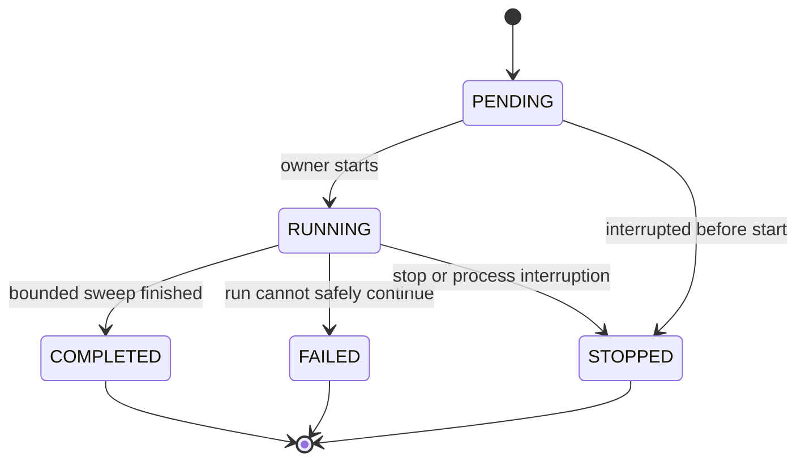

# Run and investigation lifecycles

One authoritative transition module owns these rules. API and UI display structured state; they never infer it from messages. Phase 1 exercises this contract with fixtures; later phases replace one boundary at a time.



Terminal runs never return to RUNNING. New attempts create new runs with explicit predecessor links where useful. Candidate failure need not fail the run: finish other candidates, record counts and PARTIAL coverage. Budget-limited normal runs may be COMPLETED with deferred candidates. COMPLETED is not a scientific success classification.

Stages: INVENTORY → GDC_FAST_SEARCH → STATE_GENERATION → JEV_WIDE, then candidate DEEP_ANALYSIS → EVIDENCE_BUILD → JEV_DEEP → HYPOTHESIS_GENERATION → HYPOTHESIS_VERIFICATION → FOLLOWUP → EVIDENCE_BUILD/JEV_DEEP/review → DOSSIER or candidate termination. Store stage occurrences with candidate/iteration IDs; a single pipeline display cannot imply all candidates advance together.

**Phase 2 live loop (implemented).** `python -m cancerjev run --live` runs one bounded sweep:

1. `INVENTORY`: `GET /status` for release identity, `GET /projects` for the bounded roster, deterministic scope selection (up to 8 projects with 50–250 cases, ordered by `(case_count, project_id)`), `PROJECT_SCOPE_SELECTED`.
2. `GDC_FAST_SEARCH` (mutation lane): one `top_mutated_genes_by_project` call per selected project (size ≤20), deterministic union of discovered genes, one `top_cases_counts_by_genes` call for the union (≤100 genes), one unfiltered `mutated_cases_count_by_project` call for coverage, one `/genes` call for identity of the selected ≤10 genes. Provider `_score` is retained only as `provider_discovery_rank`.
3. `STATE_GENERATION`: one complete `/cases` page per project (size 250, `sort=case_id`), one expression availability call per project, one provider `gene_selection` call per project, one local `values` call per project (`tsv_units=uqfpkm`, ≤10 genes); deterministic methods compute per-project mutation counts, coverage, local log2 summaries, provider summaries and dominance; one immutable StatisticalState artifact per gene plus `STATISTICAL_STATE_CREATED`; `WIDE_SCAN_COMPLETED`.
4. `JEV_WIDE` (Phase 3, same run when enabled): projection per state, one Jev request per state with the `wide-v2` set, validation, persistence, baseline and Jev rankings, bounded candidate promotion.
5. `RUN_COMPLETED` with `coverage = COMPLETE_FOR_SCOPE` or `PARTIAL`, real GDC/Jev usage counters, and zero LLM calls.

Failure discipline: any budget exhaustion, transport failure or parser rejection stops admission for the affected lane, is recorded as a typed event, and leaves the run COMPLETED/PARTIAL or FAILED with the reason — never a silent skip. Deep stages remain Phase 4+ and are not reachable from the live loop.

Candidate transitions:

```text
NEW -> WIDE_EVALUATED -> DEEP_ANALYZED -> HYPOTHESIZED
HYPOTHESIZED -> FOLLOWUP -> DEEP_ANALYZED -> HYPOTHESIZED
HYPOTHESIZED -> DOSSIER_READY
NEW|WIDE_EVALUATED|DEEP_ANALYZED|HYPOTHESIZED|FOLLOWUP
    -> TERMINATED | DEFERRED | FAILED
```

Re-entering HYPOTHESIZED after follow-up may mean re-reviewing existing hypotheses, not generating six new ones. Retain immutable state/evaluation histories; `latest_evidence_state_id` is only a pointer.

Baseline deep evidence is iteration 0. At most two subsequent follow-up rounds create iteration 1 and 2. Within these rounds at most three total follow-up executions are admitted. A round can execute multiple independent eligible actions, each using a slot, and publish one combined new EvidenceState only after their outcomes are recorded. Failed actions consume slots; a round containing admitted work consumes the iteration even if no useful evidence emerges. No repeated unchanged-state loop.

Hypotheses have a lifetime cap of six per candidate. Preserve initial hypotheses; if a later generation is useful, ask only for remaining capacity. A revision/new replacement counts as a new hypothesis. Re-reviewing an unchanged hypothesis against new evidence consumes a Jev call, not a new hypothesis slot.

Routing order: hard validity/access checks → resource and capability checks → semantic evaluation → deterministic eligible-action selection → execute or terminal disposition. Registered action selection records action/version, evidence hash, parameters, expected costs and reason. Model-proposed action IDs and parameters must match the registry; unknown names or incompatible inputs produce `UNSUPPORTED_FOLLOWUP`. Code recomputes eligibility immediately before execution.

TERMINATED reasons include invalid candidate, no useful pattern, no information gain, redundant hypotheses and supported no-further-test decision. DEFERRED reasons include DEFERRED_BUDGET, UNAVAILABLE_ACCESS, UNVERIFIED_CAPABILITY, UNSUPPORTED_FOLLOWUP, UNSUPPORTED_IN_V1 and INSUFFICIENT_EVIDENCE. FAILED is execution/contract failure, not weak biology. On interrupted run, unfinished candidates become DEFERRED/INTERRUPTED, with their previous evidence preserved.

Dossier readiness requires an explicit research puzzle, adequate deterministic observations, missingness/contradictions represented, competing hypotheses, and a falsifiable wet-lab direction. It does not require a proven mechanism or significant p-value. Dossier creation and DOSSIER_READY commit together; one candidate has at most one dossier. No-result runs are valid outcomes.

Continuous mode takes the process lock, reconciles prior unfinished runs, creates a run immediately, completes it, persists cursor advancement and terminal event in one transaction, waits the configured interval (default 60 minutes), and repeats. Advance traversal based on attempted scope with explicit incomplete dispositions so a failing project cannot starve the roster. Mid-run process loss is recorded before the next cursor decision. No cloud scheduler or queue.

Phase 1 demo must include a promoted candidate, baseline fake evidence, independent fake Jev judgments, competing fixture hypotheses, one registered fixture follow-up producing different evidence, and a fake dossier. Separate small fixtures cover defer, failure, stop and no-dossier branches. Every artifact is labeled synthetic; fake provider usage is never presented as real network usage.

Phase 2 live runs are bounded single sweeps: real GDC requests, deterministic methods, real StatisticalStates, no Jev, no LLM. Phase 3 live runs add real Jev wide evaluation and ranking but still stop before deep analysis. The fixture demo remains available and separate; a run’s `mode` (`FAKE` or `LIVE`) is stored on the run and every artifact keeps its label, so synthetic and real records are never mixed in rankings, caches or dossiers.
