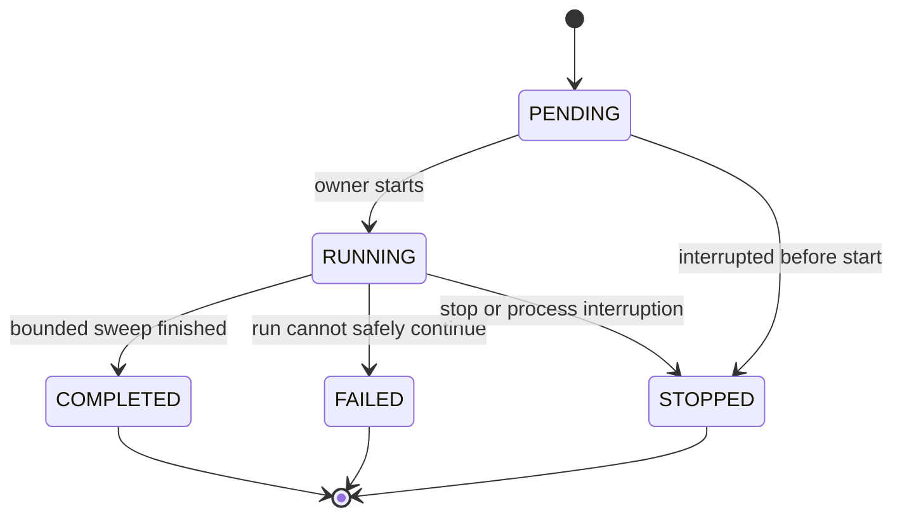

# Run and investigation lifecycles

One authoritative transition module owns these rules. API and UI display structured state; they
never infer it from messages. Phase 1 exercises this contract with fixtures; later phases replace
one boundary at a time.

Terminal runs never return to RUNNING. New attempts create new runs with explicit predecessor
links where useful. Candidate failure need not fail the run: finish other candidates, record
counts and PARTIAL coverage. Budget-limited normal runs may be COMPLETED with deferred
candidates. COMPLETED is not a scientific success classification.

Stages: INVENTORY → GDC_FAST_SEARCH → STATE_GENERATION → JEV_WIDE, then the **PLANNED** candidate
stages DEEP_ANALYSIS → EVIDENCE_BUILD → JEV_DEEP → HYPOTHESIS_GENERATION →
HYPOTHESIS_VERIFICATION → FOLLOWUP → review → DOSSIER or candidate termination. Store stage
occurrences with candidate/iteration IDs; a single pipeline display cannot imply all candidates
advance together.

## Current live loop (IMPLEMENTED, Phase 2 + optional Phase 3)

`python -m cancerjev run --live` runs one bounded sweep against the single production
specification `LUAD_RESEARCH_V1`:

1. `INVENTORY`: `GET /status` for release identity, `GET /projects` for the open inventory, then
   exactly the spec's `project_id` (`TCGA-LUAD`) selected by exact match. No case-count window
   and no cross-project pooling.
2. `GDC_FAST_SEARCH` (mutation lane): one `top_mutated_genes_by_project` call for the cohort
   (size = configured discovery limit ≤20), one `top_cases_counts_by_genes` call for the selected
   gene set (≤100 genes), one unfiltered `mutated_cases_count_by_project` call for coverage, and
   one `/genes` call for identity of the selected candidate genes. Provider `_score` is retained
   only as `provider_discovery_rank`.
3. `STATE_GENERATION`: bounded paginated `/cases` acquisition for the cohort (size ≤250,
   `sort=case_id`, ≤10 pages, fail-closed on inconsistent totals/offsets, premature empty pages,
   cross-page duplicates or unexpected project IDs); one `/files` provenance call with
   `access=open`; then expression availability and local `values` requests partitioned by the
   configured batch size (each ≤250 cases × ≤10 genes, `tsv_units=uqfpkm`). Returned values and
   missing columns are merged by identifier before deterministic cohort-wide summaries.
   Provider `gene_selection` summaries are retained only when the whole cohort fits one admitted
   request; a batched cohort records `BATCHED_PROVIDER_SUMMARY_NOT_COHORT_WIDE` rather than
   aggregating per-batch statistics. Deterministic methods produce one immutable
   StatisticalState artifact per gene plus `STATISTICAL_STATE_CREATED`; `WIDE_SCAN_COMPLETED`.
4. `JEV_WIDE` (Phase 3, same run when enabled): single-cohort projection per state, one Jev
   request per state with `wide-v3`, validation, persistence, deterministic baseline and Jev
   admission rankings, and at most three candidate promotions. Incomplete/unobserved evidence is
   excluded deterministically; a valid zero-admission result is recorded as `ABSTAIN`.
5. `DEEP_ANALYSIS` + `FOLLOWUP` (Phase 4 first slice, same run, only when the operator passes
   `--deep-candidate <gene-symbol|slot:N>`): accept the selected promoted candidate's immutable
   StatisticalState as E0 (verify the artifact hash and the recorded `state_hash`), record the
   baseline EvidenceState revision (iteration 0), compute the eligible registered deterministic
   actions in Python, execute exactly one selected action over retained evidence, and record the
   result as a new immutable EvidenceState revision E1 whose parent is E0. Nothing is acquired from
   GDC and no model is called. Wide admission never dispatches a follow-up on its own: a selection
   that matches no promoted candidate records `DEEP_SELECTION_UNAVAILABLE`, and zero eligible
   actions, an already-executed action or an exhausted budget record `FOLLOWUP_ABSTAINED` or
   `FOLLOWUP_SKIPPED`. A deterministic action failure records `FOLLOWUP_FAILED` and leaves E0 and the
   candidate unchanged.
6. `JEV_DEEP` (Phase 4 next stage, same run): one Deep Jev fan-out over the new revision plus the
   eligible registered action set with the versioned `deep-v1` question set, persisted as a normal
   evaluation with `purpose=DEEP` and `input_ref_kind=EVIDENCE_STATE`; then the deterministic Python
   next-move policy (`deep-policy-v2`) records one typed move (`COMPLETE`/`FOLLOW_UP`/`ABSTAIN`) with
   its dimensions and thresholds. The judgment is an input and the move is recorded, not dispatched:
   Jev never selects, authorizes or executes an action.
7. `HYPOTHESIS_GENERATION` (Phase 4-6, same run): when the policy records `GENERATE_HYPOTHESES`
   and iteration is authorized, bounded statements are generated (deterministic by default, or by a
   generator injected by the caller -- never by this repository), stored with their generator label,
   and judged once each under `hypothesis-v2`. Generated text is never evidence and never writes a
   measured field.
8. `DOSSIER` (Phase 5, same run): the candidate's live dossier is recorded as authoritative JSON plus
   derived Markdown over the accepted state, every revision, every execution, every judgment and every
   recorded next move, with an explicit availability per section; the candidate becomes
   `DOSSIER_READY`.
9. `FOLLOWUP` (Phase 4 bounded arc, same run): when the recorded move is `FOLLOW_UP` and the
   operator authorized dispatch (`--deep-followup`), at most one further immutable revision (`E2`,
   parent `E1`) is produced by the distinct eligible revision action, and it is judged again by the
   same deep fan-out. Every refusal (not a `FOLLOW_UP`, not authorized, no distinct eligible action,
   either cap, action failure) is a typed `NEXT_MOVE_DISPATCHED` record. Autonomous iteration beyond
   this one authorized dispatch is not implemented.
10. `RUN_COMPLETED` with `coverage = COMPLETE_FOR_SCOPE` or `PARTIAL`, real GDC/Jev usage counters,
   the deep-slice and dispatch summaries when they ran, and zero LLM calls.

Failure discipline: any budget exhaustion, transport failure or parser rejection stops admission
for the affected lane, is recorded as a typed event, and leaves the run COMPLETED/PARTIAL or
FAILED with the reason — never a silent skip. Hypothesis generation, further revisions beyond the
authorized caps and Phase 7 offline autoresearch remain later work, and nothing in the live loop
dispatches a follow-up from a recorded next move without explicit operator authorization.

## Planned candidate investigation (Phase 4+, first slices IMPLEMENTED)

This is the approved conceptual direction, deliberately minimal. Three slices are implemented: the
deterministic E0 → one registered action → E1 revision, one Deep Jev fan-out over that revision, and
the Python next-move decision record. Remaining work: a second registered action (so a recorded
`FOLLOW_UP` can be dispatched), repeated judging of further revisions, and multi-candidate
iteration. A next
move is a Python result
(`FOLLOW_UP`, `GENERATE_HYPOTHESES`, `TEST_HYPOTHESIS`, `NEXT_CANDIDATE`, `COMPLETE`, `ABSTAIN`),
not a persisted planner object. Candidate selection can remain
`candidate = next_eligible_candidate(...)`; a GDC refresh is normally another bounded
`ResearchRun`, not a permanent discovery-cycle subsystem.

1. A promoted candidate becomes a scientific **investigation**: candidate gene + cohort/population
   + research question. A candidate gene alone is not an investigation.
2. Python computes deterministically eligible registered actions from the current immutable
   evidence. Jev never authorizes new endpoints or invents action IDs.
3. Where the questions inspect the same evidence state, prefer **one Deep Jev fan-out** over
   chained Deep → action-value → routing requests. Python combines the Jev judgment with
   deterministic eligibility, action cost and remaining budget to choose a next move.
4. A deterministic follow-up produces a new immutable evidence revision (E0 → E1 → E2) and may
   justify a second Jev request because a genuinely new state exists. Failed actions consume
   budget; no repeated unchanged-state loop.
5. A later generative LLM (PLANNED) may propose bounded hypotheses. Python validates their
   schema and determines applicable registered tests; Jev evaluates hypothesis/test propositions;
   Python policy decides. The LLM never controls execution or writes measured fields.
6. A no-result or abstain outcome is valid. A dossier requires an explicit research puzzle,
   adequate deterministic observations, represented missingness/contradictions, competing
   explanations, and a falsifiable direction — not a proven mechanism or significant p-value.

Provisional operational limits (PLANNED, not enforced by Phase 2/3 code): at most two
evidence-changing follow-up rounds after baseline iteration 0, at most three follow-up executions
total, at most six hypotheses per candidate, and at most 20 admitted deep candidates per run.
When Phase 4 begins, choose the smallest representation compatible with the existing repository;
`EvidenceState` revisions are immutable and `previous_evidence_state_id` is only a pointer.

## Continuous mode

Continuous mode takes the process lock, reconciles prior unfinished runs, creates a run
immediately, completes it, persists cursor advancement and terminal event in one transaction,
waits the configured interval (default 60 minutes), and repeats. A failing project cannot starve
the roster. Mid-run process loss is recorded before the next decision. No cloud scheduler or queue.

## Fixture demo

The Phase 1 demo must include a promoted candidate, baseline fake evidence, independent fake Jev
judgments, competing fixture hypotheses, one registered fixture follow-up producing different
evidence, and a fake dossier. Separate small fixtures cover defer, failure, stop and no-dossier
branches. Every artifact is labeled synthetic; fake provider usage is never presented as real
network usage. Phase 2 live runs are bounded single sweeps; Phase 3 adds real Jev wide evaluation
and ranking but still stops before deep analysis. A run's `mode` (`FAKE` or `LIVE`) is stored on
the run and every artifact keeps its label, so synthetic and real records are never mixed.
